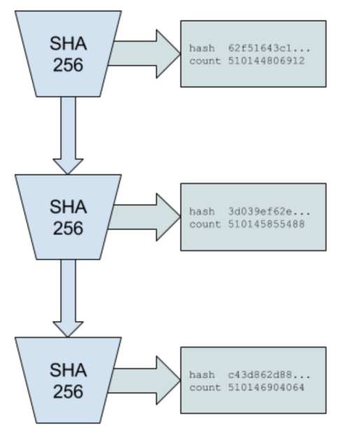

本文为solana白皮书: [Solana: A new architecture for a high performance blockchain v0.8.14](./solana-whitepaper-en.pdf)的读书笔记, 本文旨在理清索拉纳提出新型POH共识机制, 本文写作时间较早很多是我的个人阅读之后的感想, 多处引用可能也不严谨. 如果您在阅读过程中有任何意见可以发起ISSUE, 如果喜欢的话可以点击`star`.

*solana1是众多区块链中非常耀眼的一位"新人", 号称实现了710k tps2(在1gb网络环境下)而收获了大量的目光. 众所周知区块链技术的tps与其共识机制有着密不可分的关系, 今天笔者透过solana的白皮书来和大家唠叨一下solana's PoH.*

# My Impressions on Solana White Paper 

## Solana Proof of History

*总所周知索拉纳采用的是PofH(历史证明)共识, 是一种历史数据运算长期累加的一种证明方式, 与大多数区块链项目一样PoH也是**一种可验证**, **确定性**的共识方式, 由于poh验证特性索拉纳项目方要求验证节点需要配备gpu这一昂贵的硬件, 下面我将结合白皮书以及其书面材料来尽量简单明了的说明索拉纳的poh共识机制:*

*假设进行3次hash运算(在这里使用的是sha256), 第一次运算的内容可以是任意的或者随机的, 周知hash运算会将数据运算成一个256位的伪随机结果, 然后将该结果作为hash1代入到第二次hash运算, 得到结果作为hash2, hash2再代入到第三次hash运算如此往复可以进行n次hash运算最终得到结果hashn, 由于hash运算的伪随机特性, 在第一次运算的内容以及运算次数已知的情况下, hashn是一个确定的256位伪随机数, 如此往复是为了什么呢?*

*笔者看来可验证验证人的的确确是从确定的内容开始进行hash运算的并且运算了n次...咋看之下poh的共识机制与btc的pow共识有些许类似都需要进行大量的hash运算, 但是!!! poh的验证要求验证人同样要重复n次hash运算而btc仅要求验证人只需进行一次hash运算........这不禁让笔者摸不清索拉纳的poh共识有何优越性, 难道仅仅是为了符合他需要验证人节点配备gpu这一昂贵硬件的需要?*

## 防止错位(reversal1)攻击

*索拉纳的错位(reversal)攻击示意如下图所示:*

*正常情况下每个生成器(类似与验证者)依据前一个"块"的hash为一个子项计算下一个"块"的hash, 这也是上述的poh共识, 但倘若只做出块对一条链来说是远远不够, 于是solana增加了一个宽泛的内容"事件(event1)"(笔者认为"事件"可能包括交易, 链上治理, slash等等需要上链保存的信息). 对于区块来说也就是在区块中增加一个"input"的内容, 以交易事件为例, 交易具有明显的时序性, 也就是第一笔交易必须在第二笔交易之前, 第二笔交易同理, 作恶者可以将在一个生成器下产生的交易事件颠倒传入另一个生成器, 如下图所示:*

*生成器A与生成器B在同步时, 生成器A生成的事件序列event1, event2, evnet3反转传入生成B, 实现错位攻击. 正如先哲所说:*

>计算机问题都是可以通过增加中间层来解决.

*因此solana防止错位攻击也增加了一个中间层, 同样如下图所示如图所示*

*方法就在于计算event的hash加入了block hash作为子项, 那么event就具备了区块序列的属性, 在理论上反转攻击将无法实施. 与很多中间层解决策略类似这并不是免费的, 增加了事件的区块序列属性, 意味着验证事件序列就需要与生成事件序列生成器或节点通信获得相关的区块序列, 增加了区块链中一致(consensus)的开销.*

## 笔者总结

solana提出的PoH共识对于链圈来讲是一种很好的补充, 而且也带来了在tps, 可扩展性等方面的提升*, poh带来好处同时也增加了solana节点的硬件要求, 白皮书中有句原话:

>4000 hashes per second would generate an additional 160 kilobytes of data, and would require access to a GPU with 4000 cores and roughly 0.25-0.75 milliseconds of time to verify

举的例子是GPU拥有4000核心(GPU的核心与CPU的概念不一致, 甚至Nvidia与AMD对GPU核心定义也不一), 拿Nvida家用热门的2060来说, 其配备了1920个流处理器核心, 也就是说达到论文的4000核心, 就需要2060的双阵列, 由此可窥见硬件成本不低. 不过solana是采用PoH, PoS以及PoReplication三种共识算法, 其真实的性能和表现还有待于其主网上线后才能知晓, 对此笔者怀有很高的期待.

## reference
1. Solana: A new architecture for a high performance blockchain v0.8.14
2. Solana ICO Review — Redesigning the High Performance Blockchain[https://hackernoon.com/solana-ico-review-redesigning-the-high-performance-blockchain-5e051297bb7d] 2019.10.10