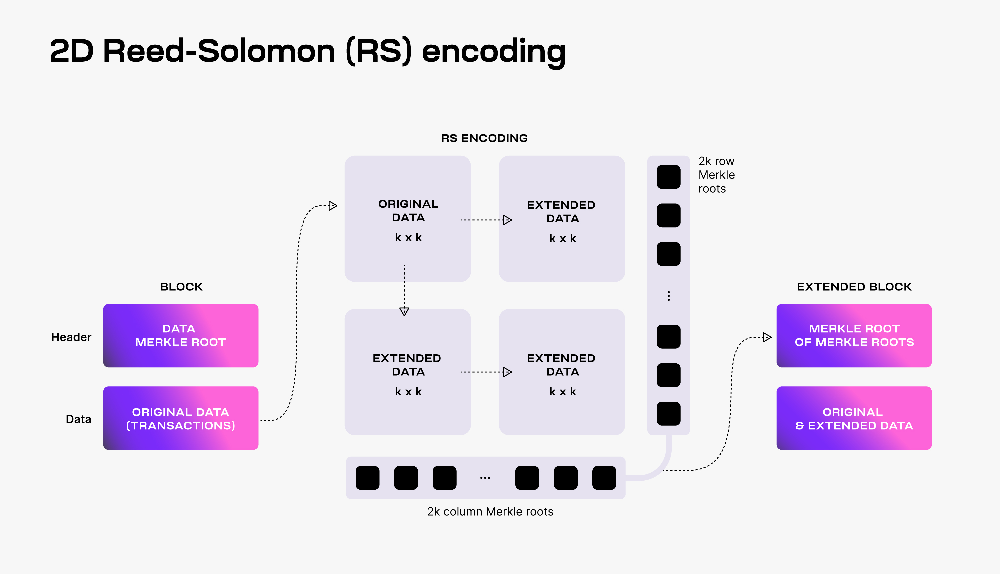
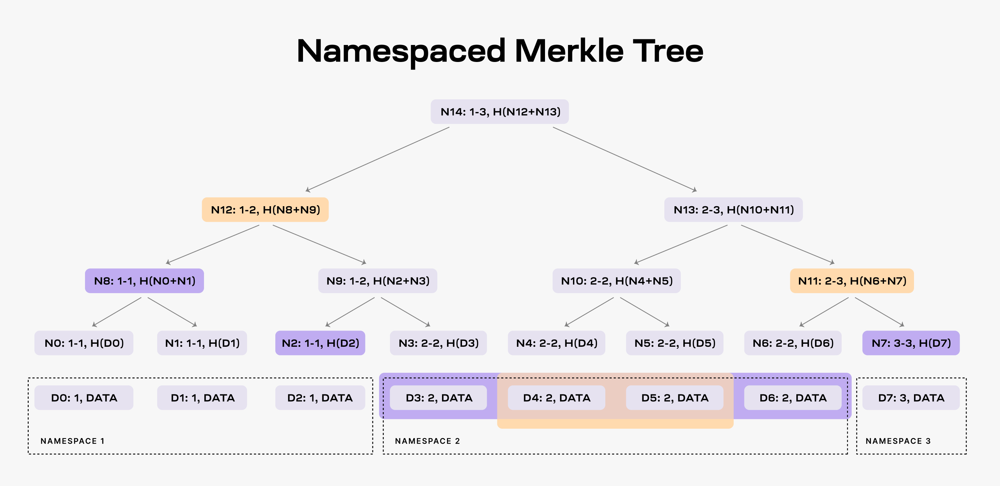
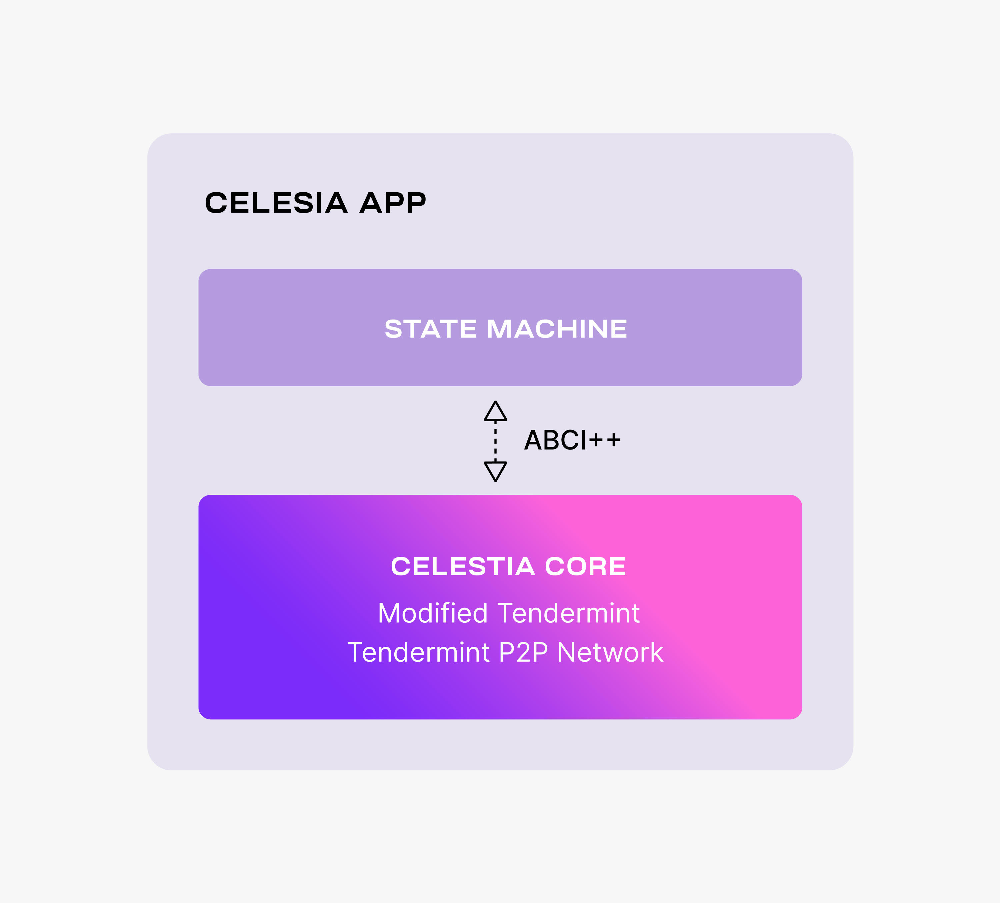

# Celestia's Data Availability Layer

文章链接: [地址](https://docs.celestia.org/concepts/how-celestia-works/data-availability-layer)

Celestia的数据可用性层(DA)是一个被传的神乎其神的技术, 同时被寄以厚望可能“超越”以太的技术, 现在笔者根据Celtesia的官方文档来一探究尽.

首先来看数据可用DA问题, 来源于: [文章](https://coinmarketcap.com/alexandria/article/what-is-data-availability)

### Where Is the Data Availability Problem Relevant?

#### Increasing the Size of Blocks

> In blockchains like [Bitcoin], most standard laptops have the ability to run a full node and verify the entire chain, because there is an artificial block size limit to keep the blockchain small. 
>
> But what if we wanted to increase the block size limit? Less people will afford to run full nodes and independently verify the chain, and more people will run light clients that are less secure. This is bad for decentralization, because it would be easier for block producers to change the protocol rules and insert invalid transactions that light clients will accept as valid. Therefore, adding fraud proof support for light clients becomes very important, but as discussed, light clients need a way to check that all the data in blocks has been published for this to work.

:book: 日益增长的块大小, 像比特币这样的区块链, 大多数标准笔记本也用能力去运行一个全节点并且验证完整的链, 因为有一个人为限定的区块大小来保证生成小区块.

但是如果我们想要增大区块限制? 那么只有少数人可以能够运行全节点并且独立验证链, 并且更多人会选择运行轻节点, 但这并不足够安全. 这对于去中心化来说非常不利, 出块者可以轻易改变出块规则在块中加入无效交易而轻节点却无法校验. 因此增加一种欺诈证明对于轻节点来说至关重要, 但就像讨论的一样, 轻节点需要一种方法证明块中所有数据是已发布才能接着正常工作.

### What Solutions Are Available for the Data Availability Problem?

#### Downloading All The Data

> The most obvious way, as discussed, to solve the data availability problem is to simply require everyone (including light clients) to download all the data. Clearly, this doesn’t scale well. This is what most blockchains, such as Bitcoin and Ethereum, currently do.

:book: 最显而易见解决数据解决数据可用性方法的问题是下载全量数据, 包括轻节点. 很显然, 这无法很好的扩展. 这同时也是目前比特币和以太坊当前采用的方法.

#### Data Availability Proofs

> Data availability proofs are a new technology that allows clients to check with very high probability that all the data for a block has been published, by only downloading a very small piece of that block.

:book: 数据可用性证明是一种新技术允许客户端检查块中所有数据被大概率的发布过, 并且仅下载其中很小一部分数据.

> It uses a mathematical primitive called [erasure codes](https://en.wikipedia.org/wiki/Erasure_code), which are used everywhere in information technology from CD-ROMs to satellite communications to QR codes. Erasure coding allows you to take a block, say 1MB big, and “blow it up” to 2MB big, where the extra 1MB is a special piece of data called the erasure code. If any bytes from the block go missing, you can recover those bytes easily thanks to the code. You can recover the entire block even if up to 1MB of the block goes missing. It’s the same technology that allows your computer to read all the data in a CD-ROM even if it’s scratched.

:book: 使用了一种叫纠删码的数学原语, 这项技术从cd-rom到卫星通信以及二维码都有广泛使用. 纠删码允许你拿走一个块, 比如1M大小, 并且放大到2M大小, 这额外1M的数据就被称为纠删码. 如果任何块内的其他数据丢失, 你都可以轻易的恢复通过纠删码. 你甚至可以恢复完整的1M块信息在该信息丢失的情况下. 这与cd-rom数据被划伤你依然能够读取完整信息是一种相同的技术.

> This means that in order for 100% of a block to be available, only 50% of it needs to be published to the network by the block producer. If a malicious block producer wants to withhold even 1% of the block, they must withhold 50% of the block, because that 1% can be recovered from the 50%.

:book: 这意味着想要保证块100%可用性, 对于块生产者只需要发布块50%的部分到网络中. 如果一个恶意的块生产者想要保留1%的块, 那他必须保留50%的块, 因为被保留的1%可以从50%中恢复出来.

> Armed with this knowledge, clients can do something clever to make sure that no parts of the block have been withheld. They can try to download some random chunks from the block, and if they are unsuccessful in downloading any of those chunks (i.e. the chunk is in the 50% of the chunks that a malicious block producer didn’t publish), then they will reject the block as unavailable. After trying to download one random chunk, there’s a 50% chance that they will detect that the block is unavailable. After two chunks, there’s a 75% chance, after three chunks, there’s a 87.5% chance and so on until after seven chunks, there’s a 99% chance. This is very convenient, because it means that clients can check with high probability that the entire block was published, by only downloading a small portion of it.

:book: 运用以上的知识, 客户可以用一种聪明的方式来验证块没有部分被保留了.它们能够下载块中随机部分, 并且如果他们没有下载到指定的部分(例如该部分是恶意者50%保留内容的一部分), 那么他们就可以以不可用拒绝这个块. 在下载了随机部分, 有50%机会他们能够检测出这个块是不可用的. 经过两轮, 证明的概率为75%, 经过3轮以后, 有87.5%几率并且随着轮数增加, 块可用性甚至可以高达99%. 这非常方便, 因为这意味客户可以检查这个块是否完全被发布, 并仅下载一小部分.

完整论文: [data availability proofs paper](https://arxiv.org/abs/1809.09044)

:bulb: 实质上来说数据可用性验证非常简单, 通过纠删码增加了作恶者的作恶负担, 块的大小被扩大了1倍, 同时作恶需要完全保留纠删部分, 也意味着作恶至少保留了50%块, 轻节点利用该特性请求块的特定部分, 来验证块是否作恶者保留, 通过请求的次数n的增加那么块未被保留的概率P=1-0.5^n, 达到99%可用性, 所需要的下载次数为7次, P=99.218%. 较少的验证和极低的概率保证对于轻节点来说块高可用. 非常简单但对于轻节点来说确实非常有用.

我们重新回到Celestia的文档.

## [Data Availability Sampling (DAS)](https://docs.celestia.org/concepts/how-celestia-works/data-availability-layer/#data-availability-sampling-das)

> In general, light nodes download only block headers that contain commitments (i.e., Merkle roots) of the block data (i.e., the list of transactions).
>
> To make DAS possible, Celestia uses a 2-dimensional Reed-Solomon encoding scheme to encode the block data: every block data is split into k × k chunks, arranged in a k × k matrix, and extended with parity data into a 2k × 2k extended matrix by applying multiple times Reed-Solomon encoding.
>
> Then, 4k separate Merkle roots are computed for the rows and columns of the extended matrix; the Merkle root of these Merkle roots is used as the block data commitment in the block header.

:book: 普遍的, 轻节点只会下载块头信息和包含投票信息(例如默克尔根)以及块信息(例如交易列表).

为了保证das的可行性, Celestia使用了一种二维的Reed-Solomon编码方法来对块数据进行编码: 每一个块的信息都会被切割成 k × k 部分, 排列成 k × k 矩阵, 并且扩展奇偶校验数据为 2k × 2k 的扩展矩阵通过多次Reed-Solomon编码的方式.

那么4k个独立默克尔根可以从扩展的矩阵的行列中计算出来; 并且这些默克尔根信息会作为承诺信息放在区块头中.

> To verify that the data is available, Celestia light nodes are sampling the 2k × 2k data chunks.
>
> Every light node randomly chooses a set of unique coordinates in the extended matrix and queries full nodes for the data chunks and the corresponding Merkle proofs at those coordinates. If light nodes receive a valid response for each sampling query, then there is a [high probability guarantee](https://github.com/celestiaorg/celestia-node/issues/805#issuecomment-1150081075) that the whole block's data is available.
>
> Additionally, every received data chunk with a correct Merkle proof is gossiped to the network. As a result, as long as the Celestia light nodes are sampling together enough data chunks (i.e., at least k × k unique chunks), the full block can be recovered by honest full nodes.

:book: 验证数据可用性, Celestia轻节点可以采样 2k × 2k 的数据部分.

每一个轻节点可以随机选择扩展矩阵上的任意坐标并且向全节点请求改部分数据以及对应的坐标的默克尔证明. 如果轻节点的每次采样请求都可以接收到正确的回应, 那么数据具有很高的可用性.

另外, 通过网络gossip传输每个部分数据都接收到正确的默克尔证明. 结果是, 只要轻节点共同采样足够多的数据内容(至少是 k × k 个不同的部分), 那么完整的区块就可以从全节点中恢复出来.

想要参看das的原始解释, 请阅读 [original paper](https://arxiv.org/abs/1809.09044).

### [Scalability](https://docs.celestia.org/concepts/how-celestia-works/data-availability-layer#scalability)

> DAS enables Celestia to scale the DA layer. DAS can be performed by resource-limited light nodes since each light node only samples a small portion of the block data. The more light nodes there are in the network, the more data they can collectively download and store.
>
> This means that increasing the number of light nodes performing DAS allows for larger blocks (i.e., with more transactions), while still keeping DAS feasible for resource-limited light nodes. However, in order to validate block headers, Celestia light nodes need to download the 4k intermediate Merkle roots.
>
> For a block data size of $n^2$ bytes, this means that every light node must download O(n) bytes. Therefore, any improvement in the bandwidth capacity of Celestia light nodes has a quadratic effect on the throughput of Celestia's DA layer.

:book: DAS保证了Celestia实现DA层的扩容. DAS可以在资源首先要的轻节点上实现, 因为每个轻节点只会采样完整块的一小部分数据. 越多的轻节点参与网络, 那么越多的数据他们可以集体下载和存储.

这意味着越多的轻节点执行DAS来允许更大的区块(也就是有更多的交易), 同时仍然保持DAS对资源有限的轻节点仍然适用. 但为了验证区块头, Celetia的轻节点需要下载4k的中间默克尔根.

对于一个具有$n^2$字节的区块来说, 意味着轻节点必须下载O(n)级的字节. 反面来说对于Celestia轻节点的带宽容量提升会对Celetia的DA层吞吐有二次级的提升.

### [Fraud Proofs of Incorrectly Extended Data](https://docs.celestia.org/concepts/how-celestia-works/data-availability-layer/#fraud-proofs-of-incorrectly-extended-data)

> The requirement of downloading the 4k intermediate Merkle roots is a consequence of using a 2-dimensional Reed-Solomon encoding scheme. Alternatively, DAS could be designed with a standard (i.e., 1-dimensional) Reed-Solomon encoding, where the original data is split into k chunks and extended with k additional chunks of parity data. Since the block data commitment is the Merkle root of the 2k resulting data chunks, light nodes no longer need to download O(n) bytes to validate block headers.
>
> The downside of the standard Reed-Solomon encoding is dealing with malicious block producers that generate the extended data incorrectly.
>
> This is possible as **Celestia does not require a majority of the consensus (i.e., block producers) to be honest to guarantee data availability.** Thus, if the extended data is invalid, the original data might not be recoverable, even if the light nodes are sampling sufficient unique chunks (i.e., at least k for a standard encoding and k × k for a 2-dimensional encoding).
>
> As a solution, *Fraud Proofs of Incorrectly Generated Extended Data* enable light nodes to reject blocks with invalid extended data. Such proofs require reconstructing the encoding and verifying the mismatch. With standard Reed-Solomon encoding, this entails downloading the original data, i.e., $n^2$ bytes. Contrastingly, with 2-dimensional Reed-Solomon encoding, only O(n) bytes are required as it is sufficient to verify only one row or one column of the extended matrix.

:book: 所需要下载的4k间接默克尔树根是上文提到的Reed-Solomon编码重排的结果. 可选的, DAS能够被设计成标准的(例如1维)Reed-Solomon编码, 其中原始数据被切割成了k个部分和扩展的额外的k部分的奇偶数据. 因此区块数据承诺就是2k部分数据的默克尔根, 轻节点不需要下载O(n)用来验证区块头.

标准的Reed-Solomon编码方式的缺点是要处理不正确地生成扩展数据的恶意节点.

对于Celestia并不需要大多数的共识节点(例如出块者)是诚实的才能保证数据可用性是有可能的. 是因为, 如果扩展数据是无效的, 那么原始数据可能就无法恢复, 即使轻节点正在对足够多的唯一块进行采样(标准编码是k个部分, 对于二维数据是k × k个部分).

结论是, 错误生成的扩展数据的欺诈证明能够使轻节点可以拒绝错误扩展数据的区块. 这些证明需要重构编码并且验证错误. 通过标准Reed-Solomon编码, 这需要下载原始数据, 例如$n^2$字节的区块信息. 相对, 采用二维的Reed-Solomon编码, 那么只需要O(n)字节的数据就足够验证单行或单列的扩展矩阵.

:bulb: 文章这部分写的非常简略, 结论也没有任何的共识佐证, 但整体思路已经介绍了大概: 本章主要提到二维的Reed-Solomon编码相对与标准的Reed-Solomon编码有着对于轻节点带宽的压力的缓解, 虽然笔者也不懂Reed-Solomon编码, 也没有办法根据上文推导出数学证明(因为本文压根没提供数据证明), 只要读者对于默克尔数有充分的了解也能懂得其中的整体思路. 而二维的优化可能主要是通过单行或者单列证明的方式来提升的.

## [Namespaced Merkle Trees (NMTs)](https://docs.celestia.org/concepts/how-celestia-works/data-availability-layer#namespaced-merkle-trees-nmts)

> Celestia partitions the block data into multiple namespaces, one for every application (e.g., rollup) using the DA layer. As a result, every application needs to download only its own data and can ignore the data of other applications.
>
> For this to work, the DA layer must be able to prove that the provided data is complete, i.e., all the data for a given namespace is returned. To this end, Celestia is using Namespaced Merkle Trees (NMTs).
>
> An NMT is a Merkle tree with the leafs ordered by the namespace identifiers and the hash function modified so that every node in the tree includes the range of namespaces of all its descendants. The following figure shows an example of an NMT with height three (i.e., eight data chunks). The data is partitioned into three namespaces.

:book: Celestia分割区块数据成多个命名空间, 一个是对于应用(例如rollup)使用数据可用层. 结果是, 所有应该只需要下载自己的数据并且可以忽略其他应用的数据.

为了实现这一目标, 数据可用层必须能够证明提供的数据是完整的, 例如返回所有给定命名空间的数据. 为了实现该功能, Celestia使用一种命名空间默克尔树(NMTs).

NMT是一种默克尔数结构叶子节点以命名空间id进行排序, 父hash与子hash的关系: parent_hash = hash(son1_hash, son2_hash). 下图是NMT的一个例子(树高为3, 叶子节点8个). 这些数据被分割成3个命名空间.

> When an application requests the data for namespace 2, the DA layer must provide the data chunks `D3`, `D4`, `D5`, and `D6` and the nodes `N2`, `N8` and `N7` as proof (note that the application already has the root `N14` from the block header).
>
> As a result, the application is able to check that the provided data is part of the block data. Furthermore, the application can verify that all the data for namespace 2 was provided. If the DA layer provides for example only the data chunks `D4` and `D5`, it must also provide nodes `N12` and `N11` as proofs. However, the application can identify that the data is incomplete by checking the namespace range of the two nodes, i.e., both `N12` and `N11` have descendants part of namespace 2.
>

:book: 当应用需要命名空间2的数据的时候, 数据可用层提供数据`D3`, `D4`, `D5`, 和`D6` 以及节点 `N2`, `N8` 和 `N7` 作为证明.(注意`N14`可以从区块头中获取到).

结果是, 应用能够证明提供的数据是区块的一部分. 更进一步, 应该能够验证所有命名空间2中的数据. 如果数据可用层举例仅提供数据`D4`和`D5`, 那么就需要提供节点`N12`和`N11`作为证据. 然而, 通过检查两个节点命名空间能够识别出数据是不完整的, 例如节点`N12` 和 `N11` 含有命名空间2的子节点.

想要了解更多细节, 建议阅读原文[original paper](https://arxiv.org/abs/1905.09274).

:bulb: 虽然文字很简单, 但所描述的NMT确实让笔者感到脑门一亮, 有兴趣的朋友一定要看看他们的论文, 笔者只能说Celestia是有点东西.

### [Building a PoS Blockchain for DA](https://docs.celestia.org/concepts/how-celestia-works/data-availability-layer/#building-a-pos-blockchain-for-da)

#### [Providing Data Availability](https://docs.celestia.org/concepts/how-celestia-works/data-availability-layer/#providing-data-availability)

> The Celestia DA layer consists of a PoS blockchain. Celestia is dubbing this blockchain as the [Celestia App](https://github.com/celestiaorg/celestia-app), an application that provides transactions to facilitate the DA layer and is built using [Cosmos SDK](https://docs.cosmos.network/main). The following figure shows the main components of Celestia App.

:bulb: 这段就不翻译了, 说人话就是使用了Cosmos SDK来作了开发, 具体看下图:

> Celestia App is built on top of [Celestia Core](https://github.com/celestiaorg/celestia-core), a modified version of the [Tendermint consensus algorithm](https://arxiv.org/abs/1807.04938). Among the more important changes to vanilla Tendermint, Celestia Core:
>
> * Enables the erasure coding of block data (using the 2-dimensional Reed-Solomon encoding scheme).
> * Replaces the regular Merkle tree used by Tendermint to store block data with a [Namespaced Merkle tree](https://github.com/celestiaorg/nmt) that enables the above layers (i.e., execution and settlement) to only download the needed data (for more details, see the section below describing use cases).

:book: Celestia App是构建在Celestia Core之上的, 一种修改的Tendermint共识算法. 与vanilla Tendermint主要的区别点是, Celestia Core:

* 启用块数据的纠删码(使用2维的Reed-Solomon来做编码)
* 使用NMT替代Tendermint中常规的默克尔数存储, 来实现上层(例如, 执行层和结算层)只需要下载关心的数据(有关详细信息, 请参阅下面描述用例的部分).

> For more details on the changes to Tendermint, take a look at the [ADRs](https://github.com/celestiaorg/celestia-core/tree/v0.34.x-celestia/docs/celestia-architecture). Notice that Celestia Core nodes are still using the Tendermint p2p network.
>
> Similarly to Tendermint, Celestia Core is connected to the application layer (i.e., the state machine) by [ABCI++](https://github.com/tendermint/tendermint/tree/master/spec/abci%2B%2B), a major evolution of [ABCI](https://github.com/tendermint/tendermint/tree/master/spec/abci) (Application Blockchain Interface).
>
> The Celestia App state machine is necessary to execute the PoS logic and to enable the governance of the DA layer.
>
> However, the Celestia App is data-agnostic -- the state machine neither validates nor stores the data that is made available by the Celestia App.

更多的关于Tendermint修改的细节, 请查看一下[ADRs](https://github.com/celestiaorg/celestia-core/tree/v0.34.x-celestia/docs/celestia-architecture).
