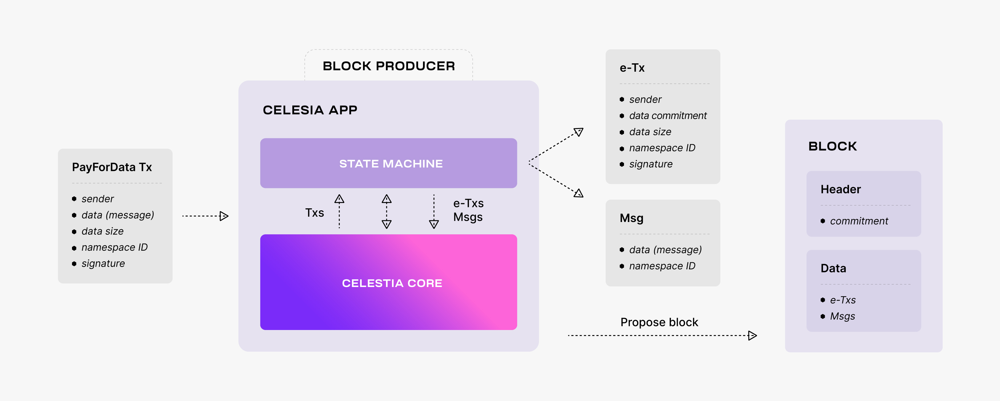
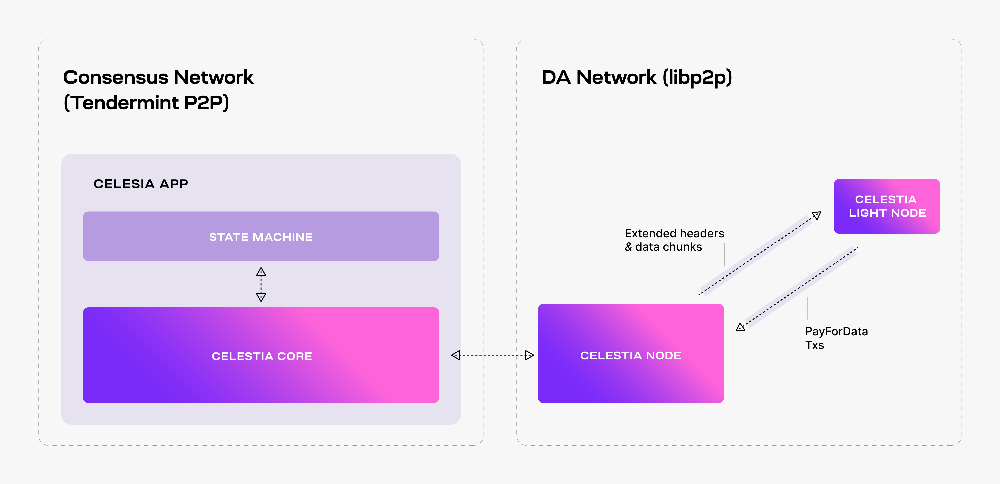

# The Lifecycle of a Celestia App Transaction

该repository作为本人读书笔记, 记录知识的获取, 以blog的形式记录下来. 该文库我会不断更新, 如果喜欢的话麻烦点一下`star`.

由于文章由markdown的方式编写, 部分链接与图片显示可能存在问题, 大家可以移步到[github源](https://github.com/Pencil-Yao/YBlog/blob/master/excellent_article/Having a safe CEX: proof of solvency and beyond.md)查看.

文章链接: [地址](https://docs.celestia.org/concepts/how-celestia-works/transaction-lifecycle)

Celestia的数据可用性层(DA)是一个被传的神乎其神的技术, 同时被寄以厚望可能“超越”以太的技术, 现在笔者根据Celtesia的官方文档来一探究尽, 本文来将一下Celestia的交易生命周期, 由于轻节点不需要下载所有数据, 因此Celestia中的交易的处理也很特殊.

---

> Users request the Celestia App to make data available by sending `PayForData` transactions. Every such transaction consists of the identity of the sender, the data to be made available, also referred to as the message, the data size, the namespace ID, and a signature. Every block producer batches multiple `PayForData` transactions into a block.

:book: 用户请求Celestia App的可用数据需要发送 `PayForData` 交易. 每一笔此类交易包含发送者的ID, 来使数据可用, 数据也可以被定义为消息, 数据大小, 命名空间id还有签名, 每一个区块产生者打包多笔 `PayForData` 在一个区块中.

> Before proposing the block though, the producer passes it to the state machine via ABCI++, where each `PayForData` transaction is split into a namespaced message (denoted by `Msg` in the figure below), i.e., the data together with the namespace ID, and an executable transaction (denoted by `e-Tx` in the figure below) that does not contain the data, but only a commitment that can be used at a later time to prove that the data was indeed made available.

:book: 在提出区块之前, 出块人会将块通过 ABCI++ 发送到状态机, 在这里每一笔 `PayForData` 会按照命名空间消息进行切分(下图中用 `Msg` 表示), 例如按照相同命名空间 id 归类数据, 以及一种可执行交易(下图中用 `e-Tx` 表示)不会包含 data 信息, 但其中包含一条承诺信息, 该信息后续会被用于证明 data 信息确实可用.

> Thus, the block data consists of data partitioned into namespaces and executable transactions. Note that only these transactions are executed by the Celestia state machine once the block is committed.

:book: 因此, 区块中包含的数据可以按照命名空间以及可执行交易进行划分. 需要注意的是交易只能在区块被提交后由 Celestia 状态机仅执行1次.

Next, the block producer adds to the block header a commitment of the block data. As described [here](https://docs.celestia.org/concepts/how-celestia-works/data-availability-layer), the commitment is the Merkle root of the 4k intermediate Merkle roots (i.e., one for each row and column of the extended matrix). To compute this commitment, the block producer performs the following operations:

:book: 紧接着, 区块生产者在区块头中添加一个承诺, 这也是区块数据的一部分. 这部分在我的上一篇文章有描述 [here](./Celestia_s_Data_Availability_Layer.md), 该承诺是总默克尔数的 4k 个间接默克尔数根(例如, 扩展的矩阵的每一行和每一列都会产生一个根). 为了计算上述承诺, 区块生产者需要遵照以下操作:

- It splits the executable transactions and the namespaced data into shares. Every share consists of some bytes prefixed by a namespace ID. To this end, the executable transactions are associated with a reserved namespace.
- It arranges these shares into a square matrix (row-wise). Note that the shares are padded to the next power of two. The outcome square of size k × k is referred to as the original data.
- It extends the original data to a 2k × 2k square matrix using the 2-dimensional Reed-Solomon encoding scheme described above. The extended shares (i.e., containing erasure data) are associated with another reserved namespace.
- It computes a commitment for every row and column of the extended matrix using the NMTs described above.

Thus, the commitment of the block data is the root of a Merkle tree with the leaves the roots of a forest of Namespaced Merkle subtrees, one for every row and column of the extended matrix.

## Checking Data Availability

To enhance connectivity, the Celestia Node augments the Celestia App with a separate libp2p network, i.e., the so-called *DA network*, that serves DAS requests.

Light nodes connect to a Celestia Node in the DA network, listen to extended block headers (i.e., the block headers together with the relevant DA metadata, such as the 4k intermediate Merkle roots), and perform DAS on the received headers (i.e., ask for random data chunks).

Note that although it is recommended, performing DAS is optional -- light nodes could just trust that the data corresponding to the commitments in the block headers was indeed made available by the Celestia DA layer. In addition, light nodes can also submit transactions to the Celestia App, i.e., `PayForData` transactions.

While performing DAS for a block header, every light node queries Celestia Nodes for a number of random data chunks from the extended matrix and the corresponding Merkle proofs. If all the queries are successful, then the light node accepts the block header as valid (from a DA perspective).

If at least one of the queries fails (i.e., either the data chunk is not received or the Merkle proof is invalid), then the light node rejects the block header and tries again later. The retrial is necessary to deal with false negatives, i.e., block headers being rejected although the block data is available. This may happen due to network congestion for example.

Alternatively, light nodes may accept a block header although the data is not available, i.e., a *false positive*. This is possible since the soundness property (i.e., if an honest light node accepts a block as available, then at least one honest full node will eventually have the entire block data) is probabilistically guaranteed (for more details, take a look at the [original paper](https://arxiv.org/abs/1809.09044)).

By fine tuning Celestia's parameters (e.g., the number of data chunks sampled by each light node) the likelihood of false positives can be sufficiently reduced such that block producers have no incentive to withhold the block data.