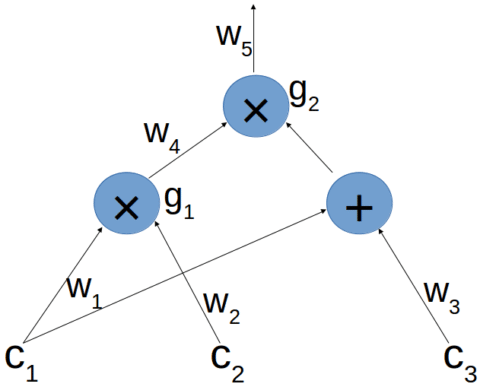

该repository作为本人读书笔记, 记录知识的获取, 以blog的形式记录下来. 该文库我会不断更新, 如果喜欢的话麻烦点一下`star`. 

# From Computations to Polynomials

[<<part IV](./4.How_to_make_Blind_Evaluation_of_Polynomials_Verifiable.md)

In this post we explain the translation into *Quadratic Arithmetic Program*(QAPs) by example. Even when focusing on a small example rather than the general definition, it is unavoidable that it is a lot to digest at first, so be prepared for a certain mental effort :).

:book: 在这篇文章中我们将通过例子介绍二进制运算程序的转换. 即使只关注一个小的例子而不是一般性的定义，也不可避免地需要一开始就进行大量的消化，因此请做好一定的心理准备​ :slightly_smiling_face:.

Suppose Alice wants to prove to Bob she knows  such that {\cdot}(c_1+c_3)=7). The first step is to present the expression computed from  as an *arithmetic circuit*.

:book: 假设 Alice 想要向 Bob 证明她知道  满足 {\cdot}(c_1+c_3)=7). 第一步需要提供由  计算出得表达式作为运算电路.

### Arithmetic circuits

An arithmetic circuit consists of gates computing arithmetic operations like addition and multiplication, with wires connecting the gates. In our case, the circuit looks like this:

:book: 运算电路包含乘法与加法的门电路运算, 使用线连接各个门. 在我们的例子中该电路类似:

A *legal assignment* for the circuit, is an assignment of values to the labeled wires where the output value of each multiplication gate is indeed the product of the corresponding inputs.

:book: 合法的电路分配是将值分配给标记的导线，其中每个乘法门的输出值确实是相应输入的乘积。

### Reduction to a QAP

We associate each multiplication gate with a field element:  will be associated with  and  with . We call the points  our *target points*. Now we need to define a set of “left wire polynomials” , “right wire polynomials”  and “output wire polynomials” .

:book: 我们关联乘法门一个字段元素:  被赋予了  而  被赋予了 . 我们称点  为我们的目标点. 现在我们定义左线多项式  和右线多项式  以及输出多项式 .

The idea for the definition is that the polynomials will usually be zero on the target points, except the ones involved in the target point’s corresponding multiplication gate.

:book: 以如此想法定义多项式在目标点大多为 0, 除了目标点对应的乘法门中涉及的那些.

Concretely, as ,, are, respectively, the left, right and output wire of ; we define , as the polynomial  is one on the point 1 corresponding to  and zero on the point 2 corresponding to .

:book: 具体地说, 对于 ,, 来说, 分别对应  的左输入线, 右输入线和输出线; 我们定义 , 作为多项式  在点 1 为 1 对应  而且再点 2 为 0 对应 .

Note that  and  are *both* right inputs of. Therefore, we define similarly  as  is one on the target point 2 corresponding to  and zero on the other target point. We set the rest of the polynomials to be the zero polynomial.

:book: 注意到  和  是  的右输入. 因此我们同样定义  同时  在点 2 为 1 对应与  而且在其他点为 0. 其余多项式的值我们设为0.

Given fixed values ) we use them as coefficients to define a left, right, and output “sum” polynomials. That is, we define

and then we define the polynomia 

:book: 给予固定的值 ) 我们将其作为系数来用于定义左, 右, 输出多项式. 因此, 我们定义:

并且我们定义多项式 

Now, after all these definitions, the central point is this: ) *is a legal assignment to the circuit if and only if*  *vanishes on all the target points*.

现在, 在所有定义之后, 其中心点是: 当且只有  在所有目标点上为 0 时, ) 才算是合法赋值.

Let’s examine this using our example. Suppose we defined  as above given some ). Let’s evaluate all these polynomials at the target point 1:

让我们用们的例子来举例. 假设我们用以上给出的 ) 来定义 . 让我们推导点 1 的多项式:

Out of all the 's only  is non-zero on 1. So we have =c_1{\cdot}L_1(1)=c_1). Similarly, we get =c_2) and =c_4).

所有  的输出只有  在点 1 非 0. 所以我们定义 =c_1{\cdot}L_1(1)=c_1). 同理我们得到了 =c_2) 和 =c_4).

Therefore, =c_1{\cdot}c_2-c_4). A similar calculation shows =c_4{\cdot}(c_1+c_3)-c_5).

因此, =c_1{\cdot}c_2-c_4). 同样的公式表示 =c_4{\cdot}(c_1+c_3)-c_5).

Defining the *target polynomial* :=(X-1){\cdot}(X-2)), we thus have that  divides  if and only if ) is a legal assignment.

定义目标多项式  :=(X-1){\cdot}(X-2)), 在 ) 是合法赋值时, 我们得到了  除以 .

Following the above discussion, we define a QAP as follows:

跟着之前的讨论, 我们定义 QAP 如下:

*A Quadratic Arithmetic Program*  *of degree*  *and size*  *consists of polynomials* , ,  *and a target polynomial*  *of degree* .

一个四则运算程序 : 有  阶,  元多项式  和  阶多项式 .

*An assignment* ) *satisfies*  *if, defining* , *we have that*  *divides* .

赋值 ) 满足 , 需要定义  以及我们得到  除以 .

To summarize, we have seen how a statement such as “I know  such that {\cdot}(c_1+c_3)=7)” can be translated into an equivalent statement about polynomials using QAPs. In the next part, we will see an efficient protocol for proving knowledge of a satisfying assignment to a QAP.

总结全文, 我们明白了对于状态(例如"我知道一组  满足多项式 {\cdot}(c_1+c_3)=7)") 能够被转化为多项式满足 QAPs 的对等状态. 下一篇文章, 我们讲明白一种高效的协议证明知道赋值满足一个 QAP.