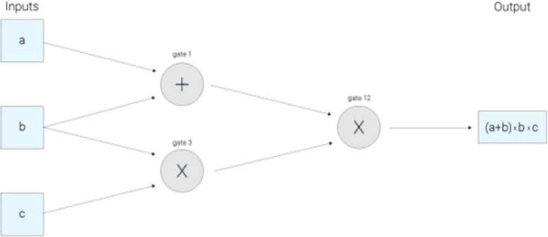

该repository作为本人读书笔记, 记录知识的获取, 以blog的形式记录下来. 该文库我会不断更新, 如果喜欢的话麻烦点一下`star`.

# zk-SNARK

先看下zcash对zk-SNARK的[介绍](https://z.cash/technology/zksnarks/), 以下是是一部重点语段的翻译.

The acronym zk-SNARK stands for “Zero-Knowledge Succinct Non-Interactive Argument of Knowledge,” and refers to a proof construction where one can prove possession of certain information, e.g. a secret key, without revealing that information, and without any interaction between the prover and verifier.

:book: zk-SNARK是"Zero-Knowledge Succinct Non-Interactive Argument of Knowledge"的缩写, 表示可以构建对特定信息的证明, eg. 密钥, 不暴露信息并且证明者与验证者之间不需要交互.

“Succinct” zero-knowledge proofs can be verified within a few milliseconds, with a proof length of only a few hundred bytes even for statements about programs that are very large. In the first zero-knowledge protocols, the prover and verifier had to communicate back and forth for multiple rounds, but in “non-interactive” constructions, the proof consists of a single message sent from prover to verifier. Currently, the most efficient known way to produce zero-knowledge proofs that are non-interactive and short enough to publish to a block chain is to have an initial setup phase that generates a common reference string shared between prover and verifier. We refer to this common reference string as the public parameters of the system.

:book: "简明"零知识证明可在数微妙之内被验证， 仅需要几百字节的证明甚至对于非常巨大程序的状态. 在最初的零知识证明协议中, 证明人与验证人之间必须来回通信多次, 但是在"非交互"构建下, 该证明包含了单条消息由证明人发给验证人. 当前, 当前最有效的产生零知识证明的方式是非交互的, 最有效的发布在区块链的方式是初始启动阶段在证明人与验证人之间产生共同的引用字符串. 我们将公共的引用字符串视为系统的公共参数.

Looking at such a circuit, we can think of the input values a, b, c as “traveling” left-to-right on the wires towards the output wire. Our next step is to build what is called a Rank 1 Constraint System, or R1CS, to check that the values are “traveling correctly”. In this example, the R1CS will confirm, for instance, that the value coming out of the multiplication gate where b and c went in is b*c.

:book: 观察如上逻辑电路, 我们可以认为输入数据a, b, c是沿着线路从左移动到右边的输出线路. 我们下一步是构建被称为1级限制系统, 或叫R1CS, 是用于校验该线路的正确性. 在该例子中R1CS将会校验从乘法门电路出来的是b*c该值由b和c输入得到.

In this R1CS representation, the verifier has to check many constraints — one for almost every wire of the circuit. (For technical reasons, it turns out we only have a constraint for wires coming out of multiplication gates.) In a 2012 [paper on the topic](https://eprint.iacr.org/2012/215.pdf), Gennaro, Gentry, Parno and Raykova presented a nice way to “bundle all these constraints into one”. This method uses a representation of the circuit called a Quadratic Arithmetic Program (QAP). The single constraint that needs to be checked is now between polynomials rather than between numbers. The polynomials can be quite large, but this is alright because when an identity does not hold between polynomials, it will fail to hold at most points. Therefore, you only have to [check that the two polynomials match at one randomly chosen point](https://z.cash/blog/snark-explain2) in order to correctly verify the proof with high probability.

:book: 在R1CS的表达式中, 验证人必须验证很多限制—几乎逻辑电路中的每一条连线. (处于技术原因, 原来从乘法门出来的连线我们只有一个约束.)  在2012年的[主题论文](https://eprint.iacr.org/2012/215.pdf)Gennaro, Gentry, Parno and Raykova展示了一个很好的方式"捆绑这些限制成为一个限制". 该方法使用了一种被成为Quadratic Arithmetic Program (QAP)的逻辑电路表现形式. 该单一限制需要在多项式之间检查而非数字. 该多项式可以非常巨大, 但这并没问题, 因为当多项式之间的恒等式无法成立时, 大多数点也将难以保持. 因此, 你只需要[校验两个多项式在一个随机点的情况](https://z.cash/blog/snark-explain2)用来验证该证明是高度可能的.

If the prover knew in advance which point the verifier would choose to check, they might be able to craft polynomials that are invalid, but still satisfy the identity at that point. With zk-SNARKs, sophisticated mathematical techniques such as [homomorphic encryption](https://en.wikipedia.org/wiki/Homomorphic_encryption) and [pairings](https://en.wikipedia.org/wiki/Pairing-based_cryptography) of elliptic curves are used to evaluate polynomials “blindly” – i.e. without knowing which point is being evaluated. The public parameters described above are used to determine which point will be checked, but in encrypted form so that neither the prover nor the verifier know what it is.

:book: 如果证明人事先知道验证人会选择哪个点用于检查, 那么他可以建立一个错误的多项式, 但用已知点仍然能够通过恒等式. 对于zk-SNARKs应用的复杂数学技术例如同态加密和椭圆曲线对用于盲目的评估多项式 即不知道哪个点会被用于评估. 上文提到的公开参数用于决定哪个点会被用于评估, 但是在的加密形式下所以不论证明人或者验证人都不会知道这个点是哪个.

The description so far has mainly addressed how to get the S and N in “SNARKs” — how to get a short, non-interactive, single message proof — but hasn’t addressed the “zk” (zero-knowledge) part which allows the prover to maintain the confidentiality of their secret inputs. It turns out that at this stage, the “zk” part can be easily added by having the prover use “random shifts” of the original polynomials that still satisfy the required identity.

For a step-by-step, in-depth explanation of key concepts behind zk-SNARKs in Zcash, see our SNARKs Explainer series with posts on:

1. [Homomorphic Hiding](https://electriccoin.co/blog/snark-explain1/)
2. [Blind Evaluation of Polynomials](https://electriccoin.co/blog/snark-explain2/)
3. [The Knowledge of Coefficient Test and Assumption](https://electriccoin.co/blog/snark-explain3/)
4. [How to make Blind Evaluation of Polynomials Verifiable](https://electriccoin.co/blog/snark-explain4/)
5. [From Computations to Polynomials](https://z.cash/blog/snark-explain5)
6. [The Pinocchio Protocol](https://z.cash/blog/snark-explain6)
7. [Pairings of Elliptic Curves](https://z.cash/blog/snark-explain7)

:book: 到目前为止的描述主要是在"SNARK"如何体现"S"和"N"上 — 如何得到一个简短的, 非交互的, 单一消息证明 — 并没有定位"zk-"(零知识)的部分, 该部分允许证明人保持自己输入数据的隐私性. 事实证明, 在该阶段"zk"的部分可以简单的添加通过"随机移位"初始的多项式并且该多项式任能够满足恒等式成立.

为了解释zk-SNARK我们需要先阐释一些基本的组件:

1. [同态隐藏(Homomorphic Hidings)](./1.Homomorphic_Hidings.md)
2. [多项式的盲估计(Blind Evaluation of Polynomials)](./2.Blind_Evaluation_of_Polynomials.md)
3. [系数测试和假设知识(The Knowledge of Coefficient Test and Assumption)](./3.The_Knowledge_of_Coefficient_Test_and_Assumption.md)
4. [如何构建多项式盲估计的验证(How to make Blind Evaluation of Polynomials Verifiable)](./4.How_to_make_Blind_Evaluation_of_Polynomials_Verifiable.md)
5. [从计算到多项式(From Computations to Polynomials)](./5.From_Computations_to_Polynomials.md)
6. [匹诺曹协议(The Pinocchio Protocol)](./6.The_Pinocchio_Protocol.md)
7. [椭圆曲线对(Pairings of Elliptic Curves)](./7.Pairings_of_Elliptic_Curves.md)

Zcash uses [bellman](https://github.com/zcash/librustzcash/tree/master/bellman), a Rust-language library for zk-SNARKs. Before the Sapling upgrade, Zcash used a fork of the C++ library, [libsnark](https://github.com/scipr-lab/libsnark). For a deeper dive into the protocols used for Zcash’s zk-SNARKs, refer to the paper on the [Pinocchio protocol](https://eprint.iacr.org/2013/279.pdf), which was used until the Sapling upgrade, and [Jens Groth’s zk-SNARK](https://eprint.iacr.org/2016/260.pdf) which is used currently.

:book: Zcass 使用 bellman, 一个 rust 版的 zk-SNARKs 实现库. 在 Sapling 升级之前, Zcash  使用一个 C++ 实现库, [libsnark](https://github.com/scipr-lab/libsnark). 想要更深入的挖掘 Zcash's zk-SNARKs 协议, 参看论文 [Pinocchio protocol](https://eprint.iacr.org/2013/279.pdf), 这个是 Sapling 升级之前使用的, 当前参考的论文是 [Jens Groth’s zk-SNARK](https://eprint.iacr.org/2016/260.pdf).

## How zk-SNARKs are applied to create a shielded transaction

In Bitcoin, transactions are validated by linking the sender address, receiver address, and input and output values on the public blockchain. Zcash uses zk-SNARKs to prove that the conditions for a valid transaction have been satisfied without revealing any crucial information about the addresses or values involved. The sender of a shielded transaction constructs a proof to show that, with high probability: 

- the input values sum to the output values for each shielded transfer.
- the sender proves that they have the private spending keys of the input notes, giving them the authority to spend.
- The private spending keys of the input notes are cryptographically linked to a signature over the whole transaction, in such a way that the transaction cannot be modified by a party who did not know these private keys.

:book: 在比特币中, 交易的通过检查发送地址, 接收地址, 以及公链中输入输出值的检查来验证交易. Zcash 使用 zk-SNARKs 来满足在完全不泄露任何重要信息(交易双方的地址, 交易数目)的情况下来验证交易的有效性. 该笔隐藏交易的发送这通过构建证明来实现此特性, 在高概率的情况下:

* 输入值对于每一个屏蔽交易都进行一次输出值求和.
* 交易发送者证明他们有交易输入金额的私人钥匙,  这个钥匙给与他们去使用这笔钱的权利.
* 这个输入金额的私钥在这个交易中与一个签名相关联, 在这种情况下这笔交易不能被不知道这个私钥的任何一方进行修改.

In addition, shielded transactions must satisfy some other conditions that are described below.

:book: 另外, 隐藏交易必须满足其他下述条件.

Bitcoin tracks unspent transaction outputs (UTXOs) to determine what transactions are spendable. In Zcash, the shielded equivalent of a UTXO is called a “commitment”, and spending a commitment involves revealing a “nullifier”. Zcash nodes keep lists of all the commitments that have been created, and all the nullifiers that have been revealed. Commitments and nullifiers are stored as hashes, to avoid disclosing any information about the commitments, or which nullifiers relate to which commitments.

:book: 比特币跟踪 UTXO 来决定哪一笔余额被花费了. 在 Zcash中, 隐藏交易等价于 UTXO 并被命名为 "commitment", 并且花费这个 commitment 需要揭示一个 "nullifier". Zcash 节点保留所有被创建的 commitment, 以及所有揭示的 nullifiers. Commitments 和 nullifiers 以 hashes 方式存储, 以避免泄露关于 commitment 相关的任何信息, 包括哪个 nullifiers 对应哪个 Commitments.

For each new note created by a shielded payment, a commitment is published which consists of a hash of: the address to which the note was sent, the amount being sent, a number “rho” which is unique to this note (later used to derive the nullifier), and a random nonce.

*Commitment = HASH(recipient address, amount, rho, r)*

:book: 对于隐藏交易产生的每一笔记录, 每一个 commitment 的 hash 是由: 交易方地址, 交易花费数量, "rho"(一个独一无二的记录, 之后用于获得nullifier) 和 一个随机数 nonce 这些信息杂凑获得.

*Commitment = HASH(recipient address, amount, rho, r)*

When a shielded transaction is spent, the sender uses their spending key to publish a nullifier which is the hash of the secret unique number (“rho”) from an existing commitment that has not been spent, and provides a zero-knowledge proof demonstrating that they are authorized to spend it. This hash must not already be in the set of nullifiers tracking spent transactions kept by every node in the blockchain.

*Nullifier = HASH(spending key, rho)*

:book: 当一笔隐藏交易被话费掉的时候, 发送方使用他的话费钥匙来公开一个 nullifier(正是未花费且存在 commitment 中的独一无二值 rho, 再加上一个可以证明发送者有权对其进行花费的零知识证明). 这个 hash 必须不能已经出现在链上每个节点已记录的 nullifiers 跟踪消费交易的集合中.

*Nullifier = HASH(spending key, rho)*

The zero-knowledge proof for a shielded transaction verifies that, in addition to the conditions listed above, the following assertions are also true:

- For each input note, a revealed commitment exists.
- The nullifiers and note commitments are computed correctly.
- It is infeasible for the nullifier of an output note to collide with the nullifier of any other note.

:book: 对于隐藏交易的零知识证明已证明了, 不止以上所列出的内容, 以下特性也是正确的：

* 对于每一条记录, 都存在一个已揭示的 commitment.
* 计算 nullifiers 和 commitments 是正确的.
* 一条记录的 nullifier 与其他记录的 nullifier 发生碰撞是不可能的.

In addition to the spending keys used to control addresses, Zcash uses a set of proving and verifying keys to create and check proofs. These keys are generated in the public parameter ceremony discussed above, and shared among all participants in the Zcash network. For each shielded transaction, the sender uses their proving key to generate a proof that their inputs are valid. Miners check that the shielded transaction follows consensus rules by checking the prover’s computation with the verifying key. The way that Zcash’s proof generation is designed requires the prover to do more work up-front, but it simplifies verifying, so that the major computational work is offloaded to the creator of the transaction (this is why creating a shielded Zcash transaction can take several seconds, while verifying that a transaction is valid only takes milliseconds).

:book: 除了用于控制地址的私钥外, Zcash 使用一套证明与验证密钥来创建和校验证明. 这些私钥是由之前所述的公共参数所产生, 并且在整个 Zcash 网络中同步共享. 对于每一笔隐藏交易, 发送者使用他们的证明私钥来生成一个证明表明交易的输入是有效的. 矿工检查隐藏交易符合共识规则使用验证私钥通过证明人的计算. Zcash证明生成的方式被设计为需要证明人作更多的前置工作, 但是这个方式简化了验证, 所以主要的计算工作的负担都转移给了交易的创建者(这就是为什么Zcash创建一笔隐藏交易需要花费数秒时间, 然而证明一笔交易有效仅需要数毫秒).

The privacy of Zcash’s shielded transactions relies upon standard, tried-and-tested cryptography (hash functions and stream ciphers), but it’s the addition of zk-SNARKs, applied with the system of commitments and nullifiers, that allows senders and receivers of shielded transactions to prove that encrypted transactions are valid. Other methods of providing privacy for cryptocurrencies rely upon obscuring the linkage between transactions, but the fact that Zcash transactions can be stored on the blockchain fully encrypted opens up [new possibilities for cryptocurrency applications](https://z.cash/blog/encrypted-memo-field). Encrypted transactions allow parties to enjoy the benefits of public blockchains, while still protecting their privacy. Planned future upgrades will allow users to selectively disclose information about shielded transactions at their discretion. See our [Near Future of Zcash](https://z.cash/blog/the-near-future-of-zcash) blog post on future plans for Zcash.

:book: Zcash 的隐藏交易的隐私性依赖 hash 函数和流加密, 但正是加入了 zk-SNARKs, 应用了 commitments 和 nullifiers 系统, 使得允许隐藏交易的发送者和接收者证明这笔加密交易是有效的. 为加密货币提供隐私的其他方法依赖于掩盖交易之间的联系, 但事实上, Zcash交易可以完全加密地存储在区块链上, 这为[加密货币应用提供了新的可能性](https://z.cash/blog/encrypted-memo-field). 加密交易允许参与者享受公链的优势, 并且同时保证私密性. 未来的升级计划允许用户酌情选择性的披露隐藏交易的信息.

