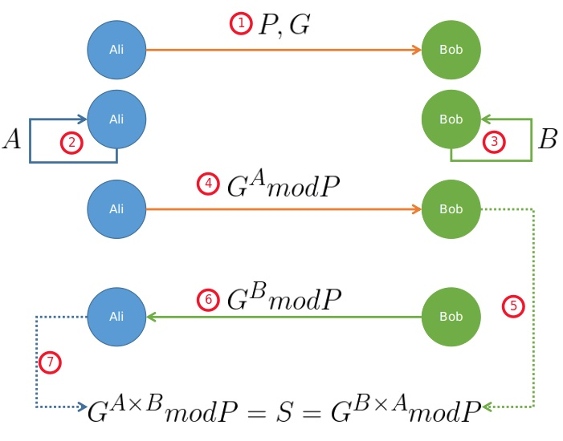
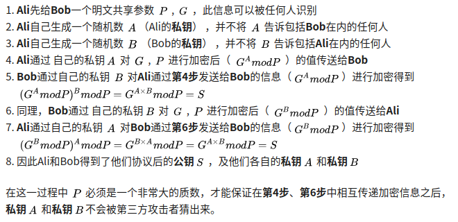

该repository作为本人读书笔记, 记录知识的获取, 以blog的形式记录下来. 该文库我会不断更新, 如果喜欢的话麻烦点一下`star`.

## 1. DH(Diffie-Hellman)算法





DH 算法其实也叫作Diffie-Hellman密钥交换协议，是一个不安全的秘钥共享网络协议，无法避免中间人攻击。

DH背后的数学算法证明

设 已知 二元组)

Alice 生成随机值A，计算
Bob  生成随机值B， 计算

Alice 计算^{B}modp)
Bob 计算^{A}modp)

我们需要证明

^{B}modp=(g^{A}modp)^{B}modp)

令，则，也即

^{A}modp=T^{A}modp=(q^{B}-kp)^{A}modp)

由于对 ^{A}) 展开，除了第一项为  以及最后一项为^{A})，其余每一项均存在，所以计算^{A}modp)之后，只保留了第一项，即

同理可正

## 2. RSA 算法

首先看这个加密算法的命名.很有意思,它其实是三个人的名字.早在1977年由麻省理工学院的三位数学家Rivest、Shamir 和 Adleman一起提出了这个加密算法,并且用他们三个人姓氏开头字母命名.

* 使用公钥加密的数据,利用私钥进行解密
* 使用私钥加密的数据,利用公钥进行解密

RSA加密使用了“一对”密钥.分别是公钥和私钥，这个公钥和私钥其实就是一组数字！其二进制位长度可以是1024位或者2048位。长度越长其加密强度越大，目前为止公之于众的能破解的最大长度为768位密钥，只要高于768位，相对就比较安全。所以目前为止,这种加密算法一直被广泛使用。

由于RSA算法的原理都是大数计算，使得RSA最快的情况也比对称加密算法慢上好几倍。速度一直是RSA的缺陷，一般来说RSA只用于小数据的加密。RSA的速度是对应同样安全级别的对称加密算法的1/1000左右。

RSA选取的大素数（100~200十进制数或更大），假设两个大素数p和q， 计算乘机


随机选取加密秘钥e，使e和(p-1)(q-1)互素。最后用阿几里德扩展算法计算解密秘钥d，以满足

(q-1))

(q-1))

d与n为互素，同样与(q-1))互素。
加密的过程：


解密的过程：


数学证明：

^{d}modn=m^{e}dmodn=m^{k(p-1)(q-1)+1}modn)

(q-1)}modn=m)

### 参考

[1] 应用密码学[B]

## 3. Secp256k1 vs Prime256v1

prime256v1 aka X9_62_prime256v1 aka P256 aka secp256r1

Both elliptic curves are of the form:


### 椭圆曲线参数<sup>[1]</sup>
```go
ec.secNamedCurves = {
	// used by Bitcoin
	"secp256k1": function () {
		// p = 2^256 - 2^32 - 2^9 - 2^8 - 2^7 - 2^6 - 2^4 - 1
		var p = ec.fromHex("FFFFFFFFFFFFFFFFFFFFFFFFFFFFFFFFFFFFFFFFFFFFFFFFFFFFFFFEFFFFFC2F");
		var a = BigInteger.ZERO;
		var b = ec.fromHex("7");
		var n = ec.fromHex("FFFFFFFFFFFFFFFFFFFFFFFFFFFFFFFEBAAEDCE6AF48A03BBFD25E8CD0364141");
		var h = BigInteger.ONE;
		var curve = new ec.CurveFp(p, a, b);
		var G = curve.decodePointHex("04"
				+ "79BE667EF9DCBBAC55A06295CE870B07029BFCDB2DCE28D959F2815B16F81798"
				+ "483ADA7726A3C4655DA4FBFC0E1108A8FD17B448A68554199C47D08FFB10D4B8");
		return new ec.X9Parameters(curve, G, n, h);
	}
	// used by Woodcoin
	"secp256r1": function () {
        // p = 2^224(2^32 - 1) + 2^192 +2^96 -1
		var p = ec.fromHex("FFFFFFFF00000001000000000000000000000000FFFFFFFFFFFFFFFFFFFFFFFF");
		var a = ec.fromHex("FFFFFFFF00000001000000000000000000000000FFFFFFFFFFFFFFFFFFFFFFFC");
		var b = ec.fromHex("5AC635D8AA3A93E7B3EBBD55769886BC651D06B0CC53B0F63BCE3C3E27D2604B");
		var n = ec.fromHex("FFFFFFFF00000000FFFFFFFFFFFFFFFFBCE6FAADA7179E84F3B9CAC2FC632551");
		var h = BigInteger.ONE;
		var curve = new ec.CurveFp(p, a, b);
		var G = curve.decodePointHex("04"
				+ "6B17D1F2E12C4247F8BCE6E563A440F277037D812DEB33A0F4A13945D898C296"
				+ "4FE342E2FE1A7F9B8EE7EB4A7C0F9E162BCE33576B315ECECBB6406837BF51F5");
		return new ec.X9Parameters(curve, G, n, h);
	}
};
```

>The “k” in sepc256k1 stands for Koblitz and the “r” in sepc256r1 stands for random. A Koblitz elliptic curve has some special properties that make it possible to implement the group operation more efficiently. It is believed that there is a small security trade-off, that more “randomly” selected parameters are more secure. However, some people suspect that the random coefficients may have been selected to provide a back door.<sup>[2]</sup>

字母 "k" 在 secp256k1 代表 Koblitz 而 “r” 在 sepc256r1 中代表随机。Koblitz 椭圆曲线有着一些特殊的特性使并发操作能够更有效率。但者被认为是有一定的安全代价的，secp256r1 选择的参数是更加安全。然而有些人猜测所采用的随机参数可能是有意挑选为了能提供后门的。

[1] http://woodcoin.info/2016/05/12/secp256k1-vs-p256/
[2] https://www.johndcook.com/blog/2018/08/21/a-tale-of-two-elliptic-curves/

## 4. Elliptic Curve Cryptography<sup>[1]</sup>

### Domain parameters

密码学中，椭圆曲线的参数有：

- The prime *p* that specifies the size of the finite field.（注： *p* 一般取很大的素数）
- The coefficients *a* and *b* of the elliptic curve equation.
- The base point *G=(xG,yG)* that generates our subgroup.
- The order *n* of the subgrouop.（注： *n* 越大，越难暴力破解）
- The cofactor *h=N/n* of the subgroup.（注： *h* 一般为较小的正整数。它为 *h=1* 时，循环子群就是椭圆曲线群本身）

上面这些参数称为“domain parameters”。

### Random curves (seed *S*)

前面说，椭圆曲线离散对数问题的困难的。这不完全正确，如当满足条件 *p=hn* 时的所有椭圆曲线都比较容易破解。

为了减少潜在的风险，我们可以增加一个随机种子 *S* ，用它来产生参数 *a*,*b* ，或者 *G* ，或者这两者。这样，椭圆曲线变得不可预测。

[1] http://aandds.com/blog/ecc.html

## 5. Montgomery Reduction

Montgomery乘法是公钥算法实现中的一个核心算法，其主要作用是为模乘运算加速。

例如要计算11111111除以1011（二进制表示），写出其除法过程如下：

```
1011| 11111111| 1
    | 1011    
——————————————
    |  1001111| 0
    |  0000
——————————————
    |  1001111| 1
    |   1011  
——————————————
    |   100011| 0
    |   0000
——————————————
    |   100011| 1
    |    1011 
——————————————
    |    1101 | 1
    |    1011       
——————————————
           10     
```

计算过程本质上是将被除数从高位归0直至余数小于除数的过程，归0过程的规则是要使用被除数减除数。例如在第一步中，是将1111减去1011，即把被除数最高位归成0，然后将余做100作高位与被除数低位1111拼成新的被除数，如此迭代。

现在来做一种新的运算。这种新运算与之前除法有两点相反：一是从低位归0，二是归0规则使用加法，其运算过程如下：

```
      11111111| 1011
          1011|
————————————
     100001010|
         1011 |
————————————
     100100000|
```

从低位归0需要“除数”是奇数，否则，当“被除数”是奇数时，“被除数”的最低位总是无法归成0。 

低位归0方法总可以迭代到“被除数”的非0高位与“除数”相差不大，上例中，当低位归到5个0时，“被除数”的高位变为1001，舍弃低位的5个0，把高位的1001当做“余数”；通常，传统的Montgomery乘法归0的个数是与模数位长相等的，所以这里我们归掉4个0，然后将10010减去1011，得到的111作为“余数”。

上述第二种“除法”实际是在被除数上加了若干除数，使得被除数的低位变为0，而高位与除数接近（所以也可以让其比除数小），将高位当做余数。用S记被除数，M记除数，q记累加M的次数，R记2^bitlen，其中bitlen指归0的个数，则余数的表达式为：/R)。

/R=SR^{-1}modM)

更为重要的是，Montgomery乘法可以做大量的并行运算，而A*B mod M则必须先将A*B计算出来再计算除法。所以当使用硬件实现Montgomery乘法会有很高的效率。

如何使用A*B*R^(-1) mod M代替A*B mod M呢？

通常，将x映射成x*R mod M，后者可以称之为x的Montgomery表示，可以发现，输入两个Montgomery表示下的乘数，使用Montgomery乘法运算，可以得到原乘数使用普通模乘得到的数的Montgomery表示。所以，要计算模乘运算，可以先将乘数化成Montgomery表示，然后使用Montgomery乘法，最后将结果脱掉Montgomery表示，即得普通模乘的结果；这个过程虽然复杂些，但是对于计算大量模乘的运算（例如模幂）而言，只是多了初始的入和出Montgomery表示的过程，但中间每次计算Montgomery乘法，却比计算普通模乘省下大量时间。

要将x写成Montgomery表示，可以计算x与R^2的Montgomery乘法，要脱掉Montgomery乘法，可以计算x与1的Montgomery乘法。由于R^2是常数，可以提前计算。


=A'B'=A'B'R^{-1}=ABRmodM)

)

## 6. Jacobi coordinate system

其他点的 ![[公式]](https://www.zhihu.com/equation?tex=Z)坐标都不为零。这样，我们在实现椭圆曲线时，每个点可以用三个坐标  ![[公式]](https://www.zhihu.com/equation?tex=%28X%2CY%2CZ%29) 来表示，当 ![[公式]](https://www.zhihu.com/equation?tex=Z%3D0) 时意味着该点就是无穷远点。而且，两种坐标的转化方法为：

仿射 to 射影 ： ![[公式]](https://www.zhihu.com/equation?tex=%28X%2CY%29+%5Crightarrow+%28X%2CY%2C1%29)

射影 to 仿射： ![[公式]](https://www.zhihu.com/equation?tex=%28X%2CY%2CZ%29%5Crightarrow+%28%5Cfrac%7BX%7D%7BZ%7D%2C+%5Cfrac%7BY%7D%7BZ%7D%29)

下面来说明，利用这种坐标，如何进行点的运算，考虑 ![[公式]](https://www.zhihu.com/equation?tex=%28X_1%2CY_1%2CZ_1%29%2B%28X_2%2CY_2%2CZ_2%29) ,将这两个点转化为仿射坐标的形式，即为 ![[公式]](https://www.zhihu.com/equation?tex=%28X_1%2FZ_1%2CY_1%2FZ_1%29%2B%28X_2%2FZ_2%2CY_2%2FZ_2%29) ,这时，按照仿射点的运算公式，最后将每个坐标统一扩大分母的倍数，也就是消去分母，这样便不必求逆了。

上面讨论的是标准射影坐标的情况，在实际中，雅可比坐标应用的更多，雅可比坐标也是类似的，只不过是用 ![[公式]](https://www.zhihu.com/equation?tex=%28X%2CY%2CZ%29%5Crightarrow%28X%2FZ%5E2%2CY%2FZ%5E3%29) 来进行转化，这种坐标对应的无穷远点为 ![[公式]](https://www.zhihu.com/equation?tex=%281%3A1%3A0%29) ,因此，一样可以通过 ![[公式]](https://www.zhihu.com/equation?tex=Z) 坐标是否为零来判断当前点是否为无穷远点。

设

,Q\left(X_{2},Y_{2},Z_{2}\right),R\left(X_{3},Y_{3},Z_{3}\right),R=P+Q)

的情形，

-s_{1}h^{3}\\Z_{3}=Z_{1}Z_{2}h\end{array}\right.)

对于 ![[公式]](https://www.zhihu.com/equation?tex=P+%3DQ) ,

(X_1+\delta)\\X_3=\alpha^{2}-8\beta\\Y_3=\alpha(4\beta-X_3)-8\gamma^{2}\\Z_3=(Y_1+Z_1)^{2}-\gamma-\delta\\\end{array}\right.)

可以发现，使用标准射影坐标和雅可比坐标最大的好处就是不需要求逆。在大多数基于椭圆曲线的密码体制中，点乘***(kP)***运算几乎是必须的，因此，在实际中，可以先将点表示为雅可比坐标形式，中间的计算可以不必求逆，计算结束后，必要时再转化为仿射坐标形式。

## 7. ECDSA

## 8. BLS 签名算法
