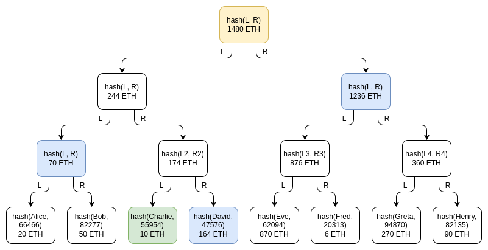
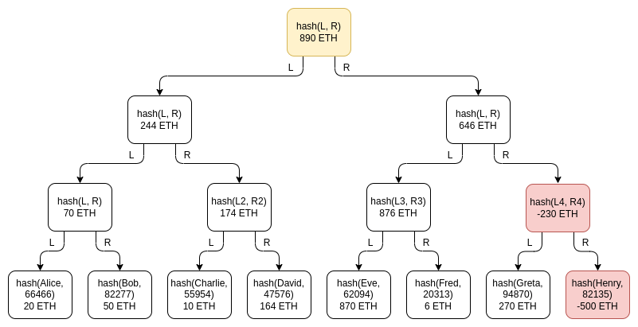

该repository作为本人读书笔记, 记录知识的获取, 以blog的形式记录下来. 该文库我会不断更新, 如果喜欢的话麻烦点一下`star`.

V神的储备证明文章原文[Having a safe CEX: proof of solvency and beyond](https://vitalik.ca/general/2022/11/19/proof_of_solvency.html)

# Having a safe CEX: proof of solvency and beyond

> 历史背景是11月8-11日3天时间FTX的轰然倒塌, V神也对sbf进行了一番“冷嘲热讽”, 随后bn以及各个大型交易所开始与v开展了储备证明的工作, v神随即也发布了储备证明的文章, 以下是本人对认为重要的章节进行选翻.

> The earliest attempts by exchanges to try to cryptographically prove that they are not cheating their users go back quite far. In 2011, then-largest Bitcoin exchange MtGox proved that they had funds by sending [a transaction](https://www.blockchain.com/btc/tx/3a1b9e330d32fef1ee42f8e86420d2be978bbe0dc5862f17da9027cf9e11f8c4) that [moved 424242 BTC](https://en.bitcoin.it/wiki/Mt._Gox#Trading_incidents) to a pre-announced address. In 2013, [discussions started](https://web.archive.org/web/20170106070229/https://people.xiph.org/~greg/bitcoin-wizards-fraud-proof.log.txt) on how to solve the other side of the problem: proving the total size of customers' deposits. If you prove that customers' deposits equal X ("**proof of liabilities**"), and prove ownership of the private keys of X coins ("**proof of assets**"), then you have a **proof of solvency**: you've proven the exchange has the funds to pay back all of its depositors.

:book: 交易所最早的在密码学上向自己的用户证明自己并没有欺骗自己的用可以追溯已久. 在2011年, 当时最大的bitcoin交易所MtGox证明自己持有这些资金的方式是发送一笔转移424242枚btc的交易到先前声明的地址上的方式. 到2013年, 关于如何解决另一方面的问题: 如何证明完整的用户资金的讨论逐渐开始. 如果你证明客户的存款等于X“**负债证明**”), 并证明拥有X个币的私钥(“**资产证明**”), 那么你就有了一个**证明偿付能力**: 您已经证明交易所有资金偿还所有存款人。

> The simplest way to prove deposits is to simply publish a list of `(username, balance)` pairs. Each user can check that their balance is included in the list, and anyone can check the full list to see that (i) every balance is non-negative, and (ii) the total sum is the claimed amount. Of course, this breaks privacy, so we can change the scheme a little bit: publish a list of `(hash(username, salt), balance)` pairs, and send each user privately their [`salt`](https://en.wikipedia.org/wiki/Salt_(cryptography)) value. But even this leaks balances, and it leaks the pattern of changes in balances. The desire to preserve privacy [brings us](https://bitcoin.stackexchange.com/questions/37060/is-there-a-generally-agreed-on-protocol-for-creating-proof-of-solvency) to the [next invention](https://web.archive.org/web/20170114112433/https://iwilcox.me.uk/2014/proving-bitcoin-reserves#merkle_top): **the Merkle tree technique**.

:book: 最简单的证明存款的方式是公布`(username, balance)`的列表对. 任意一个用户可以证明自己的资产是被列入的, 而且任何人可以检查每一个pair是非零的, 并且总量是一个被宣称的数值. 当然这样会打破隐私, 那么我可以做一定编排上的修改: 公布`(hash(username, salt), balance)`列表对, 并且发送给每一用它们私人的`salt`值. 但是尽管如此依然还会泄漏余额, 也会泄漏余额变更的模式. 为了设计一种保留隐私的方案让我们引入新的变革:  **the Merkle tree technique**.

> The Merkle tree technique consists of putting the table of customers' balances into a **Merkle sum tree**. In a Merkle sum tree, each node is a `(balance, hash)` pair. The bottom-layer leaf nodes represent the balances and salted username hashes of individual customers. In each higher-layer node, the balance is the sum of the two balances below, and the hash is the hash of the two nodes below. A Merkle sum proof, like a Merkle proof, is a "branch" of the tree, consisting of the sister nodes along the path from a leaf to the root.

:book: The Merkle tree technique把所有客户的余额放入默克尔的求和数中. 在默克尔求和数, 任何一个节点都是`(balance, hash)`对. 最底层的叶子结点代表了所有用户的用户名和salts的求hash以及余额. 在任何更上层的结点, 余额是下层两个余额的求和, hash是下层两个节点hash组合后求得的hash. 默克尔求和树证明类似于默克尔证明是树的分支, 包含了从叶子结点至根结点的完整路径的姐妹节点.

:bulb: 之后提供了示例代码: **[here](https://github.com/ethereum/research/blob/master/proof_of_solvency/merkle_sum_tree.py)**.

> Privacy leakage in this design is much lower than with a fully public list, and it can be decreased further by shuffling the branches each time a root is published, but some privacy leakage is still there: Charlie learns that *someone* has a balance of 164 ETH, *some* two users have balances that add up to 70 ETH, etc. An attacker that controls many accounts could still potentially learn a significant amount about the exchange's users.

:book: 隐私泄漏在以上方案中已经较一份公开的列表来说已经下降非常多了, 而且还能更显著的下降通过每次发布根时都对分支进行洗牌, 但是一些隐私泄漏依然是存在的: Charlie发现有人的余额为164eth, 以及存在两个用户的余额相加为70eth等等. 控制许多账户的攻击者仍然可以潜在的知道大量用户的余额数目.

> One important subtlety of the scheme is the possibility of *negative* balances: what if an exchange that has 1390 ETH of customer balances but only 890 ETH in reserves tries to make up the difference by adding a -500 ETH balance under a fake account somewhere in the tree? It turns out that this possibility does not break the scheme, though this is the reason why we specifically need a Merkle sum tree and not a regular Merkle tree. Suppose that Henry is the fake account controlled by the exchange, and the exchange puts -500 ETH there:

:book: 一种精巧的编排结构是采用负余额: 如果一个交易所客户的所有资产为1390eth但是只有890eth的准备金, 为了掩盖事实添加一个-500eth的余额在一个虚假账户呢? 这可以实现并且不破坏整体整体的排序, 因此这就是为什么我们采用一种特殊的默克尔求和树而非传统的默克尔树. 如下图所示加入Henry就是交易所控制虚假账并且交易了-500eth在其中:

