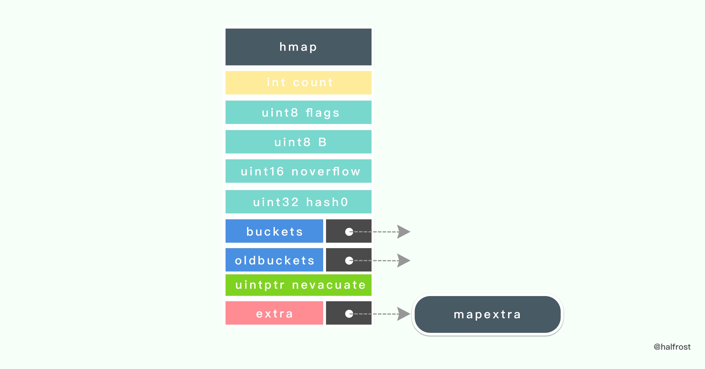
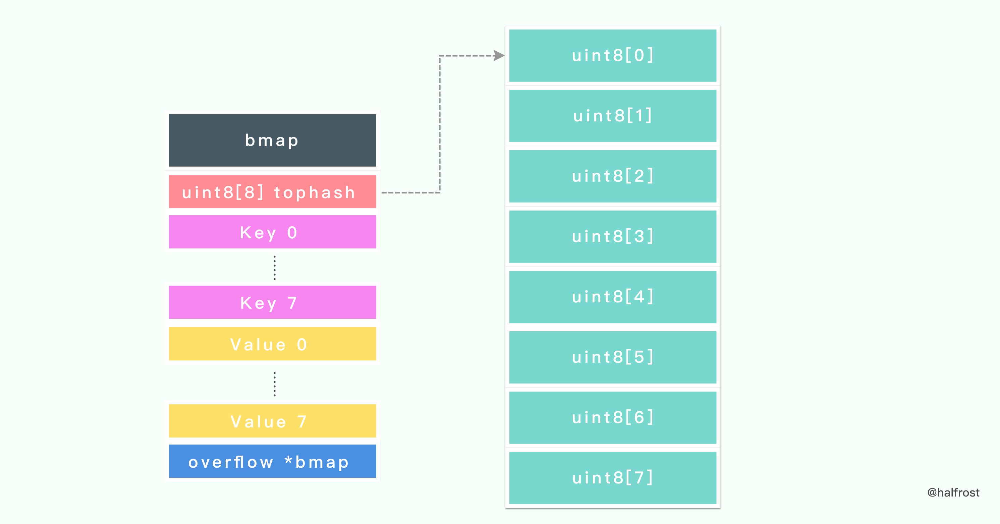
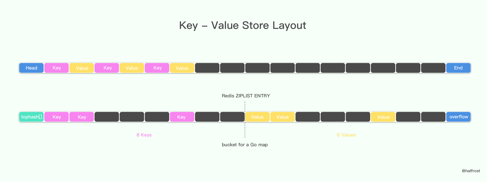
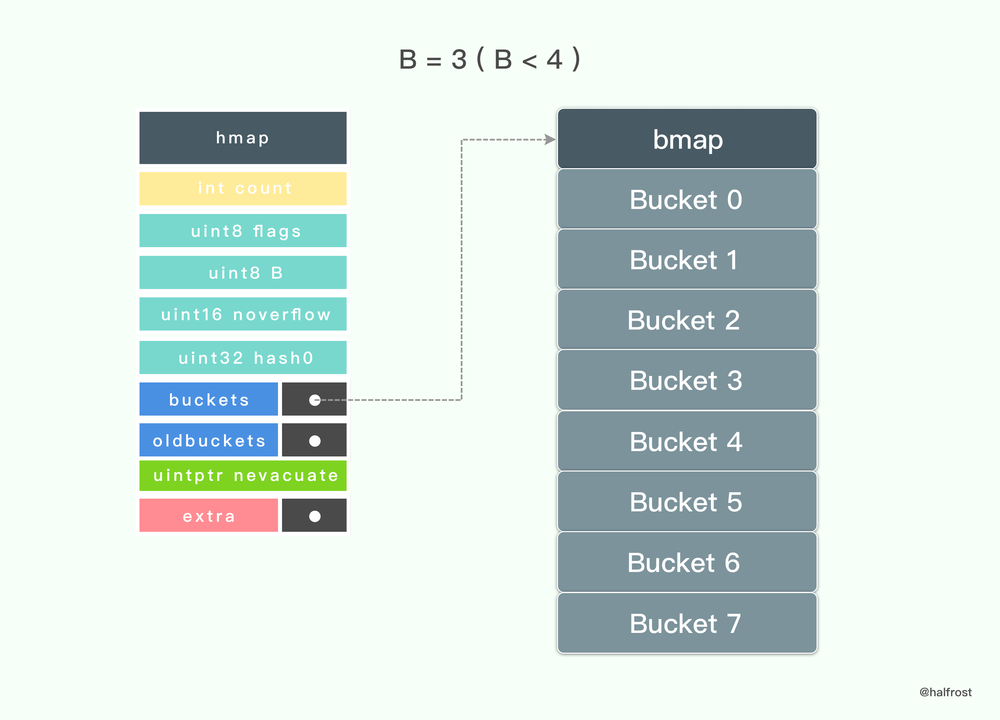
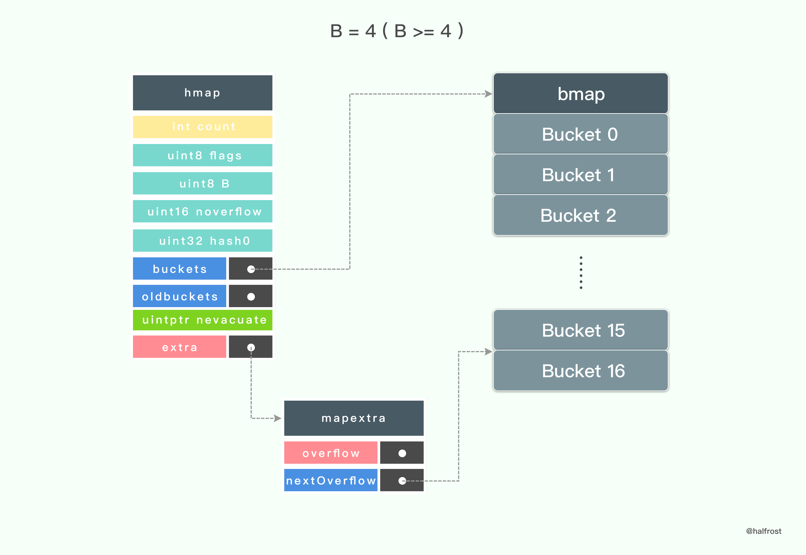
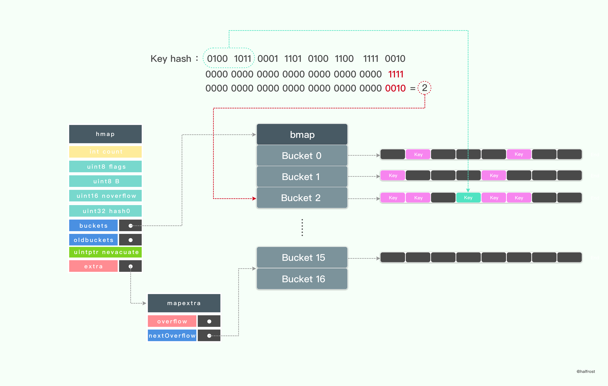
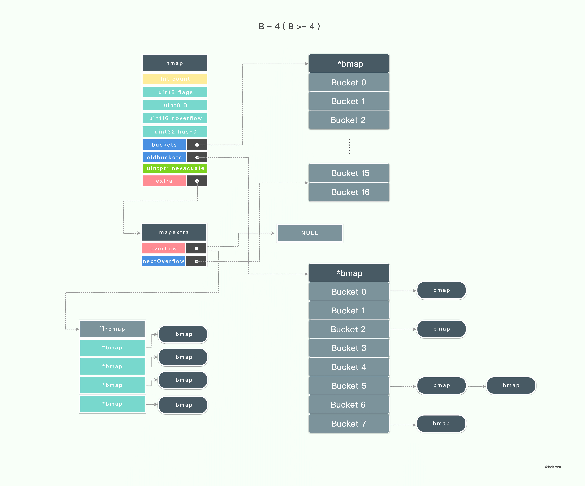
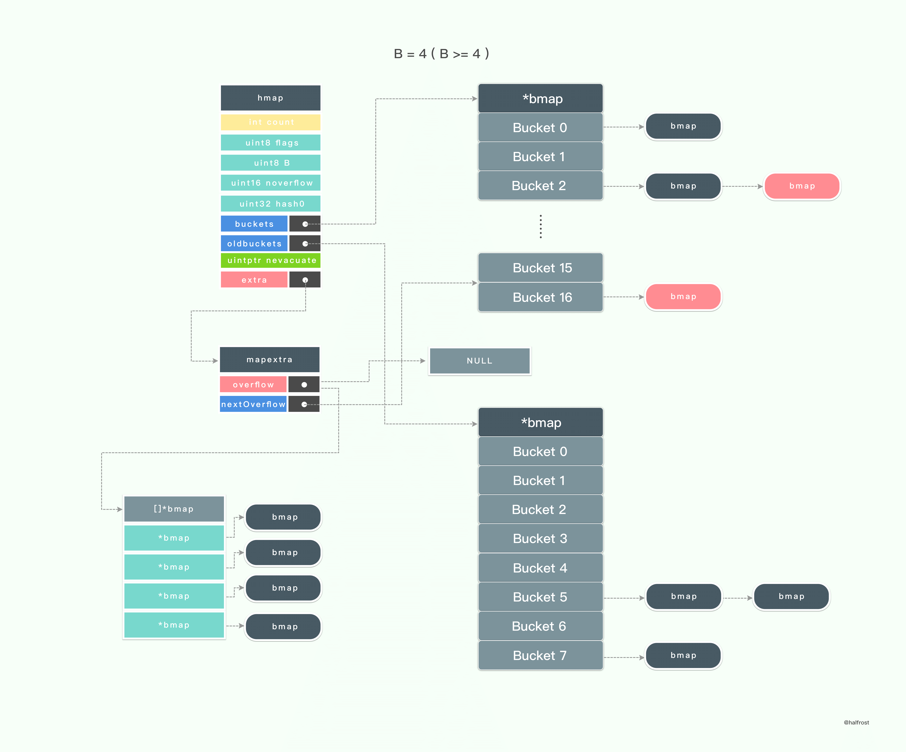
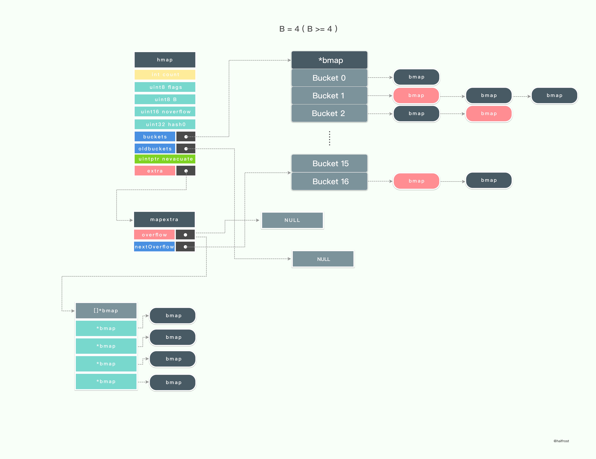

该repository作为本人读书笔记, 记录知识的获取, 以blog的形式记录下来. 该文库我会不断更新, 如果喜欢的话麻烦点一下`star`.
# map分析

## golang的hash算法

在上面分析 Go 的 hash 算法的时候, 我们可以看到它对 CPU 是否支持 AES 指令集进行了判断, 当 CPU 支持 AES 指令集的时候, 它会选用 AES Hash 算法, 当 CPU 不支持 AES 指令集的时候, 换成 memhash 算法. 

AES 指令集全称是**高级加密标准指令集**（或称英特尔**高级加密标准新指令**, 简称**AES-NI**）是一个 [x86](https://zh.wikipedia.org/wiki/X86)[指令集架构](https://zh.wikipedia.org/wiki/指令集架構) 的扩展, 用于 [Intel](https://zh.wikipedia.org/wiki/英特尔) 和 [AMD](https://zh.wikipedia.org/wiki/超威半导体)[微处理器](https://zh.wikipedia.org/wiki/微处理器) . 

利用 AES 实现 Hash 算法性能会很优秀, 因为它能提供硬件加速. 
map结构的策略控制函数:
```go
const (
   // Maximum number of key/elem pairs a bucket can hold.
   bucketCntBits = 3
   bucketCnt     = 1 << bucketCntBits

   // Maximum average load of a bucket that triggers growth is 6.5.
   // Represent as loadFactorNum/loadFactDen, to allow integer math.
   loadFactorNum = 13
   loadFactorDen = 2

   // Maximum key or elem size to keep inline (instead of mallocing per element).
   // Must fit in a uint8.
   // Fast versions cannot handle big elems - the cutoff size for
   // fast versions in cmd/compile/internal/gc/walk.go must be at most this elem.
   maxKeySize  = 128
   maxElemSize = 128

   // data offset should be the size of the bmap struct, but needs to be
   // aligned correctly. For amd64p32 this means 64-bit alignment
   // even though pointers are 32 bit.
   dataOffset = unsafe.Offsetof(struct {
      b bmap
      v int64
   }{}.v)

   // Possible tophash values. We reserve a few possibilities for special marks.
   // Each bucket (including its overflow buckets, if any) will have either all or none of its
   // entries in the evacuated* states (except during the evacuate() method, which only happens
   // during map writes and thus no one else can observe the map during that time).
   emptyRest      = 0 // this cell is empty, and there are no more non-empty cells at higher indexes or overflows.
   emptyOne       = 1 // this cell is empty
   evacuatedX     = 2 // key/elem is valid.  Entry has been evacuated to first half of larger table.
   evacuatedY     = 3 // same as above, but evacuated to second half of larger table.
   evacuatedEmpty = 4 // cell is empty, bucket is evacuated.
   minTopHash     = 5 // minimum tophash for a normal filled cell.

   // flags
   iterator     = 1 // there may be an iterator using buckets
   oldIterator  = 2 // there may be an iterator using oldbuckets
   hashWriting  = 4 // a goroutine is writing to the map
   sameSizeGrow = 8 // the current map growth is to a new map of the same size

   // sentinel bucket ID for iterator checks
   noCheck = 1<<(8*sys.PtrSize) - 1
)
```
loadfactor为map扩容的重要因子, loadfactor取的太大, 那么造成溢出的概率会大大提高, loadfactor取的太小, 那么map数据结构就会浪费太多的存储空间, 6.5取的是一个经验值.

谷歌的测试数据如下:

```go
// Picking loadFactor: too large and we have lots of overflow
// buckets, too small and we waste a lot of space. I wrote
// a simple program to check some stats for different loads:
// (64-bit, 8 byte keys and elems)
//  loadFactor    %overflow  bytes/entry     hitprobe    missprobe
//        4.00         2.13        20.77         3.00         4.00
//        4.50         4.05        17.30         3.25         4.50
//        5.00         6.85        14.77         3.50         5.00
//        5.50        10.55        12.94         3.75         5.50
//        6.00        15.27        11.67         4.00         6.00
//        6.50        20.90        10.79         4.25         6.50
//        7.00        27.14        10.15         4.50         7.00
//        7.50        34.03         9.73         4.75         7.50
//        8.00        41.10         9.40         5.00         8.00
// %overflow   = percentage of buckets which have an overflow bucket
// bytes/entry = overhead bytes used per key/elem pair
// hitprobe    = # of entries to check when looking up a present key
// missprobe   = # of entries to check when looking up an absent key
```

goalng中map的实际数据结构:

```go
// A header for a Go map.
type hmap struct {
   // Note: the format of the hmap is also encoded in cmd/compile/internal/gc/reflect.go.
   // Make sure this stays in sync with the compiler's definition.
   count     int // # live cells == size of map.  Must be first (used by len() builtin)
   flags     uint8
   B         uint8  // log_2 of # of buckets (can hold up to loadFactor * 2^B items)
   noverflow uint16 // approximate number of overflow buckets; see incrnoverflow for details
   hash0     uint32 // hash seed

   buckets    unsafe.Pointer // array of 2^B Buckets. may be nil if count==0.
   oldbuckets unsafe.Pointer // previous bucket array of half the size, non-nil only when growing
   nevacuate  uintptr        // progress counter for evacuation (buckets less than this have been evacuated)

   extra *mapextra // optional fields
}
```



hmap 的最后一个字段是一个指向 mapextra 结构的指针, 它的定义如下：

```go
// mapextra holds fields that are not present on all maps.
type mapextra struct {
   // If both key and elem do not contain pointers and are inline, then we mark bucket
   // type as containing no pointers. This avoids scanning such maps.
   // However, bmap.overflow is a pointer. In order to keep overflow buckets
   // alive, we store pointers to all overflow buckets in hmap.extra.overflow and hmap.extra.oldoverflow.
   // overflow and oldoverflow are only used if key and elem do not contain pointers.
   // overflow contains overflow buckets for hmap.buckets.
   // oldoverflow contains overflow buckets for hmap.oldbuckets.
   // The indirection allows to store a pointer to the slice in hiter.
   overflow    *[]*bmap
   oldoverflow *[]*bmap

   // nextOverflow holds a pointer to a free overflow bucket.
   nextOverflow *bmap
}
```

再看看桶的数据结构的定义, bmap 就是 Go 中 map 里面桶对应的结构体类型. 

```go
type bmap struct {
	tophash [bucketCnt]uint8
}
```

桶的定义, 里面就只是包含了一个 uint8 类型的数组, 数组长度为8分别对应桶内的包含8个元素hash值的高8位. 如果topHash[i] < minTopHash, 那么topHash[i]代表桶的扩容状态.

在 tophash 之后的内存布局里还有2块内容. 紧接着 tophash 之后的是8对 键值 key- value 对. 并且排列方式是 8个 key 和 8个 value 放在一起. 

8对 键值 key- value 对结束以后紧接着一个 overflow 指针, 指向下一个 bmap. 从此也可以看出 Go 中 map是用链表的方式处理 hash 冲突的. 



为何 Go 存储键值对的方式不是普通的 key/value、key/value、key/value……这样存储的呢？它是键 key 都存储在一起, 然后紧接着是 值value 都存储在一起, 为什么会这样呢？



在 Redis 中, 当使用 REDIS_ENCODING_ZIPLIST 编码哈希表时,  程序通过将键和值一同推入压缩列表,  从而形成保存哈希表所需的键-值对结构, 如上图. 新添加的 key-value 对会被添加到压缩列表的表尾. 

这种结构有一个弊端, 如果存储的键和值的类型不同, 在内存中布局中所占字节不同的话, 就需要对齐. 比如说存储一个 map[int64]int8 类型的字典. 

Go 为了节约内存对齐的内存消耗, 于是把它设计成上图所示那样. 

如果 map 里面存储了上万亿的大数据, 这里节约出来的内存空间还是比较可观的. 

从上述代码里面可以看出, 只有当 B >=4 的时候, makeBucketArray 才会生成 nextOverflow 指针指向 bmap, 从而在 Map 生成 hmap 的时候才会生成 mapextra . 

当 B = 3 ( B < 4 ) 的时候, 初始化 hmap 只会生成8个桶. 



当 B = 4 ( B >= 4 ) 的时候, 初始化 hmap 的时候还会额外生成 mapextra , 并初始化 nextOverflow. mapextra 的 nextOverflow 指针会指向第16个桶结束, 第17个桶的首地址(nextOverflow指向2^B+1的地址). 第17个桶（从0开始, 也就是下标为16的桶）的 bucketsize - sys.PtrSize 地址开始存一个指针, 这个指针指向当前整个桶的首地址, 指针地址(指向2^B + 2^(B-4) + bucketsize - sys.PtrSize). extra.overflow存放所有溢出桶的"overflow溢出桶"地址.



### 查找key



key计算hash得到keyhash(第一行), 与bucketmask(取余)得到key所在bucket位置, 然后通过比较key值找到正确的kv对, 如果未找到则返回该map对象的零结构体.

**hash 的低 B 位决定了桶数组里面的第几个桶, hash 值的高8位决定了这个桶数组 bmap 里面 key 存在 tophash 数组的第几位了**. 如上图, hash 的高8位用来和 tophash 数组里面的每个值进行对比, 如果高8位和 tophash[i] 不等, 就直接比下一个. 如果相等, 则取出 bmap 里面对应完整的 key, 再比较一次, 看是否完全一致. 

### 插入key

插入key与查找key类似地方在于都会对输入的key求key hash, 之后依据key hash去匹配各个桶中的数据. 插入key比起查找key还多了一部插入的操作, 如此就要分为以下情况:

情况一: 在原有桶内匹配到相同的key值, 这时只需要将输入的value值更新桶中对应old value即可.
情况二: 在原有桶内未匹配到相同的key值, 这时要进行插入操作, 但是该操作会引入两种可能:**  1. new key hash对应的桶, 桶内数据全满, 也就是桶溢出;  2. 由于map增加了一element引发了map的下一次扩容操作**. 这两种可能发生的先后逻辑顺序满足以下可能:

  可能一: 插入新值, 即未导致桶溢出, 也未导致map的扩容, 那么new key以及new key的tophash将会正常的存储在所在的bucket上面
  可能二: 插入新值, 导致桶溢出, 未触发map扩容, 这时候会检查map中是否存在extra.nextOverflow(仅在B>=4的情况下存在), 以及nextOverflow是否被未被用完, 如果两者皆为true, 那么会从extra.nextOverflow中取出一个当前bmap作为前一个溢出桶的overflow地址(实现一种链表连接), 并且在链接形成前extra.nextOverflow列表也将更新, 指向下一个未被分配的桶; 如果两者有一个为false, 那么会生成一个全新bmap作为前一个桶的溢出桶, 并且new key以及new value将存储在这个new bucket上面, 以及new key的tophash
  可能三: 无论插入新值是否造成桶溢出, 但由于map多加了一个element引发map扩容, 这时map会先完成扩容操作后, 重新做一次key查找的操作, 然后进入new key是否在溢出桶的判断, 分别进入可能一与可能二的逻辑.

> 在扩容过程中, oldbucket是被冻结的, 查找 key 时会在oldbucket 中查找, 但不会在oldbucket 中插入数据. 如果在oldbucket 是找到了相应的key, 做法是将它迁移到新 bmap 后加入 evalucated 标记. 

### 删除key

删除key与查找key的操作相类似, 与插入key相对应, map容量-1并不会造成map的缩容, 因此在在逻辑上相对简单不少. 唯一需要注意的地方是, 如果删除的key的cell(kv pair)在bucket桶(包括其后的溢出桶)中为最后一个非空cell, 那么该cell的tophash要置为emptyRest, 并且要前向蔓延, 使所有空cell都置为emptyRest, emptyRest标志位的含义:

```go
emptyRest      = 0 // this cell is empty, and there are no more non-empty cells at higher indexes or overflows.
```

实现以上刷新标志位操作的核心代码:

```go
// If the bucket now ends in a bunch of emptyOne states,
// change those to emptyRest states.
// It would be nice to make this a separate function, but
// for loops are not currently inlineable.
if i == bucketCnt-1 {
   if b.overflow(t) != nil && b.overflow(t).tophash[0] != emptyRest {
      goto notLast
   }
} else {
   if b.tophash[i+1] != emptyRest {
      goto notLast
   }
}
for {
   b.tophash[i] = emptyRest
   if i == 0 {
      if b == bOrig {
         break // beginning of initial bucket, we're done.
      }
      // Find previous bucket, continue at its last entry.
      c := b
      for b = bOrig; b.overflow(t) != c; b = b.overflow(t) {
      }
      i = bucketCnt - 1
   } else {
      i--
   }
   if b.tophash[i] != emptyOne {
      break
   }
}
```

### 翻倍增量扩容

>这部分算是整个 Map 实现比较核心的部分了. 我们都知道 Map 在不断的装载 Key 值的时候, 查找效率会变的越来越低, 如果此时不进行扩容操作的话, 哈希冲突使得链表变得越来越长, 性能也就越来越差. 扩容势在必行. 
在插入 Key 值的时候, 如果当前在扩容过程中, oldbucket 是被冻结的, 查找时会先在 oldbucket 中查找, 但不会在oldbucket中插入数据. 只有在 oldbucket 找到了相应的 key, 那么将它迁移到新 bucket 后加入 evalucated 标记. 
在删除 Key 值的时候, 如果当前在扩容过程中, 优先查找 bucket, 即新桶, 找到一个以后把它对应的 Key、Value 都置空. 如果 bucket 里面找不到, 才会去 oldbucket 中去查找

每次插入 Key 值的时候, 都会判断一下当前装载因子是否超过了 6.5, 如果达到了这个极限, 就立即执行扩容操作 hashGrow. 这是扩容之前的准备工作. 由**hashGrow**函数完成:



该函数主要实现了扩容过去bucket的数量, 将old hmap的buckets对象放入new hmap对象的oldbuckets中, 将old hamp下的extra对象的overflow[0]放入new hmap下的extra对象overflow[1] (在最新的go1.13中, 改为" 将old hamp下的extra对象的overflow放入new hmap下的extra对象的oldoverflow"), 将new hmap的nevacuate对象置为0, 后续扩容操作会使用到. 

> 实际迁移桶内数据的操作会在**evacuate**函数中进行.

执行map扩容的函数正是**evacuate**函数, 而该函数的调用仅在**growWork**函数中:

```go
func growWork(t *maptype, h *hmap, bucket uintptr) {
   // make sure we evacuate the oldbucket corresponding
   // to the bucket we're about to use
   evacuate(t, h, bucket&h.oldbucketmask())

   // evacuate one more oldbucket to make progress on growing
   if h.growing() {
      evacuate(t, h, h.nevacuate)
   }
}
```

从这里我们可以看到, 每次执行一次 growWork 会迁移2个桶. 一个是当前的桶, 这算是局部迁移, 另外一个是 hmap 里面指向的 nevacuate 的桶, 这算是增量迁移. 

> 扩容过程中如果一次性执行全部桶的扩容操作, 会阻断 Key 值的写入, 在处理大数据的时候会导致有一段不响应的时间, 如果用在高实时的系统中, 那么每次扩容都会卡几秒, 这段时间都不能相应任何请求. 这种性能明显是不能接受的. 所以要既不影响写入, 也同时要进行扩容. 这个时候就应该增量扩容了. 这里增量扩容其实用途已经很广泛了, 之前举例的 Redis 就采用的增量扩容策略. 

**evacuate**函数具体实现:

```go
func evacuate(t *maptype, h *hmap, oldbucket uintptr) {
   b := (*bmap)(add(h.oldbuckets, oldbucket*uintptr(t.bucketsize)))
   newbit := h.noldbuckets()
   if !evacuated(b) {
      // TODO: reuse overflow buckets instead of using new ones, if there
      // is no iterator using the old buckets.  (If !oldIterator.)

      // xy contains the x and y (low and high) evacuation destinations.
      var xy [2]evacDst
      x := &xy[0]
      x.b = (*bmap)(add(h.buckets, oldbucket*uintptr(t.bucketsize)))
      x.k = add(unsafe.Pointer(x.b), dataOffset)
      x.e = add(x.k, bucketCnt*uintptr(t.keysize))

      if !h.sameSizeGrow() {
         // Only calculate y pointers if we're growing bigger.
         // Otherwise GC can see bad pointers.
         y := &xy[1]
         y.b = (*bmap)(add(h.buckets, (oldbucket+newbit)*uintptr(t.bucketsize)))
         y.k = add(unsafe.Pointer(y.b), dataOffset)
         y.e = add(y.k, bucketCnt*uintptr(t.keysize))
      }

      for ; b != nil; b = b.overflow(t) {
         k := add(unsafe.Pointer(b), dataOffset)
         e := add(k, bucketCnt*uintptr(t.keysize))
         for i := 0; i < bucketCnt; i, k, e = i+1, add(k, uintptr(t.keysize)), add(e, uintptr(t.elemsize)) {
            top := b.tophash[i]
            if isEmpty(top) {
               b.tophash[i] = evacuatedEmpty
               continue
            }
            if top < minTopHash {
               throw("bad map state")
            }
            k2 := k
            if t.indirectkey() {
               k2 = *((*unsafe.Pointer)(k2))
            }
            var useY uint8
            if !h.sameSizeGrow() {
               // Compute hash to make our evacuation decision (whether we need
               // to send this key/elem to bucket x or bucket y).
               hash := t.key.alg.hash(k2, uintptr(h.hash0))
               if h.flags&iterator != 0 && !t.reflexivekey() && !t.key.alg.equal(k2, k2) {
                  // If key != key (NaNs), then the hash could be (and probably
                  // will be) entirely different from the old hash. Moreover,
                  // it isn't reproducible. Reproducibility is required in the
                  // presence of iterators, as our evacuation decision must
                  // match whatever decision the iterator made.
                  // Fortunately, we have the freedom to send these keys either
                  // way. Also, tophash is meaningless for these kinds of keys.
                  // We let the low bit of tophash drive the evacuation decision.
                  // We recompute a new random tophash for the next level so
                  // these keys will get evenly distributed across all buckets
                  // after multiple grows.
                  useY = top & 1
                  top = tophash(hash)
               } else {
                  if hash&newbit != 0 {
                     useY = 1
                  }
               }
            }

            if evacuatedX+1 != evacuatedY || evacuatedX^1 != evacuatedY {
               throw("bad evacuatedN")
            }

            b.tophash[i] = evacuatedX + useY // evacuatedX + 1 == evacuatedY
            dst := &xy[useY]                 // evacuation destination

            if dst.i == bucketCnt {
               dst.b = h.newoverflow(t, dst.b)
               dst.i = 0
               dst.k = add(unsafe.Pointer(dst.b), dataOffset)
               dst.e = add(dst.k, bucketCnt*uintptr(t.keysize))
            }
            dst.b.tophash[dst.i&(bucketCnt-1)] = top // mask dst.i as an optimization, to avoid a bounds check
            if t.indirectkey() {
               *(*unsafe.Pointer)(dst.k) = k2 // copy pointer
            } else {
               typedmemmove(t.key, dst.k, k) // copy elem
            }
            if t.indirectelem() {
               *(*unsafe.Pointer)(dst.e) = *(*unsafe.Pointer)(e)
            } else {
               typedmemmove(t.elem, dst.e, e)
            }
            dst.i++
            // These updates might push these pointers past the end of the
            // key or elem arrays.  That's ok, as we have the overflow pointer
            // at the end of the bucket to protect against pointing past the
            // end of the bucket.
            dst.k = add(dst.k, uintptr(t.keysize))
            dst.e = add(dst.e, uintptr(t.elemsize))
         }
      }
      // Unlink the overflow buckets & clear key/elem to help GC.
      if h.flags&oldIterator == 0 && t.bucket.ptrdata != 0 {
         b := add(h.oldbuckets, oldbucket*uintptr(t.bucketsize))
         // Preserve b.tophash because the evacuation
         // state is maintained there.
         ptr := add(b, dataOffset)
         n := uintptr(t.bucketsize) - dataOffset
         memclrHasPointers(ptr, n)
      }
   }

   if oldbucket == h.nevacuate {
      advanceEvacuationMark(h, t, newbit)
   }
}
```

代码本质是将old bucket中的elems在新桶和旧桶(**evacDst**结构体, x代表旧桶: 低位桶, y代表新桶: 高位桶)内重新分配, 其中有几个if判断, 分别代表:

可能一: 扩容后新桶或旧桶溢出了, 需要再进行溢出桶的操作  <u>if dst.i == bucketCnt</u>
可能二: 扩容后oldbucket与增量扩容桶序号一直, 进入**advanceEvacuationMark**函数  <u>if oldbucket == h.nevacuate</u>

**advanceEvacuationMark**函数会判断当前的扩容桶序号的正确位置, 如果当该序号指向old buckets的最后一个桶, 说明扩容完成, **最后会将old buckets以及extra下的oldoverflow均置为nil**



图示显示扩容过后, old buckets向new buckets迁移, 并且new buckets也不断有新的key填入



图示为迁移工作完全完成后后, 将old buckets以及extra下的oldoverflow均置为nil, 该操作在上文**advanceEvacuationMark**函数完成

### 等量扩容

> 严格意义上这种方式并不能算是扩容. 但是函数名是 Grow, 姑且暂时就这么叫吧. 在 go1.8 的版本开始, 添加了 sameSizeGrow, **当 overflow buckets的数量超过一定数量 (2^B) 但装载因子又未达到 6.5 的时候**, 此时可能存在部分空的bucket, 即 bucket 的使用率低, 这时会触发sameSizeGrow, 即 B 不变, 但走数据迁移流程, 将 oldbuckets 的数据重新紧凑排列提高 bucket 的利用率. 当然在 sameSizeGrow 过程中, 不会触发 loadFactorGrow. 

## Map 实现中的一些优化

>* 在 Redis 中, 采用增量式扩容的方式处理哈希冲突. 当平均查找长度超过 5 的时候就会触发增量扩容操作, 保证 hash 表的高性能. 同时 Redis 采用头插法, 保证插入 key 值时候的性能. 
>* 在 Java 中, **当桶的个数超过了64个以后, 并且冲突节点为8或者大于8, 这个时候就会触发红黑树转换**. 这样能保证链表在很长的情况下, 查找长度依旧不会太长, 并且红黑树保证最差情况下也支持 O(log n) 的时间复杂度.  Java 在迁移之后有一个非常好的设计, **只需要比较迁移之后桶个数的最高位是否为0, 如果是0, key在新桶内的相对位置不变, 如果是1, 则加上桶的旧的桶的个数oldCap就可以得到新的位置**. 
> 
>*  在 Go 中优化的点比较多:
>  1. 哈希算法选用高效的 memhash 算法 和 CPU AES指令集. AES 指令集充分利用 CPU 硬件特性, 计算哈希值的效率超高. 
>  2. key - value 的排列设计成 key 放在一起, value 放在一起, 而不是key, value成对排列. 这样方便内存对齐, 数据量大了以后节约内存对齐造成的一些浪费.  
>  3. key, value 的内存大小超过128字节以后自动转成存储一个指针.  
>  4. tophash 数组的设计加速了 key 的查找过程. tophash 也被复用, 用来标记扩容操作时候的状态. 
>  5. 用位运算转换求余操作, m % n , 当 n = 1 << B 的时候, 可以转换成 m & (1 << B - 1) . 
>  6. 增量式扩容. 
>  7. 等量扩容, 紧凑操作. 
>* 当然 Go 中还有一些需要再优化的地方：
>
>  1. 在迁移的过程中, 当前版本不会重用 overflow 桶, 而是直接重新申请一个新的桶. 这里可以优化成优先重用没有指针指向的 overflow 桶, 当没有可用的了, 再去申请一个新的. 这一点作者已经写在了 TODO 里面了. 
>  2. 动态合并多个 empty 的桶. 
>  3. 当前版本中没有 shrink 操作, Map 只能增长而不能收缩. 这块 Redis 有相关的实现. 