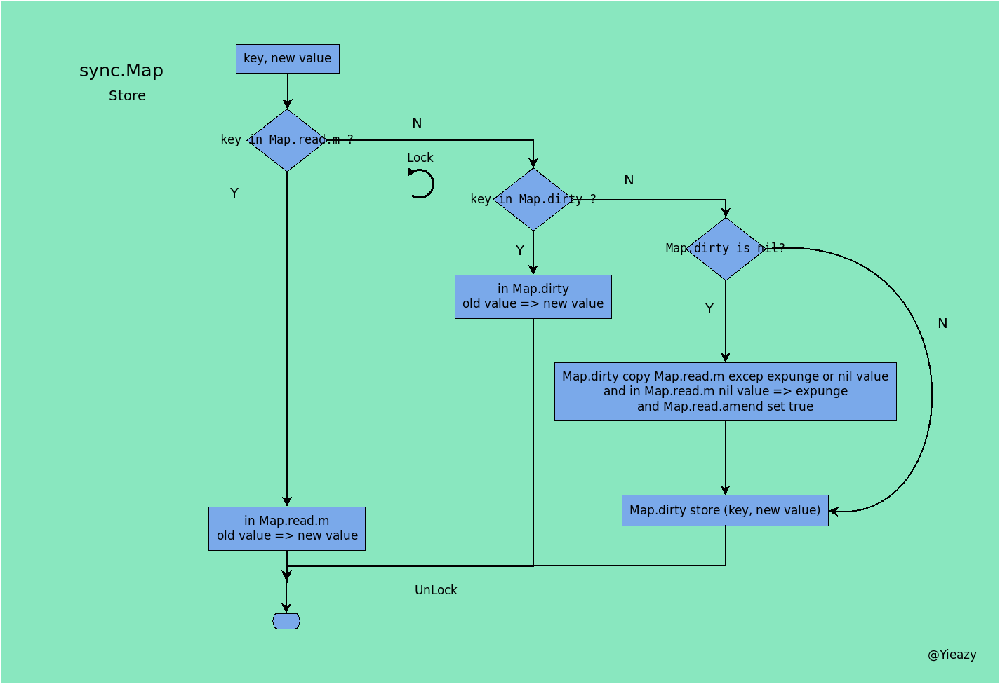

该repository作为本人读书笔记, 记录知识的获取, 以blog的形式记录下来. 该文库我会不断更新, 如果喜欢的话麻烦点一下`star`.
# map线程安全

ps. 测试环境:

```
Linux yieazy 4.15.0-66-generic #75-Ubuntu SMP Tue Oct 1 05:24:09 UTC 2019 x86_64 x86_64 x86_64 GNU/Linux
ubuntu18.04
go version: 1.13.4
cpu: Intel(R) Core(TM) i5-8500 CPU @ 3.00GHz
memory: 16GB
```

### 什么是线程安全?

> 线程安全就是如果你的代码块所在的进程中有多个线程在同时运行, 而这些线程可能会同时运行这段代码. 如果每次运行结果和单线程运行的结果是一样的, 而且其他的变量的值也和预期的是一样的, 就是线程安全的. 

线程死锁的产生原因有以下几种：

- 1.系统资源竞争
- 2.进程推荐顺序非法
- 3.死锁必要条件（必要条件中任意一个不满足, 死锁都不会发生） (1). 互斥条件 (2). 不剥夺条件 (3). 请求和保持条件 (4). 循环等待条件

想避免线程死锁的情况发生有以下几种方法可以解决：

- 1.预防死锁 (1). 资源有序分配法（破坏环路等待条件） (2). 资源原子分配法（破坏请求和保持条件）
- 2.避免死锁 银行家算法
- 3.检测死锁 死锁定理（资源分配图化简法）, 这种方法虽然可以检测, 但是无法预防, 检测出来了死锁还需要配合解除死锁的方法才行. 

彻底解决死锁有以下几种方法：

- 1.剥夺资源
- 2.撤销进程
- 3.试锁定 — 回退 如果在执行一个代码块的时候, 需要先后（顺序不定）锁定两个变量, 那么在成功锁定其中一个互斥量之后应该使用试锁定的方法来锁定另外一个变量. 如果试锁定第二个互斥量失败, 就把已经锁定的第一个互斥量解锁, 并重新对这两个互斥量进行锁定和试锁定. 


如上图, 线程2在锁定互斥量 B 的时候, 再试锁定互斥量 A, 此时锁定失败, 于是就把互斥量 B 也一起解锁. 接着线程1会来锁定互斥量 A. 此时也不会出现死锁的情况. 

- 4.固定顺序锁定


这种方式就是让线程1和线程2都按照相同的顺序锁定互斥量, 都按成功锁定互斥量1以后才能去锁定互斥量2 . 这样就能保证在一个线程完全离开这些重叠的临界区之前, 不会有其他同样需要锁定那些互斥量的线程进入到那里. 


这种方式就是让线程1和线程2都按照相同的顺序锁定互斥量, 都按成功锁定互斥量1以后才能去锁定互斥量2 . 这样就能保证在一个线程完全离开这些重叠的临界区之前, 不会有其他同样需要锁定那些互斥量的线程进入到那里. 

> 在语言原生就自带线程安全 Map 的语言中, 它们的原生底层实现都不是通过单纯的加锁来实现线程安全的, 比如 Java 的 ConcurrentHashMap, Go 1.9 新加的 sync.map. 

## 现代线程安全的 Lock - Free 方案 CAS

比较并交换即 “Compare And Swap”, 简称 CAS. 


> CAS 会先判断参数 addr 指向的被操作值与参数 old 的值是否相等. 如果相当, 相应的函数才会用参数 new 代表的新值替换旧值. 否则, 替换操作就会被忽略. 
> 这一点与互斥锁明显不同, CAS 总是假设被操作的值未曾改变, 并一旦确认这个假设成立, 就立即进行值的替换. 而互斥锁的做法就更加谨慎, 总是先假设会有并发的操作修改被操作的值, 并需要使用锁将相关操作放入临界区中加以保护. 可以说互斥锁的做法趋于悲观, CAS 的做法趋于乐观, 类似乐观锁. 

CAS提供了cpu层的指令, 以64位为例参看汇编源码:

```
TEXT ·CompareAndSwapUintptr(SB),NOSPLIT,$0-25
	JMP	·CompareAndSwapUint64(SB)

TEXT ·CompareAndSwapInt64(SB),NOSPLIT,$0-25
	JMP	·CompareAndSwapUint64(SB)

TEXT ·CompareAndSwapUint64(SB),NOSPLIT,$0-25
	MOVQ	addr+0(FP), BP
	MOVQ	old+8(FP), AX
	MOVQ	new+16(FP), CX
	LOCK
	CMPXCHGQ	CX, 0(BP)
	SETEQ	swapped+24(FP)
	RET
```

上述实现最关键的一步就是 CMPXCHG, 在intel文档中给出了CMPXCHG操作的解释:


中文描述: 比较 [_old, AX] 和 [(*__ptr) , *BP]的值, 如果相同, ZF 标志被设置, 同时[_new, CX] 的值被写到[(*__ptr) , *BP], 否则, 清 ZF 标志, 并且把[(*__ptr) , *BP]的值写回[_old, AX]. 

Intel 的手册对 LOCK 前缀的说明如下：

- 1.确保对内存的读-改-写操作原子执行. 在 Pentium 及 Pentium 之前的处理器中, 带有 LOCK 前缀的指令在执行期间会锁住总线, 使得其他处理器暂时无法通过总线访问内存. 很显然, 这会带来昂贵的开销. 从 Pentium 4, Intel Xeon 及 P6 处理器开始, Intel 在原有总线锁的基础上做了一个很有意义的优化：**如果要访问的内存区域（area of memory）在 LOCK 前缀指令执行期间已经在处理器内部的缓存中被锁定（即包含该内存区域的缓存行当前处于独占或以修改状态）**, 并且该内存区域被完全包含在单个缓存行（cache line）中, 那么处理器将直接执行该指令. **由于在指令执行期间该缓存行会一直被锁定, 其它处理器无法读/写该指令要访问的内存区域, 因此能保证指令执行的原子性. 这个操作过程叫做缓存锁定（cache locking）**, 缓存锁定将大大降低 LOCK 前缀指令的执行开销, 但是当多处理器之间的竞争程度很高或者指令访问的内存地址未对齐时, 仍然会锁住总线. 
- 2.禁止该指令与之前和之后的读和写指令重排序. 
- 3.把写缓冲区中的所有数据刷新到内存中. 

### 总线锁


> 所谓总线锁就是使用 CPU 提供的一个LOCK＃信号, 当一个处理器在总线上输出此信号时, 其他处理器的请求将被阻塞住, 那么该 CPU 可以独占使用共享内存. 总线锁的这种方式, 在执行期间会锁住总线, 使得其他处理器暂时无法通过总线访问内存. 所以总线锁定的开销比较大, 最新的处理器在某些场合下使用缓存锁定代替总线锁定来进行优化. 

### 缓存锁


> 所谓缓存锁定就是如果缓存在处理器缓存行中内存区域在 LOCK 操作期间被锁定, 当它执行锁操作回写内存时, 处理器不在总线上产生LOCK＃信号, 而是修改内部的内存地址, 并允许它的缓存一致性机制来保证操作的原子性, 因为缓存一致性机制会阻止同时修改被两个以上处理器缓存的内存区域数据, 当其他处理器回写已被锁定的缓存行的数据时会对缓存行无效. 
> 虽然缓存锁可以大大降低 CPU 锁的执行开销, 但是如果遇到多处理器之间的竞争程度很高或者指令访问的内存地址未对齐时, 仍然会锁住总线. 所以缓存锁和总线锁相互配合, 效果更佳. 

## CAS的缺陷

### 1. ABA问题


> 线程1准备用 CAS 将变量的值由 A 替换为 B , 在此之前, 线程2将变量的值由 A 替换为 C , 又由 C 替换为 A, 然后线程1执行 CAS 时发现变量的值仍然为 A, 所以 CAS 成功. 但实际上这时的现场已经和最初不同了. 图上也为了分开两个 A 不同, 所以用不同的颜色标记了. 最终线程2把 A 替换成了 B . 这就是经典的 ABA 问题. 但是这会导致项目出现什么问题呢？


> 设想存在这样一个链栈, 栈里面存储了一个链表, 栈顶是 A, A 的 next 指针指向 B. 在线程1中, 要将栈顶元素 A 用 CAS 把它替换成 B. 接着线程2来了, 线程2将之前包含 A, B 元素的链表都 pop 出去. 然后 push 进来一个 A - C - D 链表, 栈顶元素依旧是 A. 这时线程1发现 A 没有发生变化, 于是替换成 B. 这个时候 B 的 next 其实为 nil. 替换完成以后, 线程2操作的链表 C - D 这里就与表头断开连接了. 也就是说线程1 CAS 操作结束, C - D 就被丢失了, 再也找不回来了. 栈中只剩下 B 一个元素了. 这很明显出现了 bug. 
>
> 那怎么解决这种情况呢？最通用的做法就是加入版本号进行标识. 


> 每次操作都加上版本号, 这样就可以完美解决 ABA 的问题了

<u>第三章图原作者对于最后一个栈的描述可能有误, 最后一个栈的动作结合cas比较并交换的原理, 应该是替换原有[2, A]-[2, B]-[2, C]修改为仅留[1, B], ABA问题也揭示了CAS比较的不应该是单纯的值而应该是版本, 避免此值非彼值的问题!</u>

### 2. 循环时间可能过长


> 自旋 CAS 如果长时间不成功, 会给 CPU 带来非常大的执行开销. 如果能支持 CPU 提供的 Pause 指令, 那么 CAS 的效率能有一定的提升. Pause 指令有两个作用, 第一它可以延迟流水线执行指令（de-pipeline）, 使 CPU 不会消耗过多的执行资源, 延迟的时间取决于具体实现的版本, 在一些处理器上延迟时间是零. 第二它可以避免在退出循环的时候因内存顺序冲突（memory order violation）而引起 CPU 流水线被清空（CPU pipeline flush）, 从而提高 CPU 的执行效率. 

### 3. 只能保证一个共享变量的原子操作

> CAS 操作只能保证一个共享变量的原子操作, 但是保证多个共享变量操作的原子性. 一般做法可能就考虑利用锁了. 
>
> 不过也可以利用一个结构体, 把两个变量合并成一个变量. 这样还可以继续利用 CAS 来保证原子性操作. 


## 分段锁的方案, 一种non lock-free方案

创建一个带锁的结构体, 为了分开读写选择使用读写锁

```go
type SegMaps []SegmentMap

type SegmentMap struct {
   data      map[string]interface{}
   sync.RWMutex
}
```

创建slice的方案:

```go
func CreateSegMaps(num int) SegMaps {
   maps := make(SegMaps, num)
   for n, _ := range maps {
      maps[n].data = make(map[string]interface{})
   }
   return maps
}
```

键值在maps上散列分布的方案:

```go
const (
   u64c = 12200160415121876738
)

func hashUint64(m string) (hash uint64) {
   for i := 0; i < len(m) / 8; i++ {
      n := u64c ^ binary.BigEndian.Uint64([]byte(m[i*8:i*8+7]))
      hash ^= n
   }
   return
}

func (maps SegMaps) findSegmentU64(m string) SegmentMap {
   return maps[hashUint64(m) % uint64(len(maps))]
}
```

u64c为斐波那契数列中, 最大的64bit数, 采用与u64c亦或取余的方式确定该键所在map位置. 然后是get set操作:

```go
func (maps SegMaps) Get(key string) (interface{}, bool) {
   s := maps.findSegmentU64(key)
   return s.getValue(key)
}

func (maps SegMaps) Set(key string, v interface{}) {
   s := maps.findSegmentU64(key)
   s.setValue(key, v)
}
```

最后是取出所有maps中键值:

```go
func (maps SegMaps) GetAllKeys() (sts []string) {
   ch := make(chan string, len(maps))
   wg := sync.WaitGroup{}
   wg.Add(len(maps))
   for _, s :=range maps {
      go func(s SegmentMap) {
         s.RLock()
         for km := range s.data {
            ch <- km
         }
         s.RUnlock()
         wg.Done()
      }(s)
   }
   wg.Wait()
   close(ch)

   for s := range ch {
      sts = append(sts, s)
   }
   return
}
```

测试用例函数:

```go
func BenchmarkSegmentMapSet(b *testing.B) {
   maps := segment.CreateSegMaps(32)
   var (
      wg sync.WaitGroup
      begain = make(chan struct{})
   )

   benchFunc := func() {
      <- begain
      for idx := 0; idx < 100000; idx++ {
         maps.Set(strconv.Itoa(idx), idx)
      }
      wg.Done()
   }
   wg.Add(1)
   go benchFunc()
   b.StartTimer()
   close(begain)
   wg.Wait()
}
```

输入测试命令:

```shell
go test -v -bench=. segmentMap_test.go
```

输出结果:

```
goos: linux
goarch: amd64
BenchmarkSegmentMapSet-6   	1000000000	         0.0320 ns/op
PASS
ok  	command-line-arguments	0.239s
```

完整的代码与基准测试代码, [github](https://github.com/Pencil-Yao/golang-lab)

### Lock - Free 方案

golang中sync.map也同样采用该方案, sync.map的struct如下图所示:


官方在源代码中也提供了很多说明性的解释, 在go源码src/sync/map.go目录下, 由于篇幅过长不在此引述. sync.Map所具有的性质我们通过他的结构体定义, 基本可以了解他线程安全背后的原因:

```go
// Map is like a Go map[interface{}]interface{} but is safe for concurrent use
// by multiple goroutines without additional locking or coordination.
// Loads, stores, and deletes run in amortized constant time.
//
// The Map type is specialized. Most code should use a plain Go map instead,
// with separate locking or coordination, for better type safety and to make it
// easier to maintain other invariants along with the map content.
//
// The Map type is optimized for two common use cases: (1) when the entry for a given
// key is only ever written once but read many times, as in caches that only grow,
// or (2) when multiple goroutines read, write, and overwrite entries for disjoint
// sets of keys. In these two cases, use of a Map may significantly reduce lock
// contention compared to a Go map paired with a separate Mutex or RWMutex.
//
// The zero Map is empty and ready for use. A Map must not be copied after first use.
type Map struct {
   mu Mutex

   // read contains the portion of the map's contents that are safe for
   // concurrent access (with or without mu held).
   //
   // The read field itself is always safe to load, but must only be stored with
   // mu held.
   //
   // Entries stored in read may be updated concurrently without mu, but updating
   // a previously-expunged entry requires that the entry be copied to the dirty
   // map and unexpunged with mu held.
   read atomic.Value // readOnly

   // dirty contains the portion of the map's contents that require mu to be
   // held. To ensure that the dirty map can be promoted to the read map quickly,
   // it also includes all of the non-expunged entries in the read map.
   //
   // Expunged entries are not stored in the dirty map. An expunged entry in the
   // clean map must be unexpunged and added to the dirty map before a new value
   // can be stored to it.
   //
   // If the dirty map is nil, the next write to the map will initialize it by
   // making a shallow copy of the clean map, omitting stale entries.
   dirty map[interface{}]*entry

   // misses counts the number of loads since the read map was last updated that
   // needed to lock mu to determine whether the key was present.
   //
   // Once enough misses have occurred to cover the cost of copying the dirty
   // map, the dirty map will be promoted to the read map (in the unamended
   // state) and the next store to the map will make a new dirty copy.
   misses int
}
```

Map.mu是sync.Mutex锁, 提供Map并发安全的基础.
Map.read是atomic.Value的原子量, 提供读写的原子操作, 在Map中read存储readOnly struct:

```go
// readOnly is an immutable struct stored atomically in the Map.read field.
type readOnly struct {
   m       map[interface{}]*entry
   amended bool // true if the dirty map contains some key not in m.
}
```
readOnly的解释, 包含一个非线程安全的map和一个标志量, 该标志量用来判断dirty map是否含有m所不包含的key
Map.dirty同样是一个非线程安全的map, 该map的操作会用到mu锁
Map.misses计数read map更新后load操作未在read map找到key, 而在dirty map中找到的次数, 当misses的次数大于dirty map的长度, dirty map会转化为read map
sync.Map的机制正是优先检索线程安全的read map, 如果read map查找不到, 再通过加锁的方式检索dirty map以及一些列store操作和标志位操作.

### sync.Map实现细节

前面已经对syn.Map的实现要点作了提取介绍, 下面将以3张图分别对于store, load, delete的过程以图的形式进行概要讲解, 结合图去阅读[源码](https://github.com/golang/go/blob/master/src/sync/map.go)可以加快理解.

#### store



### load


#### delete


**值得一提的是: 如果在Map.read.m中未找到元素的话, 那么就会到Map.dirty去查询, 在dirty查询之前会需要获得锁Map.mu, 再获得锁之后为了避免上一个占用锁的操作正是要查询的值, 会再检索一次Map.read.m, *图中Lock下的回转符号正是表示再次搜索之意***

```go
read, _ := m.read.Load().(readOnly)
e, ok := read.m[key]
if !ok && read.amended {
	m.mu.Lock()
	// Avoid reporting a spurious miss if m.dirty got promoted while we were
	// blocked on m.mu. (If further loads of the same key will not miss, it's
	// not worth copying the dirty map for this key.)
	read, _ = m.read.Load().(readOnly)
	e, ok = read.m[key]
	if !ok && read.amended {
		......
	}
	m.mu.Unlock()
}
```

## 性能测试

性能测试的源码在, [这里](https://github.com/Pencil-Yao/golang-lab/blob/master/test_fold/mulmap_test.go), 该测试代码修改自, [halfrost](https://github.com/halfrost/Halfrost-Field/blob/master/contents/Go/go_map_bench_test/concurrent-map/concurrent_map_bench_test.go). 值得一说的是: 该测试主要测试3种map: golang build-in map:

```go
type LockMap struct {
   sync.Mutex
   m map[string]interface{}
}
```

分段锁map, 数据分散存放在多个map中, 多个map有各自的锁保护写安全:

```go
type SegMaps []*SegmentMap

type SegmentMap struct {
   data      map[string]interface{}
   sync.RWMutex
}
```

以及golang提供的线程安全map, sync.Map.

3种map进行了多种get/set的组合测试, 我们以get/set组合操作randomkey为例, 分析3种map性能:

1. get, set对等, key的随机范围与测试次数一致的情况:

```shell
go test -bench BenchmarkMultiGetSetRandom -benchmem -gcflags "-N -l" -benchtime 100000x
```

基准测试结果:

```
goos: linux
goarch: amd64
pkg: github.com/Pencil-Yao/golang-lab/test_fold
BenchmarkMultiGetSetRandomBuiltInMap-6      100000       13197 ns/op      1941 B/op     27 allocs/op
BenchmarkMultiGetSetRandom_1_Shard-6       100000       10606 ns/op      1180 B/op     25 allocs/op
BenchmarkMultiGetSetRandom_16_Shard-6       100000       4168 ns/op      1192 B/op     25 allocs/op
BenchmarkMultiGetSetRandom_32_Shard-6       100000       3881 ns/op      1251 B/op     25 allocs/op
BenchmarkMultiGetSetRandom_256_Shard-6      100000       3906 ns/op      1265 B/op     25 allocs/op
BenchmarkMultiGetSetRandomSyncMap-6        100000       16881 ns/op      1782 B/op     58 allocs/op
PASS
ok   github.com/Pencil-Yao/golang-lab/test_fold   5.634s
```

-6代表测试用了6核CPU, 100000代表循环次数, 13197 ns/op代表平均每次执行花费的时间, 1941 B/op 代表的是每次执行堆上分配内存总数, 27 allocs/op 代表的是每次执行堆上分配内存次数, 测试结果为16以上间隔的分段锁性能接近, 明显优于其他map, 单分隔的分段锁优于内置map说明sync.RWMutex性能优于sync.Mutex(分段锁还要做一个"hash"散列), 而sync.Map性能最差, 内存分配数量也不理想.

2. get, set对等的情况, key的随机范围为1000, 基准测试结果:

```
goos: linux
goarch: amd64
pkg: github.com/Pencil-Yao/golang-lab/test_fold
BenchmarkMultiGetSetRandomBuiltInMap-6      100000       7474 ns/op       737 B/op     25 allocs/op
BenchmarkMultiGetSetRandom_1_Shard-6       100000       4766 ns/op       359 B/op     24 allocs/op
BenchmarkMultiGetSetRandom_16_Shard-6       100000       2698 ns/op       388 B/op     25 allocs/op
BenchmarkMultiGetSetRandom_32_Shard-6       100000       2319 ns/op       328 B/op     24 allocs/op
BenchmarkMultiGetSetRandom_256_Shard-6      100000       2250 ns/op       326 B/op     24 allocs/op
BenchmarkMultiGetSetRandomSyncMap-6        100000       1238 ns/op       570 B/op     44 allocs/op
PASS
ok   github.com/Pencil-Yao/golang-lab/test_fold   2.336s
```

sync.Map展现出强大的性能, 唯一不足的就是内存分配方面, 在1000量级的key范围最求性能可以选择sync.Map, 最求内存最小化可以选择分段锁.

简单可以总结说sync.Map在key范围较小的情况下较优, 这与其实现线程安全的机制有关.