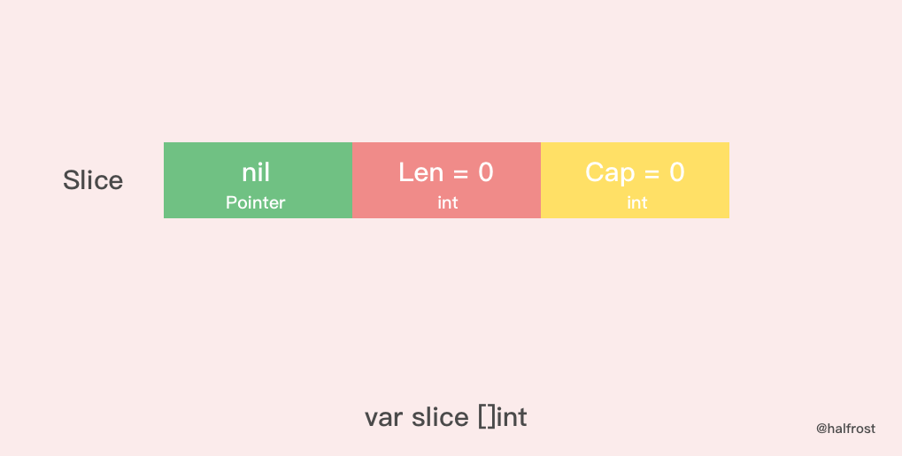
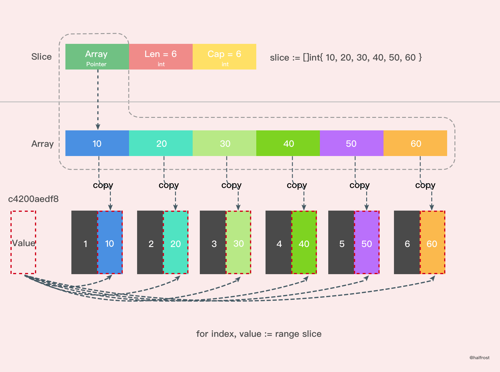

# Slice分析

ps. 测试环境:

```
Linux yieazy 4.15.0-66-generic #75-Ubuntu SMP Tue Oct 1 05:24:09 UTC 2019 x86_64 x86_64 x86_64 GNU/Linux
ubuntu18.04
go version: 1.12.4
cpu: Intel(R) Core(TM) i5-8500 CPU @ 3.00GHz
memory: 16GB
```

## slice与数组的区别

1. 数组为值类型, 切片为引用类型
2. 切片本身并不是动态数组或者数组指针。它内部实现的数据结构通过指针引用底层数组，设定相关属性将数据读写操作限定在指定的区域内。切片本身是一个只读对象，其工作机制类似数组指针的一种封装。
3. 切片赋值会在堆上开辟空间, 证据:

```go
package main
import "testing"
func array() [1024]int {
	var x [1024]int
	for i := 0; i < len(x); i++ {
		x[i] = i
	}
	return x
}
func slice() []int {
	x := make([]int, 1024)
	for i := 0; i < len(x); i++ {
		x[i] = i
	}
	return x
}
func BenchmarkArray(b *testing.B) {
	for i := 0; i < b.N; i++ {
		array()
	}
}
func BenchmarkSlice(b *testing.B) {
	for i := 0; i < b.N; i++ {
		slice()
	}
}
```
测试命令, 禁用内联和优化
```shell
go test -bench . -benchmem -gcflags "-N -l"
```
测试结果
```
BenchmarkArray-6        1000000              2277 ns/op              0 B/op          0 allocs/op
BenchmarkSlice-6          500000              3191 ns/op            8192 B/op          1 allocs/op
```
结论
这样对比看来，并非所有时候都适合用切片代替数组，因为切片底层数组可能会在堆上分配内存，而且小数组在栈上拷贝的消耗也未必比 make 消耗大

## 切片结构的类型

```go
type slice struct {
	array unsafe.Pointer
	len   int
	cap   int
}
```

手动创建一个slice结构, 从内存中得到切片的方法:

```go
s := make([]byte, 200)
ptr := unsafe.Pointer(&s[0])

fmt.Println(&s[0])
fmt.Println(ptr)

var s1 = struct {
   addr unsafe.Pointer
   len int
   cap int
}{ptr, 200, 200}
s2 := *(*[]byte)(unsafe.Pointer(&s1))
fmt.Println(s2)
```

也可以更直接的:

```go
sliceHeader := (*reflect.SliceHeader)((unsafe.Pointer(&s))) 
sliceHeader.Cap = 200 
sliceHeader.Len = 200 
sliceHeader.Data = uintptr(ptr)
```

## nil切片



nil 切片被用在很多标准库和内置函数中，描述一个不存在的切片的时候，就需要用到 nil 切片。比如函数在发生异常的时候，返回的切片就是 nil 切片。nil 切片的指针指向 nil。

## 空切片
空切片和 nil 切片的区别在于，空切片指向的地址不是nil，指向的是一个内存地址，但是它没有分配任何内存空间，即底层元素包含0个元素。
最后需要说明的一点是。不管是使用 nil 切片还是空切片，对其调用内置函数 append，len 和 cap 的效果都是一样的。
## slice扩容
Go 中切片扩容的策略是这样的：

* 首先判断，如果新申请容量（cap）大于2倍的旧容量（old.cap），最终容量（newcap）就是新申请的容量（cap）
* 否则判断，如果旧切片的长度小于1024，则最终容量(newcap)就是旧容量(old.cap)的两倍，即（newcap=doublecap）
* 否则判断，如果旧切片长度大于等于1024，则最终容量（newcap）从旧容量（old.cap）开始循环增加原来的 1/4，即（newcap=old.cap,for {newcap += newcap/4}）直到最终容量（newcap）大于等于新申请的容量(cap)，即（newcap >= cap）
* 如果最终容量（cap）计算值溢出，则最终容量（cap）就是新申请容量（cap）
**注意：扩容扩大的容量都是针对原来的容量而言的，而不是针对原来数组的长度而言的**
## Range的用法
使用range, 每次操作都是将取出结构放在同一个地址上面, 代码测试:

```
func main() {
	slice := []int{10, 20, 30, 40}
	for index, value := range slice {
		fmt.Printf("value = %d , value-addr = %x , slice-addr = %x\n", value, &value, &slice[index])
	}
}
```

测试结果:

```
value = 10 , value-addr = c4200aedf8 , slice-addr = c4200b0320
value = 20 , value-addr = c4200aedf8 , slice-addr = c4200b0328
value = 30 , value-addr = c4200aedf8 , slice-addr = c4200b0330
value = 40 , value-addr = c4200aedf8 , slice-addr = c4200b0338
```

