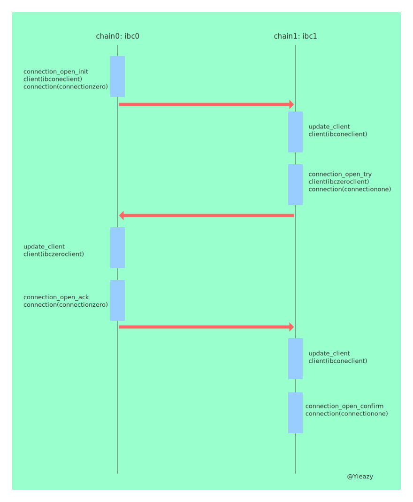
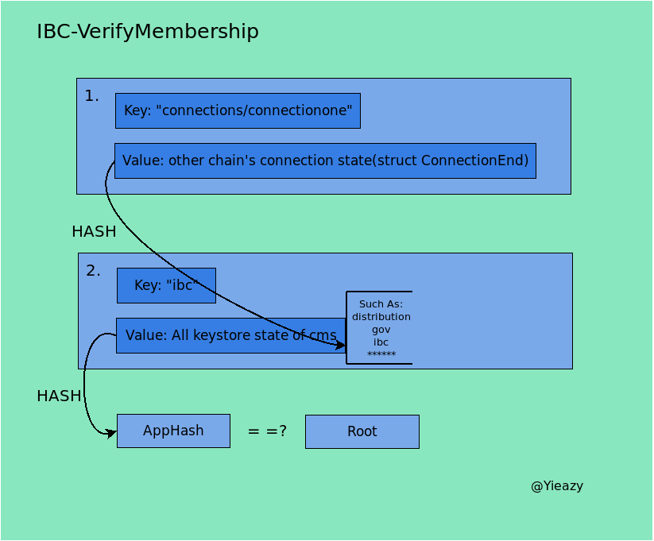

读书笔记是摘取ibc的文档ics协议中有趣的部分(可能也是关键部分)的翻译和源码对照, 意在理清ibc实现背后的原理和主要逻辑. 该repository作为本人读书笔记, 记录知识的获取, 以blog的形式记录下来. 该文库我会不断更新, 如果喜欢的话麻烦点一下`star`.
# [ics0003-connection](https://github.com/cosmos/ics/tree/master/spec/ics-003-connection-semantics)
## 大纲

>This standards document describes the abstraction of an IBC connection: two stateful objects (connection ends) on two separate chains, each associated with a light client of the other chain, which together facilitate cross-chain sub-state verification and packet association (through channels). A protocol for safely establishing a connection between two chains is described.

该标准文档描述了IBC连接的抽象: 在两条独立链上的两个具备状态的对象(连接端), 每一个对象都关联着另一条链的轻客户端, 共同促进跨链子状态的验证和包的关联(通过通道). 一种在两条链上安全建立连接的协议在下文描述.

## Motivation

>The core IBC protocol provides authorisation and ordering semantics for packets: guarantees, respectively, that packets have been committed on the sending blockchain (and according state transitions executed, such as escrowing tokens), and that they have been committed exactly once in a particular order and can be delivered exactly once in that same order.

IBC核心协议为包提供授权和排序语意: 分别保证包在发送链上已经被提交(依据状态转换执行, 例如托管代币), 这些包按照特定的顺序被准确的提交仅一次并且按照相同顺序被准确的递送仅一次. 

>An actor, as referred to in this specification, is an entity capable of executing datagrams who is paying for computation / storage (via gas or a similar mechanism) but is otherwise untrusted. Possible actors include:
>1. End users signing with an account key
>2. On-chain smart contracts acting autonomously or in response to another transaction
>3. On-chain modules acting in response to another transaction or in a scheduled manner

规范中提到的动作人, 是一个实体, 该实体能够通过为计算和存储支付的方式(比如gas或类似机制)执行数据包, 但该实体本身不受信任. 可能的动作人包括:
1. 具有签名秘钥的终端用户
2. 链上智能合约能够自动执行或应答某种交易
3. 链上模块能够应答某种交易或按计划行动

>Prior to connection establishment:
>* No further IBC sub-protocols should operate, since cross-chain sub-states cannot be verified.
>* The initiating actor (who creates the connection) must be able to specify an initial consensus state for the chain to connect to and an initial consensus state for the connecting chain (implicitly, e.g. by sending the transaction).

建立链接前的准备:

1. 在跨链的子状态无法验证通过的情况下, 不能有进一步的IBC子协议可以执行.

2. **初始动作人(connection创建人)必须能够区分目标链和发起跨链请求的链最初的共识状态**

>During handshake: once a negotiation handshake has begun:
>* Only the appropriate handshake datagrams can be executed in order.
>* No third chain can masquerade as one of the two handshaking chains

建立连接中: 一旦握手协议开始建立:
1. 只有合适的握手数据包能够被按序执行
2. 第三方链不能伪装成正在握手两条链的任何一方

>Post-Establishment: once a negotiation handshake has completed:
>* The created connection objects on both chains contain the consensus states specified by the initiating actor.
>* No other connection objects can be maliciously created on other chains by replaying datagrams.

建立链接后: 握手协议完成
1. **在跨链双方上创建的所有与connection相关的object包括工时状态都由最初动作人指定**
2. 不存在任何connection相关object能够被恶意创造, 通过重放交易的方式

## 技术规范

### 数据结构

ICS定义了两种数据结构`ConnectionState`和`ConnectionEnd`:

```typescript
enum ConnectionState {
    INIT,
    TRYOPEN,
    OPEN,
}

interface ConnectionEnd {
    state: ConnectionState
    counterpartyConnectionIdentifier: Identifier
    counterpartyPrefix: CommitmentPrefix
    clientIdentifier: Identifier
    counterpartyClientIdentifier: Identifier
    version: string | []string
}
```

源码中对`ConnectionEnd`的实现:

```go
// ConnectionEnd defines a stateful object on a chain connected to another separate
// one.
// NOTE: there must only be 2 defined ConnectionEnds to stablish a connection
// between two chains.
type ConnectionEnd struct {
    State State `json:"state" yaml:"state"`
    ClientID string `json:"client_id" yaml:"client_id"`
    // Counterparty chain associated with this connection.
    Counterparty Counterparty `json:"counterparty" yaml:"counterparty"`
    // Version is utilised to determine encodings or protocols for channels or
    // packets utilising this connection.
    Versions []string `json:"versions" yaml:"versions"`
}

// Counterparty defines the counterparty chain associated with a connection end.
type Counterparty struct {
    ClientID string `json:"client_id" yaml:"client_id"`
    ConnectionID string `json:"connection_id" yaml:"connection_id"`
    Prefix commitment.PrefixI `json:"prefix" yaml:"prefix"`
}
```

规范还涉及到对于跨链双链间验证的函数规范定义:
```typescript
function verifyClientConsensusState(
  connection: ConnectionEnd,
  height: uint64,
  proof: CommitmentProof,
  clientIdentifier: Identifier,
  consensusState: ConsensusState) {
    client = queryClient(connection.clientIdentifier)
    return client.verifyClientConsensusState(connection, height, connection.counterpartyPrefix, proof, clientIdentifier, consensusState)
}

function verifyConnectionState(
  connection: ConnectionEnd,
  height: uint64,
  proof: CommitmentProof,
  connectionIdentifier: Identifier,
  connectionEnd: ConnectionEnd) {
    client = queryClient(connection.clientIdentifier)
    return client.verifyConnectionState(connection, height, connection.counterpartyPrefix, proof, connectionIdentifier, connectionEnd)
}

function verifyChannelState(
  connection: ConnectionEnd,
  height: uint64,
  proof: CommitmentProof,
  portIdentifier: Identifier,
  channelIdentifier: Identifier,
  channelEnd: ChannelEnd) {
    client = queryClient(connection.clientIdentifier)
    return client.verifyChannelState(connection, height, connection.counterpartyPrefix, proof, portIdentifier, channelIdentifier, channelEnd)
}

function verifyPacketCommitment(
  connection: ConnectionEnd,
  height: uint64,
  proof: CommitmentProof,
  portIdentifier: Identifier,
  channelIdentifier: Identifier,
  sequence: uint64,
  commitment: bytes) {
    client = queryClient(connection.clientIdentifier)
    return client.verifyPacketCommitment(connection, height, connection.counterpartyPrefix, proof, portIdentifier, channelIdentifier, commitment)
}

function verifyPacketAcknowledgement(
  connection: ConnectionEnd,
  height: uint64,
  proof: CommitmentProof,
  portIdentifier: Identifier,
  channelIdentifier: Identifier,
  sequence: uint64,
  acknowledgement: bytes) {
    client = queryClient(connection.clientIdentifier)
    return client.verifyPacketAcknowledgement(connection, height, connection.counterpartyPrefix, proof, portIdentifier, channelIdentifier, acknowledgement)
}

function verifyPacketAcknowledgementAbsence(
  connection: ConnectionEnd,
  height: uint64,
  proof: CommitmentProof,
  portIdentifier: Identifier,
  channelIdentifier: Identifier,
  sequence: uint64) {
    client = queryClient(connection.clientIdentifier)
    return client.verifyPacketAcknowledgementAbsence(connection, height, connection.counterpartyPrefix, proof, portIdentifier, channelIdentifier)
}

function verifyNextSequenceRecv(
  connection: ConnectionEnd,
  height: uint64,
  proof: CommitmentProof,
  portIdentifier: Identifier,
  channelIdentifier: Identifier,
  nextSequenceRecv: uint64) {
    client = queryClient(connection.clientIdentifier)
    return client.verifyNextSequenceRecv(connection, height, connection.counterpartyPrefix, proof, portIdentifier, channelIdentifier, nextSequenceRecv)
}
```
然而这些颇有意思的函数与client中相关的验证一样在源码并未找到实现代码, *可能实现会放在跨链双链双方信任的中间人中进行.*

| Initiator | Datagram          | Chain acted upon | Prior state (A, B) | Posterior state (A, B) |
| --------- | ----------------- | ---------------- | ------------------ | ---------------------- |
| Actor     | `ConnOpenInit`    | A                | (none, none)       | (INIT, none)           |
| Relayer   | `ConnOpenTry`     | B                | (INIT, none)       | (INIT, TRYOPEN)        |
| Relayer   | `ConnOpenAck`     | A                | (INIT, TRYOPEN)    | (OPEN, TRYOPEN)        |
| Relayer   | `ConnOpenConfirm` | B                | (OPEN, TRYOPEN)    | (OPEN, OPEN)           |



>At the end of an opening handshake between two chains implementing the sub-protocol, the following properties hold:
* Each chain has each other's correct consensus state as originally specified by the initiating actor.
* Each chain has knowledge of and has agreed to its identifier on the other chain.
This sub-protocol need not be permissioned, modulo anti-spam measures.

在实现了子协议的两条链完成握手之后, 会具备一下特点:
1. 每条链都有初始动作人最初指定的彼此正确的共识状态
2. 每条链都清楚并同意自己在另一条链上的标识符.

下面我们来看下ics002规定的4种数据报: `ConnOpenInit`, `ConnOpenTry`, `ConnOpenAck`, `ConnOpenConfirm`.
首先是`ConnOpenInit`初始化了一个新的connection在链A上., 下面是其规范中定义的伪代码:
```typescript
function connOpenInit(
  identifier: Identifier,
  desiredCounterpartyConnectionIdentifier: Identifier,
  counterpartyPrefix: CommitmentPrefix,
  clientIdentifier: Identifier,
  counterpartyClientIdentifier: Identifier) {
    abortTransactionUnless(validateConnectionIdentifier(identifier))
    abortTransactionUnless(provableStore.get(connectionPath(identifier)) == null)
    state = INIT
    connection = ConnectionEnd{state, desiredCounterpartyConnectionIdentifier, counterpartyPrefix,
      clientIdentifier, counterpartyClientIdentifier, getCompatibleVersions()}
    provableStore.set(connectionPath(identifier), connection)
    addConnectionToClient(clientIdentifier, identifier)
}
```
`ConnOpenInit`在源码的具体是实现作比对:

```go
// ConnOpenInit initialises a connection attempt on chain A.
//
// NOTE: Identifiers are checked on msg validation.
func (k Keeper) ConnOpenInit(
    ctx sdk.Context,
    connectionID, // identifier
    clientID string,
    counterparty types.Counterparty, // desiredCounterpartyConnectionIdentifier, counterpartyPrefix, counterpartyClientIdentifier
) error {
    _, found := k.GetConnection(ctx, connectionID)
    if found {
        return sdkerrors.Wrap(types.ErrConnectionExists(k.codespace, connectionID), "cannot initialize connection")
    }

    // connection defines chain A's ConnectionEnd
    connection := types.NewConnectionEnd(types.INIT, clientID, counterparty, types.GetCompatibleVersions())
    k.SetConnection(ctx, connectionID, connection)

    err := k.addConnectionToClient(ctx, clientID, connectionID)
    if err != nil {
        sdkerrors.Wrap(err, "cannot initialize connection")
    }

    k.Logger(ctx).Info(fmt.Sprintf("connection %s state updated: NONE -> INIT", connectionID))
    return nil
}
```
显然伪码中的一个验证函数**abortTransactionUnless(validateConnectionIdentifier(identifier))**在源码中并未实现, **validateConnectionIdentifier**该验证函数在上文中也有提到. `ConnectionEnd`结构体上文也有展开
`ConnOpenTry`中继发起链到目标链的连接尝试通知(改代码在目标链上执行), 规范中的伪代码定义如下:

```typescript
function connOpenTry(
  desiredIdentifier: Identifier,
  counterpartyConnectionIdentifier: Identifier,
  counterpartyPrefix: CommitmentPrefix,
  counterpartyClientIdentifier: Identifier,
  clientIdentifier: Identifier,
  counterpartyVersions: string[],
  proofInit: CommitmentProof,
  proofConsensus: CommitmentProof,
  proofHeight: uint64,
  consensusHeight: uint64) {
    abortTransactionUnless(validateConnectionIdentifier(desiredIdentifier))
    abortTransactionUnless(consensusHeight <= getCurrentHeight())
    expectedConsensusState = getConsensusState(consensusHeight)
    expected = ConnectionEnd{INIT, desiredIdentifier, getCommitmentPrefix(), counterpartyClientIdentifier,
                             clientIdentifier, counterpartyVersions}
    version = pickVersion(counterpartyVersions)
    connection = ConnectionEnd{state, counterpartyConnectionIdentifier, counterpartyPrefix,
                               clientIdentifier, counterpartyClientIdentifier, version}
    abortTransactionUnless(connection.verifyConnectionState(proofHeight, proofInit, counterpartyConnectionIdentifier, expected))
    abortTransactionUnless(connection.verifyClientConsensusState(proofHeight, proofConsensus, counterpartyClientIdentifier, expectedConsensusState))
    previous = provableStore.get(connectionPath(desiredIdentifier))
    abortTransactionUnless(
      (previous === null) ||
      (previous.state === INIT &&
        previous.counterpartyConnectionIdentifier === counterpartyConnectionIdentifier &&
        previous.counterpartyPrefix === counterpartyPrefix &&
        previous.clientIdentifier === clientIdentifier &&
        previous.counterpartyClientIdentifier === counterpartyClientIdentifier &&
        previous.version === version))
    identifier = desiredIdentifier
    state = TRYOPEN
    provableStore.set(connectionPath(identifier), connection)
    addConnectionToClient(clientIdentifier, identifier)
}
```
再来看看源码中的实现:
```go
// ConnOpenTry relays notice of a connection attempt on chain A to chain B (this
// code is executed on chain B).
//
// NOTE:
// - Here chain A acts as the counterparty
// - Identifiers are checked on msg validation
func (k Keeper) ConnOpenTry(
    ctx sdk.Context,
    connectionID string, // desiredIdentifier
    counterparty types.Counterparty, // counterpartyConnectionIdentifier, counterpartyPrefix and counterpartyClientIdentifier
    clientID string,
    counterpartyVersions []string,
    proofInit commitment.ProofI,
    proofConsensus commitment.ProofI,
    proofHeight uint64,
    consensusHeight uint64,
) error {
    // XXX: blocked by #5078
    /*
        if consensusHeight > uint64(ctx.BlockHeight()) {
            return errors.New("invalid consensus height") // TODO: sdk.Error
        }

        expectedConsensusState, found := k.clientKeeper.GetConsensusState(ctx, clientID)
        if !found {
            return errors.New("client consensus state not found") // TODO: use ICS02 error
        }
    */

    // expectedConn defines Chain A's ConnectionEnd
    // NOTE: chain A's counterparty is chain B (i.e where this code is executed)
    prefix := k.GetCommitmentPrefix()
    expectedCounterparty := types.NewCounterparty(clientID, connectionID, prefix)
    expectedConn := types.NewConnectionEnd(types.INIT, counterparty.ClientID, expectedCounterparty, counterpartyVersions)

    // chain B picks a version from Chain A's available versions that is compatible
    // with the supported IBC versions
    version := types.PickVersion(counterpartyVersions, types.GetCompatibleVersions())

    // connection defines chain B's ConnectionEnd
    connection := types.NewConnectionEnd(types.NONE, clientID, counterparty, []string{version})
    expConnBz, err := k.cdc.MarshalBinaryLengthPrefixed(expectedConn)
    if err != nil {
        return err
    }

    ok := k.VerifyMembership(
        ctx, connection, proofHeight, proofInit,
        types.ConnectionPath(counterparty.ConnectionID), expConnBz,
    )
    if !ok {
        fmt.Sprintf("couldn't verify connection membership on counterparty's client\n")
        return errors.New("couldn't verify connection membership on counterparty's client") // TODO: sdk.Error
    }

    // XXX: blocked by #5078
    /*
        expConsStateBz, err := k.cdc.MarshalBinaryLengthPrefixed(expectedConsensusState)
        if err != nil {
            return err
        }

        ok = k.VerifyMembership(
            ctx, connection, proofHeight, proofConsensus,
            clienttypes.ConsensusStatePath(counterparty.ClientID), expConsStateBz,
        )
        if !ok {
            fmt.Sprintf("couldn't verify consensus state membership on counterparty's client\n")
            return errors.New("couldn't verify consensus state membership on counterparty's client") // TODO: sdk.Error
        }

    */

    _, found := k.GetConnection(ctx, connectionID)
    if found {
        return sdkerrors.Wrap(types.ErrConnectionExists(k.codespace, connectionID), "cannot relay connection attempt")
    }

    connection.State = types.TRYOPEN
    err = k.addConnectionToClient(ctx, clientID, connectionID)
    if err != nil {
        return sdkerrors.Wrap(err, "cannot relay connection attempt")
    }

    k.SetConnection(ctx, connectionID, connection)
    k.Logger(ctx).Info(fmt.Sprintf("connection %s state updated: NONE -> TRYOPEN ", connectionID))
    return nil
}
```
从命名上就能看出源码中尚有与consensus state相关的验证被注释掉了,  *应该与ibc不仅仅满足异构链跨链有关, consensus state proof相关的部分也并未实际运用*,  不过却有connection state相关的验证, 这块验证内容会在[最后讲到](#验证函数), 未实现的伪码:
```typescript
abortTransactionUnless(connection.verifyConnectionState(proofHeight, proofInit, counterpartyConnectionIdentifier, expected))
abortTransactionUnless(connection.verifyClientConsensusState(proofHeight, proofConsensus, counterpartyClientIdentifier, expectedConsensusState))
previous = provableStore.get(connectionPath(desiredIdentifier))
abortTransactionUnless(
  (previous === null) ||
  (previous.state === INIT &&
    previous.counterpartyConnectionIdentifier === counterpartyConnectionIdentifier &&
    previous.counterpartyPrefix === counterpartyPrefix &&
    previous.clientIdentifier === clientIdentifier &&
    previous.counterpartyClientIdentifier === counterpartyClientIdentifier &&
    previous.version === version))
```
再来看看`connOpenAck`: 中继B链上接受连接开启尝试给链A(该函数在链A上执行), 该函数的伪代码:
```js
function connOpenAck(
  identifier: Identifier,
  version: string,
  proofTry: CommitmentProof,
  proofConsensus: CommitmentProof,
  proofHeight: uint64,
  consensusHeight: uint64) {
    abortTransactionUnless(consensusHeight <= getCurrentHeight())
    connection = provableStore.get(connectionPath(identifier))
    abortTransactionUnless(connection.state === INIT || connection.state === TRYOPEN)
    expectedConsensusState = getConsensusState(consensusHeight)
    expected = ConnectionEnd{TRYOPEN, identifier, getCommitmentPrefix(),
                             connection.counterpartyClientIdentifier, connection.clientIdentifier,
                             version}
    abortTransactionUnless(connection.verifyConnectionState(proofHeight, proofTry, connection.counterpartyConnectionIdentifier, expected))
    abortTransactionUnless(connection.verifyClientConsensusState(proofHeight, proofConsensus, connection.counterpartyClientIdentifier, expectedConsensusState))
    connection.state = OPEN
    abortTransactionUnless(getCompatibleVersions().indexOf(version) !== -1)
    connection.version = version
    provableStore.set(connectionPath(identifier), connection)
}
```
再来看看源码实现:
```go
// ConnOpenAck relays acceptance of a connection open attempt from chain B back
// to chain A (this code is executed on chain A).
//
// NOTE: Identifiers are checked on msg validation.
func (k Keeper) ConnOpenAck(
    ctx sdk.Context,
    connectionID string,
    version string,.
    proofTry commitment.ProofI,
    proofConsensus commitment.ProofI,
    proofHeight uint64,
    consensusHeight uint64,
) error {
    // XXX: blocked by #5078
    /*
        if consensusHeight > uint64(ctx.BlockHeight()) {
            return errors.New("invalid consensus height") // TODO: sdk.Error
        }
    */
    connection, found := k.GetConnection(ctx, connectionID)
    if !found {
        return sdkerrors.Wrap(types.ErrConnectionNotFound(k.codespace, connectionID), "cannot relay ACK of open attempt")
    }

    if connection.State != types.INIT {
        return types.ErrInvalidConnectionState(
            k.codespace,
            fmt.Sprintf("connection state is not INIT (got %s)", connection.State.String()),
        )
    }

    if types.LatestVersion(connection.Versions) != version {
        return types.ErrInvalidVersion(
            k.codespace,
            fmt.Sprintf("connection version does't match provided one (%s ≠ %s)", types.LatestVersion(connection.Versions), version),
        )
    }

    // XXX: blocked by #5078
    /*
        expectedConsensusState, found := k.clientKeeper.GetConsensusState(ctx, connection.ClientID)
        if !found {
            return errors.New("client consensus state not found") // TODO: use ICS02 error
        }
    */
    prefix := k.GetCommitmentPrefix()
    expectedCounterparty := types.NewCounterparty(connection.ClientID, connectionID, prefix)
    expectedConn := types.NewConnectionEnd(types.TRYOPEN, connection.Counterparty.ClientID, expectedCounterparty, []string{version})

    expConnBz, err := k.cdc.MarshalBinaryLengthPrefixed(expectedConn)
    if err != nil {
        return err
    }

    ok := k.VerifyMembership(
        ctx, connection, proofHeight, proofTry,
        types.ConnectionPath(connection.Counterparty.ConnectionID), expConnBz,
    )
    if !ok {
        return errors.New("couldn't verify connection membership on counterparty's client") // TODO: sdk.Error
    }

    // XXX: blocked by #5078
    /*
        expConsStateBz, err := k.cdc.MarshalBinaryLengthPrefixed(expectedConsensusState)
        if err != nil {
            return err
        }

        ok = k.VerifyMembership(
            ctx, connection, proofHeight, proofConsensus,
            clienttypes.ConsensusStatePath(connection.Counterparty.ClientID), expConsStateBz,
        )
        if !ok {
            return errors.New("couldn't verify consensus state membership on counterparty's client") // TODO: sdk.Error
        }

    */
    connection.State = types.OPEN
    connection.Versions = []string{version}
    k.SetConnection(ctx, connectionID, connection)
    k.Logger(ctx).Info(fmt.Sprintf("connection %s state updated: INIT -> OPEN ", connectionID))
    return nil.
}
```
很显然`connOpenAck`验证consensus state部分的函数也被注释掉了
最后再来看`connOpenConfirm`函数, `connOpenConfirm`确认链A上对链B开启了接连, 函数执行完成后两条链上的连接都会被开启(该函数会在链B上实现), 其伪代码实现:
```typescript
function connOpenConfirm(
  identifier: Identifier,
  proofAck: CommitmentProof,
  proofHeight: uint64) {
    connection = provableStore.get(connectionPath(identifier))
    abortTransactionUnless(connection.state === TRYOPEN)
    expected = ConnectionEnd{OPEN, identifier, getCommitmentPrefix(), connection.counterpartyClientIdentifier,
                             connection.clientIdentifier, connection.version}
    abortTransactionUnless(connection.verifyConnectionState(proofHeight, proofAck, connection.counterpartyConnectionIdentifier, expected))
    connection.state = OPEN
    provableStore.set(connectionPath(identifier), connection)
```
再来看看源码实现:
```js
// ConnOpenConfirm confirms opening of a connection on chain A to chain B, after
// which the connection is open on both chains (this code is executed on chain B).
//
// NOTE: Identifiers are checked on msg validation.
func (k Keeper) ConnOpenConfirm(
    ctx sdk.Context,
    connectionID string,
    proofAck commitment.ProofI,
    proofHeight uint64,
) error {
    connection, found := k.GetConnection(ctx, connectionID)
    if !found {
        return sdkerrors.Wrap(types.ErrConnectionNotFound(k.codespace, connectionID), "cannot relay ACK of open attempt")
    }
.
    if connection.State != types.TRYOPEN {
        return types.ErrInvalidConnectionState(
            k.codespace,
            fmt.Sprintf("connection state is not TRYOPEN (got %s)", connection.State.String()),
        )
    }

    prefix := k.GetCommitmentPrefix()
    expectedCounterparty := types.NewCounterparty(connection.ClientID, connectionID, prefix)
    expectedConn := types.NewConnectionEnd(types.OPEN, connection.Counterparty.ClientID, expectedCounterparty, connection.Versions)

    expConnBz, err := k.cdc.MarshalBinaryLengthPrefixed(expectedConn)
    if err != nil {
        return err
    }

    ok := k.VerifyMembership(
        ctx, connection, proofHeight, proofAck,
        types.ConnectionPath(connection.Counterparty.ConnectionID), expConnBz,
    )
    if !ok {
        return types.ErrInvalidCounterpartyConnection(k.codespace)
    }

    connection.State = types.OPEN
    k.SetConnection(ctx, connectionID, connection)
    k.Logger(ctx).Info(fmt.Sprintf("connection %s state updated: TRYOPEN -> OPEN ", connectionID))
    return nil
}
```
### 验证函数
验证函数`VerifyMembership`需要注册proof的decode信息, 目前注册了四种decoder, 分别为`SimpleValue`, `IAVLValue`, `IAVLAbsence`, `MultiStoreProof`, 目前我们会用的为`IAVLValue`和
`MultiStoreProof`两种, 注册源码如下:

```go
// XXX: This should be managed by the rootMultiStore which may want to register
// more proof ops?
func DefaultProofRuntime() (prt *merkle.ProofRuntime) {
    prt = merkle.NewProofRuntime()
    prt.RegisterOpDecoder(merkle.ProofOpSimpleValue, merkle.SimpleValueOpDecoder)
    prt.RegisterOpDecoder(iavl.ProofOpIAVLValue, iavl.IAVLValueOpDecoder)
    prt.RegisterOpDecoder(iavl.ProofOpIAVLAbsence, iavl.IAVLAbsenceOpDecoder)
    prt.RegisterOpDecoder(ProofOpMultiStore, MultiStoreProofOpDecoder)
    return
}
```
验证函数的主题部分就是验证`MsgConnectionOpenTry`, `MsgConnectionOpenAck`, `MsgConnectionOpenConfirm`中的`commitment.ProofI`成员, 该成员在源码中的注释为:
```go
// ProofI implements spec:CommitmentProof.
// Proof can prove whether the key-value pair is a part of the Root or not.
// Each proof has designated key-value pair it is able to prove.
// Proofs includes key but value is provided dynamically at the verification time.
type ProofI interface {
    GetCommitmentType() Type
    VerifyMembership(RootI, PathI, []byte) bool
    VerifyNonMembership(RootI, PathI) bool
}
```
目前的验证过程只提供了connection state的验证未提供consensus state的验证, *其中的原因与proof提供的cms项有关*, 大概的验证过程可以如下表示:



connection state的proof存在两项:
* connectionone的状态以结构体`ConnectionEnd`的方式保存.
* cms的所有keystore状态, *类似与`stateRoot`*, 以kv的方式存储, key为keystore的名字例如distribution, gov, ib..., value为state的hash

第一项的value经过hash运算结果要与ibc keystore的value一致
第二项的value经过hash运算即为另一条链的apphash, 要与另一条链传递过来的root一致

*结论: 在目前的IBC中校验非常依赖于client传递的消息, 因为在链上只能校验由client传来的另一条链的**子状态**, 而且仅为最终状态, 中间块不会参与校验, 意味着这个client存在着极大的中间人攻击风险, 当然目前ibc还处在building阶段, 下定论还叫早, 但是中间人攻击已在ics规范中多次提到, 可能难以做到完全摒除, 至于consensus state为什么未做校验仅仅是由于其与connection state目前公用同一个key: ibc, 自然目前无法支持, 但日后完全可以通过增加字段予以解决. 到此ics003的规范到此为止*