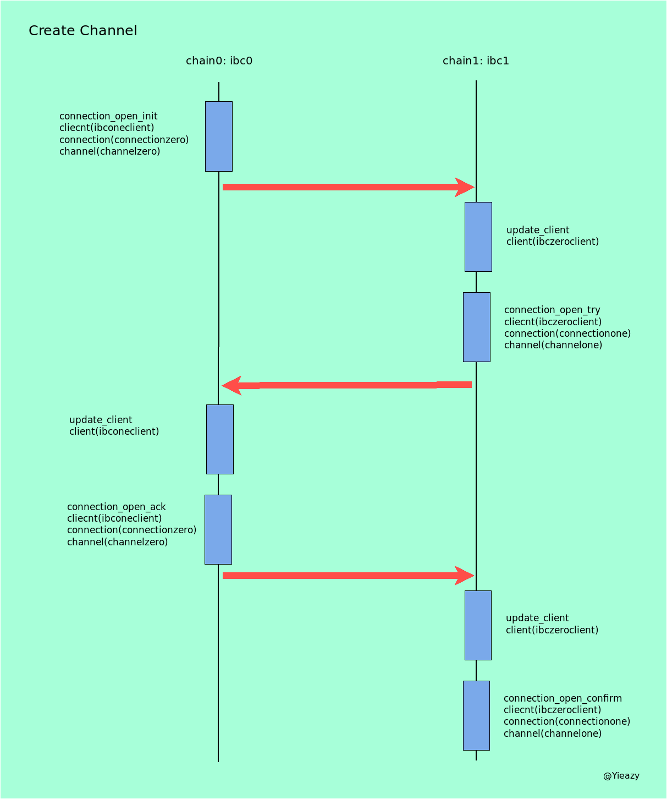
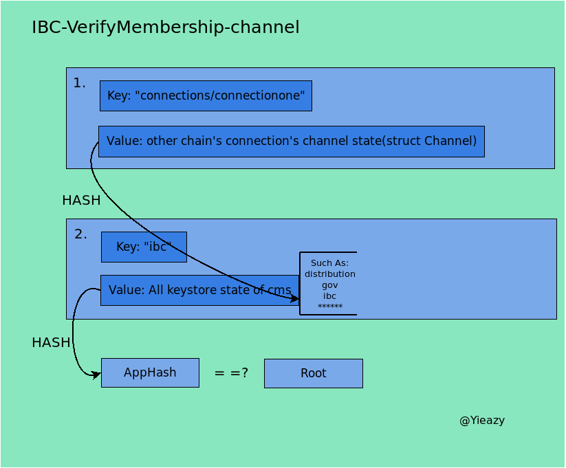
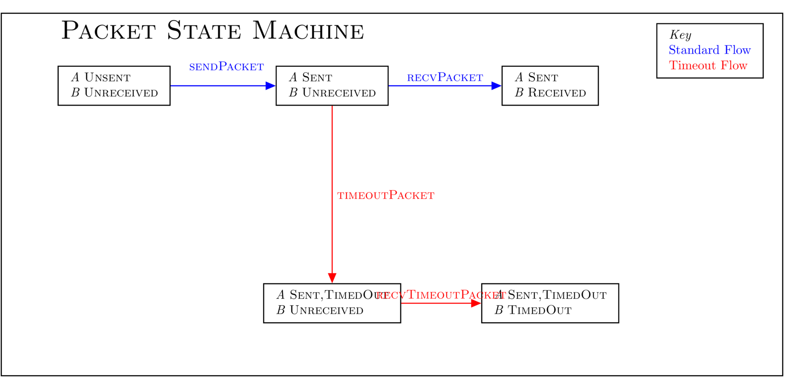

读书笔记是摘取ibc的文档ics协议中有趣的部分(可能也是关键部分)的翻译和源码对照, 意在理清ibc实现背后的原理和主要逻辑. 该repository作为本人读书笔记, 记录知识的获取, 以blog的形式记录下来. 该文库我会不断更新, 如果喜欢的话麻烦点一下`star`.

# [ics004-channel&packet](https://github.com/cosmos/ics/tree/master/spec/ics-004-channel-and-packet-semantics)

## 大纲

> The "channel" abstraction provides message delivery semantics to the interblockchain communication protocol, in three categories: ordering, exactly-once delivery, and module permissioning. A channel serves as a conduit for packets passing between a module on one chain and a module on another, ensuring that packets are executed only once, delivered in the order in which they were sent (if necessary), and delivered only to the corresponding module owning the other end of the channel on the destination chain. Each channel is associated with a particular connection, and a connection may have any number of associated channels, allowing the use of common identifiers and amortising the cost of header verification across all the channels utilising a connection & light client.
>
> Channels are payload-agnostic. The modules which send and receive IBC packets decide how to construct packet data and how to act upon the incoming packet data, and must utilise their own application logic to determine which state transactions to apply according to what data the packet contains.

提供消息传递语义的通道抽象为一种在链间通信的协议, 具备3个层面: 有序, 有且仅传递一次以及许可模块. 通道服务可以当做一个渠道使得消息可以从一条链上的模块传递给另一条链的模块, 确保这个包有且仅穿第一次, 并且准确按照发送的顺序进行传递(如有必要), 并且传递仅发生在分别拥有同一通道对应两端的链间对应模块之间. 每一条通道都会与一个特定的连接相关联, 而一个连接可关联的通道数目可以是任意的, <u>允许使用公共标识符</u>以及利用连接与请客户端分摊区块头校验的负担.

通道与负载无关. 发送与接受IBC包的模块决定如何去构建包中的数据以及如何去执行包中的数据, 这一切必须通过他们所拥有的应用逻辑去根据数据包中所包含的数据去来应用的状态事物.

### 定义

通道的一端是链上存储通道元数据的数据结构, 其结构:

```typescript
interface ChannelEnd {
    state: ChannelState
    ordering: ChannelOrder
    counterpartyPortIdentifier: Identifier
    counterpartyChannelIdentifier: Identifier
    connectionHops: [Identifier]
    version: string
}
```

`state`: 当前channel一端的当前状态.
`ordering`: 表明channel是有序的还是无序的
`connectionHops`: **按照顺序存储连接标识符的列表, 在此通道上发送的数据包将沿着该标识符列表传送**. 目前该列表长度必须为1, 未来将支持多次跳转的通道.
`version`: 存储这一个模糊的通道版本信息, 在握手阶段跨链间会达成共识. 该字段可以用于标示模块级别的配置, 例如表示通道使用了哪种数据包编码. IBC核心协议并未使用该版本.

通道端的有以下集中状态:
```typescript
enum ChannelState {
    INIT,
    TRYOPEN,
    OPEN,
    CLOSED,
}
```

* INIT: 通道端刚开启握手
* TRYOPEN: 在对应通道段承认握手阶段
* OPEN: 握手已经完成, 通道端准备好发送和接收包.
* CLOSED: 通道端已经被关闭, 无法再发送和接收包.

`Packet`: 在跨链协议中, 是一种特别的结构, 被定义如下:

```typescript
interface Packet {
  sequence: uint64
  timeoutHeight: uint64
  sourcePort: Identifier
  sourceChannel: Identifier
  destPort: Identifier
  destChannel: Identifier
  data: bytes
}
```

`sequence`: 该数字对应发送与接收的顺序, 也就是说一个有着较小sequence的包在发送和接收时必须早于sequence更大的包
`timeoutHeight`: 表示目标链上的区块高度, 当超过该高度以后该包将不会被处理, 并会将其视为已超时.
`sourcePort`: 标识发送链的端口
`sourceChannel`: 标识发送链的通道
`destPort`: 标识目标链的端口
`destChannel`: 标识目标链的通道
`data`: 是一个模糊的数据, 可以由关联模块的应用程序逻辑定义

>Note that a Packet is never directly serialised. Rather it is an intermediary structure used in certain function calls that may need to be created or processed by modules calling the IBC handler.

值得注意的事包并不是直接被串行化, 而是一个非直接的数据结构应用与特定的函数中, 这些函数大都是由被称为IBC handler的模块创建或处理.

### 需要的特性
**高效**: 包传送与确认的速度因仅受基础链速度的限制. 证明应尽可能是可批的.
**仅传递一次**: IBC包从通道一端发送到另一端必须仅一次; 并要做到不需要网络同步假设来确保仅传递一次安全. 如果跨链的双链有一条链或彼此都宕机了, 数据包最多可以传送一次, 并且一旦链恢复,  数据包应该能够再次流动.
**有序**: 在有序通道上, 包的发送与接收应该按照一致的顺序: 在发送链上如果发送x包是早于y包, 那么对应的在目标链上, 接收x包也必须早于y包; 在无序通道上, 包可能发送和接收以任意顺序. 无序的包, 与有序包一样, 有独立的超时字段, 该字段指向目标链上的区块高度.
**许可**: 通道应该被两端的模块许可, 在握手期间确定其后不做修改(高级逻辑可以通过标记端口所有权来标记通道所有权). 只有与通道关联的模块才能在其上发送或接收.

## 技术规范
### 数据流可视化

客户端, 连接, 通道以及包的架构:


### 通道生命周期管理
| Initiator | Datagram        | Chain acted upon | Prior state (A, B) | Posterior state (A, B) |
| --------- | --------------- | ---------------- | ------------------ | ---------------------- |
| Actor     | ChanOpenInit    | A                | (none, none)       | (INIT, none)           |
| Relayer   | ChanOpenTry     | B                | (INIT, none)       | (INIT, TRYOPEN)        |
| Relayer   | ChanOpenAck     | A                | (INIT, TRYOPEN)    | (OPEN, TRYOPEN)        |
| Relayer   | ChanOpenConfirm | B                | (OPEN, TRYOPEN)    | (OPEN, OPEN)           |



| Initiator | Datagram         | Chain acted upon | Prior state (A, B) | Posterior state (A, B) |
| --------- | ---------------- | ---------------- | ------------------ | ---------------------- |
| Actor     | ChanCloseInit    | A                | (OPEN, OPEN)       | (CLOSED, OPEN)         |
| Relayer   | ChanCloseConfirm | B                | (CLOSED, OPEN)     | (CLOSED, CLOSED)       |

#### 开启握手

> The chanOpenInit function is called by a module to initiate a channel opening handshake with a module on another chain.
>
>The opening channel must provide the identifiers of the local channel identifier, local port, remote port, and remote channel identifier.
>
>When the opening handshake is complete, the module which initiates the handshake will own the end of the created channel on the host ledger, and the counterparty module which it specifies will own the other end of the created channel on the counterparty chain. Once a channel is created, ownership cannot be changed (although higher-level abstractions could be implemented to provide this).

chanOpenInit函数是被模块调用用于初始化通道开启的与目标链的握手.

开启握手的通道必须提供本地channel的标识符, 本地端口, 目标链端口以及目标链标识符.

当开启握手完成, 发起握手初始化的模块将拥有创建通道的一端在链上账本, 而目标链对应模块需要定义其拥有的在目标链上创建模块的另一端. 一旦一个通道创建完成, 所有全将无法改变(更高层的抽象能够提供该实现)

```typescript
function chanOpenInit(
  order: ChannelOrder,
  connectionHops: [Identifier],
  portIdentifier: Identifier,
  channelIdentifier: Identifier,
  counterpartyPortIdentifier: Identifier,
  counterpartyChannelIdentifier: Identifier,
  version: string): CapabilityKey {
    abortTransactionUnless(validateChannelIdentifier(portIdentifier, channelIdentifier))

    abortTransactionUnless(connectionHops.length === 1) // for v1 of the IBC protocol

    abortTransactionUnless(provableStore.get(channelPath(portIdentifier, channelIdentifier)) === null)
    connection = provableStore.get(connectionPath(connectionHops[0]))

    // optimistic channel handshakes are allowed
    abortTransactionUnless(connection !== null)
    abortTransactionUnless(connection.state !== CLOSED)
    abortTransactionUnless(authenticate(privateStore.get(portPath(portIdentifier))))
    channel = ChannelEnd{INIT, order, counterpartyPortIdentifier,
                         counterpartyChannelIdentifier, connectionHops, version}
    provableStore.set(channelPath(portIdentifier, channelIdentifier), channel)
    key = generate()
    provableStore.set(channelCapabilityPath(portIdentifier, channelIdentifier), key)
    provableStore.set(nextSequenceSendPath(portIdentifier, channelIdentifier), 1)
    provableStore.set(nextSequenceRecvPath(portIdentifier, channelIdentifier), 1)
    return key
}
```
由于源码的实现除了验证方面都是按照伪代码实现, 因此文章中赘述了.

`chanOpenTry`函数是被模块调用用于接受在开启握手过程中第一步初始化操作, 该操作由另一条链完成.
```typescript
function chanOpenTry(
  order: ChannelOrder,
  connectionHops: [Identifier],
  portIdentifier: Identifier,
  channelIdentifier: Identifier,
  counterpartyPortIdentifier: Identifier,
  counterpartyChannelIdentifier: Identifier,
  version: string,
  counterpartyVersion: string,
  proofInit: CommitmentProof,
  proofHeight: uint64): CapabilityKey {
    abortTransactionUnless(validateChannelIdentifier(portIdentifier, channelIdentifier))
    abortTransactionUnless(connectionHops.length === 1) // for v1 of the IBC protocol
    previous = provableStore.get(channelPath(portIdentifier, channelIdentifier))
    abortTransactionUnless(
      (previous === null) ||
      (previous.state === INIT &&
       previous.order === order &&
       previous.counterpartyPortIdentifier === counterpartyPortIdentifier &&
       previous.counterpartyChannelIdentifier === counterpartyChannelIdentifier &&
       previous.connectionHops === connectionHops &&
       previous.version === version)
      )
    abortTransactionUnless(authenticate(privateStore.get(portPath(portIdentifier))))
    connection = provableStore.get(connectionPath(connectionHops[0]))
    abortTransactionUnless(connection !== null)
    abortTransactionUnless(connection.state === OPEN)
    expected = ChannelEnd{INIT, order, portIdentifier,
                          channelIdentifier, connectionHops.reverse(), counterpartyVersion}
    abortTransactionUnless(connection.verifyChannelState(
      proofHeight,
      proofInit,
      counterpartyPortIdentifier,
      counterpartyChannelIdentifier,
      expected
    ))
    channel = ChannelEnd{TRYOPEN, order, counterpartyPortIdentifier,
                         counterpartyChannelIdentifier, connectionHops, version}
    provableStore.set(channelPath(portIdentifier, channelIdentifier), channel)
    key = generate()
    provableStore.set(channelCapabilityPath(portIdentifier, channelIdentifier), key)
    provableStore.set(nextSequenceSendPath(portIdentifier, channelIdentifier), 1)
    provableStore.set(nextSequenceRecvPath(portIdentifier, channelIdentifier), 1)
    return key
}
```

`chanOpenAck`函数是由握手发起模块用于承认另一条链上对应模块的初始化请求:

```typescript
function chanOpenAck(
  portIdentifier: Identifier,
  channelIdentifier: Identifier,
  counterpartyVersion: string,
  proofTry: CommitmentProof,
  proofHeight: uint64) {
    channel = provableStore.get(channelPath(portIdentifier, channelIdentifier))
    abortTransactionUnless(channel.state === INIT || channel.state === TRYOPEN)
    abortTransactionUnless(authenticate(privateStore.get(channelCapabilityPath(portIdentifier, channelIdentifier))))
    connection = provableStore.get(connectionPath(channel.connectionHops[0]))
    abortTransactionUnless(connection !== null)
    abortTransactionUnless(connection.state === OPEN)
    expected = ChannelEnd{TRYOPEN, channel.order, portIdentifier,
                          channelIdentifier, channel.connectionHops.reverse(), counterpartyVersion}
    abortTransactionUnless(connection.verifyChannelState(
      proofHeight,
      proofTry,
      channel.counterpartyPortIdentifier,
      channel.counterpartyChannelIdentifier,
      expected
    ))
    channel.state = OPEN
    channel.version = counterpartyVersion
    provableStore.set(channelPath(portIdentifier, channelIdentifier), channel)
}
```

`chanOpenConfirm`函数由握手确认模块调用用于确认握手发起模块的确认, 该模块在另一条链上用以完成握手开启, 其伪代码如下:

```typescript
function chanOpenConfirm(
  portIdentifier: Identifier,
  channelIdentifier: Identifier,
  proofAck: CommitmentProof,
  proofHeight: uint64) {
    channel = provableStore.get(channelPath(portIdentifier, channelIdentifier))
    abortTransactionUnless(channel !== null)
    abortTransactionUnless(channel.state === TRYOPEN)
    abortTransactionUnless(authenticate(privateStore.get(channelCapabilityPath(portIdentifier, channelIdentifier))))
    connection = provableStore.get(connectionPath(channel.connectionHops[0]))
    abortTransactionUnless(connection !== null)
    abortTransactionUnless(connection.state === OPEN)
    expected = ChannelEnd{OPEN, channel.order, portIdentifier,
                          channelIdentifier, channel.connectionHops.reverse(), channel.version}
    abortTransactionUnless(connection.verifyChannelState(
      proofHeight,
      proofAck,
      channel.counterpartyPortIdentifier,
      channel.counterpartyChannelIdentifier,
      expected
    ))
    channel.state = OPEN
    provableStore.set(channelPath(portIdentifier, channelIdentifier), channel)
}
```

#### 关闭握手

`chanCloseInit`函数是由拥有通道两端的任意模块调用, 一旦关闭, 通道将不会再响应.
调用模块可能原子执行适当的应用程序逻辑配合`chanCloseInit`调用

```typescript
function chanCloseInit(
  portIdentifier: Identifier,
  channelIdentifier: Identifier) {
    abortTransactionUnless(authenticate(privateStore.get(channelCapabilityPath(portIdentifier, channelIdentifier))))
    channel = provableStore.get(channelPath(portIdentifier, channelIdentifier))
    abortTransactionUnless(channel !== null)
    abortTransactionUnless(channel.state !== CLOSED)
    connection = provableStore.get(connectionPath(channel.connectionHops[0]))
    abortTransactionUnless(connection !== null)
    abortTransactionUnless(connection.state === OPEN)
    channel.state = CLOSED
    provableStore.set(channelPath(portIdentifier, channelIdentifier), channel)
}
```

`chanCloseConfirm`函数是另一条链上对应模块调用, 在另一端已经关闭之后.
调用模块可能原子执行适当的应用程序逻辑配合`chanCloseConfirm`调用

```typescript
function chanCloseConfirm(
  portIdentifier: Identifier,
  channelIdentifier: Identifier,
  proofInit: CommitmentProof,
  proofHeight: uint64) {                       
     abortTransactionUnless(authenticate(privateStore.get(channelCapabilityPath(portIdentifier, channelIdentifier))))
    channel = provableStore.get(channelPath(portIdentifier, channelIdentifier))
    abortTransactionUnless(channel !== null)
    abortTransactionUnless(channel.state !== CLOSED)
    connection = provableStore.get(connectionPath(channel.connectionHops[0]))
    abortTransactionUnless(connection !== null)
    abortTransactionUnless(connection.state === OPEN)
    expected = ChannelEnd{CLOSED, channel.order, portIdentifier,
                          channelIdentifier, channel.connectionHops.reverse(), channel.version}
    abortTransactionUnless(connection.verifyChannelState(
      proofHeight,
      proofInit,
      channel.counterpartyPortIdentifier,
      channel.counterpartyChannelIdentifier,
      expected
    ))
    channel.state = CLOSED
    provableStore.set(channelPath(portIdentifier, channelIdentifier), channel)
}
```

#### channel的验证函数

channel验证与[connection的验证](./ics003-connection.md#验证函数)采用了复用的代码, 唯一区别在于第一个op中存储的是channelEnd struct而非connectionEnd, 以图说明:



### 包的流动与处理



#### 包的生命周期

首先定义发送链为ibc0, ibc0上绑定的模块为模块0, 目标链为ibc1, ibc1上绑定的模块为模块1.

1. 初始化客户端, 端口, 以任意顺序
    1. 分别在ibc0与ibc1上创建客户端
    2. 模块0与模块1绑定端口
2. 建立连接与通道, 乐观发送, 按照顺序
    1. ibc0对ibc1连接的开启握手由模块0发起
    2. 模块0对模块1通道的开启握手由模块0发起使用上一步创建的连接
    3. 通过上一步创建的通道发送从模块0到模块1的包
3. 成功完成握手(如果任意握手失败, 连接/通道会被关闭, 并且包会超时)
    1. 连接与通道的握手成功(需要有中间人参与)
4. 包在ibc1的模块1确认, 亦或包发生超时(需要有中间人参与)
5. (可能)发送应答反馈, 由ibc1上模块1发往ibc0上模块0.

以空间的方式表示, 两台机器之间的数据包传输以如下表示:


#### 发送包

`sendPacket`函数是模块发起, 是为了发送包从发送链链上拥有通道端的模块向目标链上同样拥有通道端的对应模块.

调用必须执行适当的应用逻辑为了配合`sendPacket`调用

IBC handler需要执行以下步骤:
* 检查通道与连接的状态是开启的
* 检查模块是否拥有发送端口
* 检查包的信息与通道和连接是否一致
* 检查超时高度在目标链上是否有效(目标链的区块高度未到超时高度)
* 增加发送sequence的计时
* 存储对报数据与报超时固定大小的承若

>Note that the full packet is not stored in the state of the chain - merely a short hash-commitment to the data & timeout value. The packet data can be calculated from the transaction execution and possibly returned as log output which relayers can index.

请注意, 完整的数据包不会存储在链的状态中-只有数据和超时值的哈希承诺.  可以从交易执行中计算出包数据, 并可将其作为日志输出返回, 中继器可以对其进行索引.

```typescript
function sendPacket(packet: Packet) {
    channel = provableStore.get(channelPath(packet.sourcePort, packet.sourceChannel))

    // optimistic sends are permitted once the handshake has started
    abortTransactionUnless(channel !== null)
    abortTransactionUnless(channel.state !== CLOSED)
    abortTransactionUnless(authenticate(privateStore.get(channelCapabilityPath(packet.sourcePort, packet.sourceChannel))))
    abortTransactionUnless(packet.destPort === channel.counterpartyPortIdentifier)
    abortTransactionUnless(packet.destChannel === channel.counterpartyChannelIdentifier)
    connection = provableStore.get(connectionPath(channel.connectionHops[0]))

    abortTransactionUnless(connection !== null)
    abortTransactionUnless(connection.state !== CLOSED)

    consensusState = provableStore.get(consensusStatePath(connection.clientIdentifier))
    abortTransactionUnless(consensusState.getHeight() < packet.timeoutHeight)

    nextSequenceSend = provableStore.get(nextSequenceSendPath(packet.sourcePort, packet.sourceChannel))
    abortTransactionUnless(packet.sequence === nextSequenceSend)

    // all assertions passed, we can alter state

    nextSequenceSend = nextSequenceSend + 1
    provableStore.set(nextSequenceSendPath(packet.sourcePort, packet.sourceChannel), nextSequenceSend)
    provableStore.set(packetCommitmentPath(packet.sourcePort, packet.sourceChannel, packet.sequence), hash(packet.data, packet.timeout))

    // log that a packet has been sent
    emitLogEntry("sendPacket", {sequence: packet.sequence, data: packet.data, timeout: packet.timeout})
}
```

最核心包发送函数`packetCommitmentPath`, 规范中未对其进行规范, 可以参看[ibc源码的操作四章节](./ibc源码.md#操作四: Packet)

#### 接收包

`recvPacket`与`sendPacket`相对应是由目标链上的对应模块接收和处理发送链模块发送过来的跨链包

调用必须执行适当的应用逻辑为了配合`recvPacket`调用

在目标链上IBC handler需要作一下步骤:

* 检查通道与连接的状态是开启的
* 检查模块是否拥有接收端口
* 检查包的信息与通道和连接是否一致
* 对于有序链需要检查包的sequence是否有效
* 检查超时高度是否有效
* 检查包中的proof是否正确
* 对于无序链设置一个模糊的应答值以唯一储存key来保存
* 增长目标链上通道端的接收sequence

```typescript
function recvPacket(
  packet: OpaquePacket,
  proof: CommitmentProof,
  proofHeight: uint64,
  acknowledgement: bytes): Packet {

    channel = provableStore.get(channelPath(packet.destPort, packet.destChannel))
    abortTransactionUnless(channel !== null)
    abortTransactionUnless(channel.state === OPEN)
    abortTransactionUnless(authenticate(privateStore.get(channelCapabilityPath(packet.destPort, packet.destChannel))))
    abortTransactionUnless(packet.sourcePort === channel.counterpartyPortIdentifier)
    abortTransactionUnless(packet.sourceChannel === channel.counterpartyChannelIdentifier)

    connection = provableStore.get(connectionPath(channel.connectionHops[0]))
    abortTransactionUnless(connection !== null)
    abortTransactionUnless(connection.state === OPEN)

    abortTransactionUnless(getConsensusHeight() < packet.timeoutHeight)

    abortTransactionUnless(connection.verifyPacketCommitment(
      proofHeight,
      proof,
      packet.sourcePort,
      packet.sourceChannel,
      packet.sequence,
      hash(packet.data, packet.timeout)
    ))

    // all assertions passed (except sequence check), we can alter state

    if (acknowledgement.length > 0 || channel.order === UNORDERED)
      provableStore.set(
        packetAcknowledgementPath(packet.destPort, packet.destChannel, packet.sequence),
        hash(acknowledgement)
      )

    if (channel.order === ORDERED) {
      nextSequenceRecv = provableStore.get(nextSequenceRecvPath(packet.destPort, packet.destChannel))
      abortTransactionUnless(packet.sequence === nextSequenceRecv)
      nextSequenceRecv = nextSequenceRecv + 1
      provableStore.set(nextSequenceRecvPath(packet.destPort, packet.destChannel), nextSequenceRecv)
    }

    // log that a packet has been received & acknowledged
    emitLogEntry("recvPacket", {sequence: packet.sequence, timeout: packet.timeout, data: packet.data, acknowledgement})

    // return transparent packet
    return packet
}
```

#### 包确认

`acknowledgePacket`函数是模块用于处理包的确认, 该包早些由发起模块向目标链上对应模块. `acknowledgePacket`也会清除包的提交, 由于已接收到数据包并对其进行了处理.

调用必须执行适当的应用逻辑为了配合`acknowledgePacket`调用

```typescript
function acknowledgePacket(
  packet: OpaquePacket,
  acknowledgement: bytes,
  proof: CommitmentProof,
  proofHeight: uint64): Packet {

    // abort transaction unless that channel is open, calling module owns the associated port, and the packet fields match
    channel = provableStore.get(channelPath(packet.sourcePort, packet.sourceChannel))
    abortTransactionUnless(channel !== null)
    abortTransactionUnless(channel.state === OPEN)
    abortTransactionUnless(authenticate(privateStore.get(channelCapabilityPath(packet.sourcePort, packet.sourceChannel))))
    abortTransactionUnless(packet.sourceChannel === channel.counterpartyChannelIdentifier)

    connection = provableStore.get(connectionPath(channel.connectionHops[0]))
    abortTransactionUnless(connection !== null)
    abortTransactionUnless(connection.state === OPEN)
    abortTransactionUnless(packet.sourcePort === channel.counterpartyPortIdentifier)

    // verify we sent the packet and haven't cleared it out yet
    abortTransactionUnless(provableStore.get(packetCommitmentPath(packet.sourcePort, packet.sourceChannel, packet.sequence))
           === hash(packet.data, packet.timeout))

    // abort transaction unless correct acknowledgement on counterparty chain
    abortTransactionUnless(connection.verifyPacketAcknowledgement(
      proofHeight,
      proof,
      packet.destPort,
      packet.destChannel,
      packet.sequence,
      hash(acknowledgement)
    ))

    // all assertions passed, we can alter state

    // delete our commitment so we can't "acknowledge" again
    provableStore.delete(packetCommitmentPath(packet.sourcePort, packet.sourceChannel, packet.sequence))

    // return transparent packet
    return packet
}
```

#### 超时

>Application semantics may require some timeout: an upper limit to how long the chain will wait for a transaction to be processed before considering it an error. Since the two chains have different local clocks, this is an obvious attack vector for a double spend - an attacker may delay the relay of the receipt or wait to send the packet until right after the timeout - so applications cannot safely implement naive timeout logic themselves.
>
>Note that in order to avoid any possible "double-spend" attacks, the timeout algorithm requires that the destination chain is running and reachable. One can prove nothing in a complete network partition, and must wait to connect; the timeout must be proven on the recipient chain, not simply the absence of a response on the sending chain.

应用语意可能需要超时: 用于提供链在将交易视为错误之前将等待处理多长时间的上线. 由于两条链有不同的本地时间, 这是一个明显发生双花攻击的漏洞: 攻击者可以延迟接收或在超时以后才发送包, 如此应用程序不能安全实现本身原生的超时逻辑.

注意按照顺序去避免可能的双花攻击, 需要目标链上的超时算法是可运行且会执行的. 一方在完整的网络分区无法任命任何东西, 并且必须等待连接, **在目标链上必须提供超时证明, 并非简单的对发送链不提供任何响应**.

##### 发送端

`timeoutPacket`函数是最初由发送链上试图发送包到对应模块的模块调用, 然而在目标链上超时快高已经超过但未收到包, 这时该函数会提供该包不再会被执行并且允许调用模块安全地执行适当的状态转换.

在有序通道的情况下, `timeoutPacket`函数会检查接收通道的`recvSequence`的有效性并且在包超时以后关闭通道

在无序通道的情况下, `timeoutPacket`会检查丢失证明(这会在包被接收时产生). 无序通道会倾向于继续工作在遇到超时包的情况下.

> If relations are enforced between timeout heights of subsequent packets, safe bulk timeouts of all packets prior to a timed-out packet can be performed. This specification omits details for now.

如果有序包与超时高度建立关系, 对于先于超时包的所有数据包进行安全的超时处理. 这部分细节未在本规范给出. *卖了一个大关子*:bow:.

```typescript
function timeoutPacket(
  packet: OpaquePacket,
  proof: CommitmentProof,
  proofHeight: uint64,
  nextSequenceRecv: Maybe<uint64>): Packet {

    channel = provableStore.get(channelPath(packet.sourcePort, packet.sourceChannel))
    abortTransactionUnless(channel !== null)
    abortTransactionUnless(channel.state === OPEN)

    abortTransactionUnless(authenticate(privateStore.get(channelCapabilityPath(packet.sourcePort, packet.sourceChannel))))
    abortTransactionUnless(packet.destChannel === channel.counterpartyChannelIdentifier)

    connection = provableStore.get(connectionPath(channel.connectionHops[0]))
    // note: the connection may have been closed
    abortTransactionUnless(packet.destPort === channel.counterpartyPortIdentifier)

    // check that timeout height has passed on the other end
    abortTransactionUnless(proofHeight >= packet.timeoutHeight)

    // check that packet has not been received
    abortTransactionUnless(nextSequenceRecv < packet.sequence)

    // verify we actually sent this packet, check the store
    abortTransactionUnless(provableStore.get(packetCommitmentPath(packet.sourcePort, packet.sourceChannel, packet.sequence))
           === hash(packet.data, packet.timeout))

    if channel.order === ORDERED
      // ordered channel: check that the recv sequence is as claimed
      abortTransactionUnless(connection.verifyNextSequenceRecv(
        proofHeight,
        proof,
        packet.destPort,
        packet.destChannel,
        nextSequenceRecv
      ))
    else
      // unordered channel: verify absence of acknowledgement at packet index
      abortTransactionUnless(connection.verifyPacketAcknowledgementAbsence(
        proofHeight,
        proof,
        packet.sourcePort,
        packet.sourceChannel,
        packet.sequence
      ))

    // all assertions passed, we can alter state

    // delete our commitment
    provableStore.delete(packetCommitmentPath(packet.sourcePort, packet.sourceChannel, packet.sequence))

    if channel.order === ORDERED {
      // ordered channel: close the channel
      channel.state = CLOSED
      provableStore.set(channelPath(packet.sourcePort, packet.sourceChannel), channel)
    }

    // return transparent packet
    return packet
}
```

#### 关闭超时

`timeoutOnClose`函数是由模块调用用于证明通道未接收到的包寻址已经关闭, 所以包将永远不会被接收(甚至超时快高还未达到).

```typescript
function timeoutOnClose(
  packet: Packet,
  proof: CommitmentProof,
  proofClosed: CommitmentProof,
  proofHeight: uint64,
  nextSequenceRecv: Maybe<uint64>): Packet {

    channel = provableStore.get(channelPath(packet.sourcePort, packet.sourceChannel))
    // note: the channel may have been closed
    abortTransactionUnless(authenticate(privateStore.get(channelCapabilityPath(packet.sourcePort, packet.sourceChannel))))
    abortTransactionUnless(packet.destChannel === channel.counterpartyChannelIdentifier)

    connection = provableStore.get(connectionPath(channel.connectionHops[0]))
    // note: the connection may have been closed
    abortTransactionUnless(packet.destPort === channel.counterpartyPortIdentifier)

    // verify we actually sent this packet, check the store
    abortTransactionUnless(provableStore.get(packetCommitmentPath(packet.sourcePort, packet.sourceChannel, packet.sequence))
           === hash(packet.data, packet.timeout))

    // check that the opposing channel end has closed
    expected = ChannelEnd{CLOSED, channel.order, channel.portIdentifier,
                          channel.channelIdentifier, channel.connectionHops.reverse(), channel.version}
    abortTransactionUnless(connection.verifyChannelState(
      proofHeight,
      proofClosed,
      channel.counterpartyPortIdentifier,
      channel.counterpartyChannelIdentifier,
      expected
    ))

    if channel.order === ORDERED
      // ordered channel: check that the recv sequence is as claimed
      abortTransactionUnless(connection.verifyNextSequenceRecv(
        proofHeight,
        proof,
        packet.destPort,
        packet.destChannel,
        nextSequenceRecv
      ))
    else
      // unordered channel: verify absence of acknowledgement at packet index
      abortTransactionUnless(connection.verifyPacketAcknowledgementAbsence(
        proofHeight,
        proof,
        packet.sourcePort,
        packet.sourceChannel,
        packet.sequence
      ))

    // all assertions passed, we can alter state

    // delete our commitment
    provableStore.delete(packetCommitmentPath(packet.sourcePort, packet.sourceChannel, packet.sequence))

    // return transparent packet
    return packet
}
```

#### 状态清除

`cleanupPacket`函数由模块调用用于清除接收包递交的存储记录. 接收端必须已经处理了该包(无论该包正常或超时).

在有序通道中, `cleanupPacket`通过已在另一端接收数据的证明来清除该包.

在无需通道中, `cleanupPacket`通过该包关联的应答已被写入的证明来清除该包.

```typescript
function cleanupPacket(
  packet: OpaquePacket,
  proof: CommitmentProof,
  proofHeight: uint64,
  nextSequenceRecvOrAcknowledgement: Either<uint64, bytes>): Packet {

    channel = provableStore.get(channelPath(packet.sourcePort, packet.sourceChannel))
    abortTransactionUnless(channel !== null)
    abortTransactionUnless(channel.state === OPEN)
    abortTransactionUnless(authenticate(privateStore.get(channelCapabilityPath(packet.sourcePort, packet.sourceChannel))))
    abortTransactionUnless(packet.destChannel === channel.counterpartyChannelIdentifier)

    connection = provableStore.get(connectionPath(channel.connectionHops[0]))
    // note: the connection may have been closed
    abortTransactionUnless(packet.destPort === channel.counterpartyPortIdentifier)

    // abortTransactionUnless packet has been received on the other end
    abortTransactionUnless(nextSequenceRecv > packet.sequence)

    // verify we actually sent the packet, check the store
    abortTransactionUnless(provableStore.get(packetCommitmentPath(packet.sourcePort, packet.sourceChannel, packet.sequence))
               === hash(packet.data, packet.timeout))

    if channel.order === ORDERED
      // check that the recv sequence is as claimed
      abortTransactionUnless(connection.verifyNextSequenceRecv(
        proofHeight,
        proof,
        packet.destPort,
        packet.destChannel,
        nextSequenceRecvOrAcknowledgement
      ))
    else
      // abort transaction unless acknowledgement on the other end
      abortTransactionUnless(connection.verifyPacketAcknowledgement(
        proofHeight,
        proof,
        packet.destPort,
        packet.destChannel,
        packet.sequence,
        nextSequenceRecvOrAcknowledgement
      ))

    // all assertions passed, we can alter state

    // clear the store
    provableStore.delete(packetCommitmentPath(packet.sourcePort, packet.sourceChannel, packet.sequence))

    // return transparent packet
    return packet
}
```

