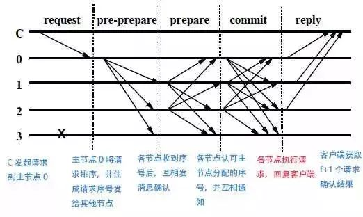

该repository作为本人读书笔记, 记录知识的获取, 以blog的形式记录下来. 该文库我会不断更新, 如果喜欢的话麻烦点一下`star`.

实用拜占庭容错(Practical Byzantine Fault Tolerance)

## Consensus Mechanism

如上图所示一共存在5个阶段
其中C为发送请求端, 0123为服务端, 3为宕机的服务端, 具体步骤如下: 

1. Request: 请求端C发送请求到任意一节点, 这里是0
2. Pre-Prepare: 服务端0收到C的请求后进行广播, 扩散至123
3. Prepare: 123,收到后记录并再次广播, 1->023, 2->013, 3因为宕机无法广播
4. Commit: 0123节点在Prepare阶段, 若收到超过一定数量的相同请求, 则进入Commit阶段, 广播Commit请求
5. Reply: 0123节点在Commit阶段, 若收到超过一定数量的相同请求, 则对C进行反馈

**容错机制:**
Prepare阶段需要对0(primary节点)的proposal进行安全校验(eg. 包含交易的合法性, 0节点身份验证...), proposal校验完成后节点会对校验结果进行广播, 并且广播的消息中包含节点的签名

Commit阶段所有活动节点正常会受到所有的其他节点prepare阶段的广播消息, 活动节点会收集这些消息, 收集到的消息需要满足: 1. 数量上大于 commit阀值Q, 考虑到可用性要求 N - f > Q (N为全节点数目, f为不响应节点)

接下来要考虑两种情况
1. 存在正确与fault两种提案需要达成一致, 要求: Q > 2F(F拜占庭节点数目)
2. 存在两种阶段需要达成一致的情况: 2Q - N > F(意图是个两个阶段一致不会由拜占庭节点决定哪个一阶段是保留阶段)

假设极端情况:
一个阶段n个节点支持, 另一个阶段n'个节点支持: 极端情况n' = n + 1, 为了使最终结果不由F节点决定所以Q >= n + F + 1, 而N = n + n' + F, 最终可得该情况下需要满足2Q - N >= F + 1

这两种都需要满足 N > 3F的情况下, 可以防止作恶保证安全以及节点宕机所致的可用性降低. 分析说明了PBFT与pow一个明显的差异支出在于PBFT需要在共识前知道所有的参与节点, 而pow却具有随时可加入, 退出的功能!