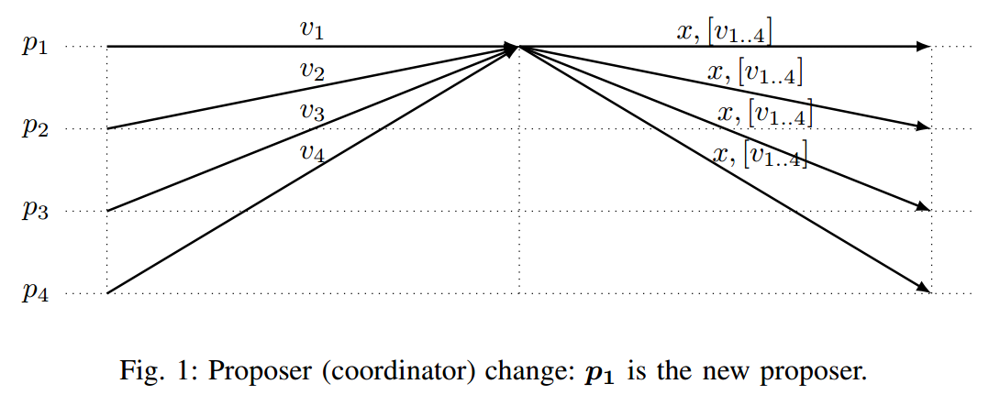

本文为tendermint paper: [The latest gossip on BFT consensus](https://www.researchgate.net/publication/326412260_The_latest_gossip_on_BFT_consensus)的读书笔记, 本文旨在理清论文中所讲的BFT共识. 如果您在阅读过程中有任何意见可以发起ISSUE, 如果喜欢的话可以点击`star`.

## 摘要

>The paper presents Tendermint, a new protocol for ordering events in a distributed network under adversarial conditions. More commonly known as Byzantine Fault Tolerant (BFT) consensus or atomic broadcast, the problem has attracted significant attention in recent years due to the widespread success of blockchain-based digital currencies, such as Bitcoin and Ethereum, which successfully solved the problem in a public setting without a central authority. Tendermint modernizes classic academic work on the subject and simplifies the design of the BFT algorithm by relying on a peer-to-peer gossip protocol among nodes.

本文介绍Tendermint, 一种在对抗的分布式网络环境下处理有序事件的协议. 更普遍的将其认知为拜占庭容错或原子广播, 该难题在最近几年由于基于区块链的数字货币, 例如, 比特币, 以太坊而受到大量的关注, 这些数字货币解决了再去中心化环境下建立可信公开环境. Tendermint协议将过去经典的学术工作做了现代化的改进并基于点对点的gossip协议简化BFT算法.

## 引言

>Consensus is one of the most fundamental problems in distributed computing. It is important because of it’s role in State Machine Replication (SMR), a generic approach for replicating services that can be modeled as a deterministic state machine [1], [2]. The key idea of this approach is that service replicas start in the same initial state, and then execute requests (also called transactions) in the same order; thereby guaranteeing that replicas stay in sync with each other. The role of consensus in the SMR approach is ensuring that all replicas receive transactions in the same order. Traditionally, deployments of SMR based systems are in data-center settings (local area network), have a small number of replicas (three to seven) and are typically part of a single administration domain (e.g., Chubby [3]); therefore they handle benign (crash) failures only, as more general forms of failure (in particular, malicious or Byzantine faults) are considered to occur with only negligible probability.

共识是最基础的问题在分布式计算中. 由于共识在状态机复制(SMR)中扮演重要角色, 复制服务的通用方法可以将其建模为确定行状态机. 方法的关键点是拷贝服务启始与一个相同的初始状态, 然后以一致的顺序执行请求(也可被称为交易); 因此保证复制状态保持同步. 共识在在SMR的方法中作用是保证接收的交易按照按照一致的顺序. 传统地, 基于SMR系统的部署是用在数据中心(本地局域网), 只有比较小的拷贝数(3-7)并且通常是单个管理域的一部分; 因此他们仅处理良性故障(奔溃), 对于更普遍形式的故障(尤其是恶意的, 或拜占庭故障)被认为发生的可能性极小.

## 正文

*正文部分不会做全翻译, 但会对重要的特性单独拿出来翻译*

> The Tendermint consensus algorithm is inspired by the PBFT SMR algorithm [8] and the DLS algorithm for authenticated faults (the Algorithm 2 from [6]).

tendermint的共识所发受到pbft smr算法与dls算法中授权故障部分的启发. 

>Tendermint is not presented in the basic round model of [6]. Furthermore, we use the term round differently than in [6]; in Tendermint a round denotes a sequence of communication steps instead of a single communication step in [6]

tendermint并不是DLS基本的回合模型. 更进一步, 我们使用了round模型有别于DLS. tendermint中每一回合代表一系列的通信步骤而非DLS中的单一通信步骤.

>To ensure that a proposed value is accepted by all correct processes a proposer will 1) build the global state by receiving messages from other processes, 2) select the safe value to propose and 3) send the selected value together with the signed messages received in the first step to support it. The value v<sub>i</sub> that a correct process sends to the next proposer normally corresponds to a value the process considers as acceptable for a decision:
>* in PBFT [8] and DLS [6] it is not the value itself but a set of 2f + 1 signed messages with the same value id,
>* in Fast Byzantine Paxos [11] the value itself is being sent.

为了确保提案被所有正确处理单元接收, 提议者需要做到:
1. 建立全局状态通过接收来自其他所有处理单元的消息
2. 选择安全的值进行提议
3. 发送挑选的值与支持该值的在第一步接收到的签名消息.
按照正确的过程发送给下一个提议者的值v<sub>i</sub>通常对应于该过程认为可以接受的值:
* 在pbft和dls中, 提议值并非数值本身而是指被2f+1签名的值;
* 在快速拜占庭paxos中该值正是被发送的值.



>In both cases, using this mechanism in our system model (ie. high number of nodes over gossip based network) would have high communication complexity that increases with the number of processes: in the first case as the message sent depends on the total number of processes, and in the second case as the value (block of transactions) is sent by each process. The set of messages received in the first step are normally piggybacked on the proposal message (in the Figure 1 denoted with [v<sub>1..4</sub>]) to justify the choice of the selected value x. Note that sending this message also does not scale with the number of processes in the system.

两方面共同的, 在我们的系统模型中使用该机制(也就大量节点使用gossip的基础网络)会随着处理单元数目的增加在交流上变得格外复杂: 第一种情况该值的消息发送依赖于处理单元的数目, 而第二种情况该值(块中的交易)是由该轮的处理单元发送. 这一类在第一轮接收的消息通常会包含在提议的消息中(图1中的v<sub>1..4</sub>)为了证明选择值x的合理性. 请注意, 发送此消息也不会随着系统中处理单元的数量增长而扩展.

>We designed a novel termination mechanism for Tendermint that better suits the system model we consider. It does not require additional communication (neither sending new messages nor piggybacking information on the existing messages) and it is fully based on the communication pattern that is very similar to the normal case in PBFT [8]. Therefore, there is only a single mode of execution in Tendermint, i.e., there is no separation between the normal and the recovery mode, which is the case in other PBFT-like protocols (e.g., [8], [12] or [13]). We believe this makes Tendermint simpler to understand and implement correctly

我们为tendermint设计了新型的终止机制, 我们认为其更适合系统模型. 该机制不需要额外的通信(既不发送新消息也不需要在当前存在的消息中附带信息)并且完全是依据非常类似与pbft的通信模式. 因此, 在tendermint只有一种执行类型, 例如, 普通模式和恢复模式没有区别, 这与其他类pbft协议不同. 我们相信这使tendermint更简单去理解与实现更正确.

> Note that the orthogonal approach for reducing message complexity in order to improve scalability and decentralization (number of processes) of BFT consensus algorithms is using advanced cryptography (for example Boneh-Lynn-Shacham (BLS) signatures [14]) as done for example in SBFT [15]

值得注意的是为了降低BFT共识算法的信息复杂度以提升可扩展性以及分散性(可容纳的处理单元数量)的正交方法目前正在使用高级的加密方法(例如Boneh-Lynn-Shacham (BLS) 签名, 该方法就用于SBFT共识中)

>Processes in our model are not part of a single administration domain; therefore we cannot enforce a direct network connectivity between all processes. Instead, we assume that each process is connected to a subset of processes called peers, such that there is an indirect communication channel between all correct processes

处理单元在我们的模型中并不一定只是单一管理域的一部分; 因此我们不能强制网络为一个直连网络: 连接了所有处理单元. 相反, 我们只能假设每一个处理单元知识与一个子集的处理单元(谓之peer)相连, 因此存在非直接通信的通道连接所有正确的处理单元.

### 定义
<u>规定&theta;为系统的执行时间上限; GST(Global Stabilization Time): 消息在正确的处理单元中通信所需要经过多少时间后才被认为可靠(消息传播时间t > GST, 消息才被认为可靠, 总时间T = t + &theta;)</u>.

>We assume that process steps (which might include sending and receiving messages) take zero time. Processes are equipped with clocks so they can measure local timeouts. All protocol messages are signed, i.e., when a correct process q receives a signed message m from its peer, the process q can verify who was the original sender of the message m.

我们假设处理某些步骤(包括接收和发送消息)耗时为零. 所有处理单元都配备时钟, 所以他们可以推断本地超时. 所有的协议消息都是被签名的, 例如, 当正确的处理单元q从peer接收了签名的消息m, 处理单元q能够验证谁是这个消息m原始的发送人.

> Gossip communication: If a correct process Preceives some message m at time t, all correct processes will receive m before max{t, GST } + &theta;.

gossip通信: 如果正确的处理单元p接收到消息m的时间为t, 所有正确的处理单元接收到m的时间会小于max{t, GST } + &theta;.

>State machine replication (SMR) is a general approach for replicating services modeled as a deterministic state machine [1], [2]. The key idea of this approach is to guarantee that all replicas start in the same state and then apply requests from clients in the same order, thereby guaranteeing that the replicas’ states will not diverge. 

复制状态机(SMR)是用于复制建模服务为了确定性状态机的通用方法. 其关键思想是保证所有复制都起始于一个相同状态然后以相同顺序执行来自客户端一致顺序的请求, 因此保证复制的状态不会分叉.

>Tendermint solves state machine replication by sequentially executing consensus instances to agree on each block of transactions that are then executed by the service being replicated. We consider a variant of the Byzantine consensus problem called Validity Predicate-based Byzantine consensus that is motivated by blockchain systems [17]. The problem is defined by an agreement, a termination, and a validity property.
>* Agreement: No two correct processes decide on different values.
>* Termination: All correct processes eventually decide on a value.
>* Validity: A decided value is valid, i.e., it satisfies the predefined predicate denoted valid().

tendermint通过顺序执行共识实例来校验区块中的交易, 然后由复制的服务来执行, 以解决状态复制的问题. 我们考虑拜占庭共识问题的变种, 它是由区块链系统驱动的基于有效性凭证的拜占庭共识. 该问题由一致性, 最终性以及有效性定义.
* 一致性: 不存在正确的处理单元选择不同的值.
* 最终性: 所有正确的处理单元最终会选择同一个值.
* 有效性: 决定的值都是有效的, 例如, 它能通过预定义为valid()的校验.

>For example, the condition 2f + 1<**PRECOMMIT**, h<sub>p</sub>, r, id(v)>, evaluates to true upon reception of **PRECOMMIT** messages for height h<sub>p</sub>, a round r and with value equal to id(v) whose senders have aggregate voting power at least equal to 2f + 1

例如,  2f + 1<**PRECOMMIT**, h<sub>p</sub>, r, id(v)>的条件, 执行为true依据PRECOMMIT消息具备接收的区块高度h<sub>p</sub>, 轮数为r以及值与id(v)一致, 并且消息的合计投票权重至少达到2f + 1.

>The variables with index p are process local state variables, while variables without index p are value placeholders. The sign * denotes any value.

变量有p下标为过程局部变量, 而没有p下标变量为占位符. 标记\*表示任意值.

>We denote with n the total voting power of processes in the system, and we assume that the total voting power of faulty processes in the system is bounded with a system parameter f. The algorithm assumes that n > 3f, i.e., it requires that the total voting power of faulty processes is smaller than one third of the total voting power. For simplicity we present the algorithm for the case n = 3f + 1.

*简译*: 文章中指定了投票权值要达到n, 并且n = 3f + 1, 其中f定义为拜占庭节点的投票权值总和.

>The algorithm proceeds in rounds, where each round has a dedicated proposer. The mapping of rounds to proposers is known to all processes and is given as a function *proposer*(h, round), returning the proposer for the round round in the consensus instance h. We assume that the proposer selection function is weighted roundrobin, where processes are rotated proportional to their voting power7. The internal protocol state transitions are triggered by message reception and by expiration of timeouts. There are three timeouts in Algorithm 1: timeoutPropose, timeoutPrevote and timeoutPrecommit. The timeouts prevent the algorithm from blocking and waiting forever for some condition to be true, ensure that processes continuously transition between rounds, and guarantee that eventually (after GST) communication between correct processes is timely and reliable so they can decide. The last role is achieved by increasing the timeouts with every new round r, i.e, timeoutX(r) = initTimeoutX + r * timeoutDelta; they are reset for every new height (consensus instance).

算法以轮进行处理, 每一轮都会有一个专门的提议人. 每一轮对应的提议人对所有处理单元来说都是已知的并由函数*proposer*(h, round), 该函数返回共识实例h下round轮的提议者. 我们假设提议者选择为加权轮询, 该过程按其投票权成比例轮换. 内部协议状态转换由消息接收和超时到期触发. 在算法1中有3种超时: timeoutPropose, timeoutPrevote以及timeoutPrecommit. 超时是为了防止算法因为等待某些条件为true导致堵塞甚至永久等待, 以及保证每一轮之间连续地处理转换, 并且最终保证(GST时间之后)正确的处理单元之间通信是及时的和可靠地因此需要定义这些超时. 最后一个角色是通过在每个新回合r中增加超时来实现的, 例如 timeoutX(r) = initTimeoutX + r*timeoutDelta; 该时间会在每个新高度重置(共识实例).

>Processes exchange the following messages in Tendermint: **PROPOSAL**, **PREVOTE** and **PRECOMMIT**. The **PROPOSAL** message is used by the proposer of the current round to suggest a potential decision value, while **PREVOTE** and **PRECOMMIT** are votes for a proposed value. According to the classification of consensus algorithms from [10], Tendermint, like PBFT [7] and DLS [6], belongs to class 3, so it requires two voting steps (three communication exchanges in total) to decide a value. The Tendermint consensus algorithm is designed for the blockchain context where the value to decide is a block of transactions (ie. it is potentially quite large, consisting of many transactions). Therefore, in the Algorithm 1 (similar as in [7]) we are explicit about sending a value (block of transactions) and a small, constant size value id (a unique value identifier, normally a hash of the value, i.e., if id(v) = id(v′), then v = v′). The **PROPOSAL** message is the only one carrying the value; **PREVOTE** and PRECOMMIT messages carry the value id. A correct process decides on a value v in Tendermint upon receiving the **PROPOSAL** for v and 2f +1 voting-power equivalent **PRECOMMIT** messages for id(v) in some round r. In order to send **PRECOMMIT** message for v in a round r, a correct process waits to receive the **PROPOSAL** and 2f +1 of the corresponding **PREVOTE** messages in the round r. Otherwise, it sends **PRECOMMIT** message with a special nil value. This ensures that correct processes can **PRECOMMIT** only a single value (or nil) in a round. As proposers may be faulty, the proposed value is treated by correct processes as a suggestion (it is not blindly accepted), and a correct process tells others if it accepted the **PROPOSAL** for value v by sending **PREVOTE** message for id(v); otherwise it sends **PREVOTE** message with the special nil value.

tendermint中处理单元交换以下消息: **PROPOSAL**, **PREVOTE**以及**PRECOMMIT**. **PROPOSAL**是提议者用于在当前轮建议一个可能的决定值, 而**PROPOSAL**和**PRECOMMIT**是对提议的值进行投票. 根据共识算法的分类, tendermint, PBFT以及DLS属于第3类, 所以需要两轮投票步骤(通信消息总共需要交换3次)来决定值. tendermint的共识算法是设计用于区块上下文, 该上下文用于决定值也正是区块中的交易(例如, 交易可能会很大, 包含大量的交易). 因此, 在算法1中我们显示发送值(区块中的交易)以及一个定长的值ID(一个独一的标识符, 通常为hash). **PROPOSAL**消息是唯一包含值的; **PREVOTE**和**PRECOMMIT**消息只包含值ID. 在tendermint一个正确的处理单元决定值v需要包含v的**PROPOSAL**得到2f + 1的票权以及**PRECOMMIT**也得到了对id(v)同等的票权在同一轮r中. 为了在r轮发送v对应的**PRECOMMIT**消息, 每个正确的处理单元在轮r需要等待**PROPOSAL**消息以及2f + 1票权对应的 **PREVOTE**消息. 否则, 该单元将会发送一个特殊空值的**PRECOMMIT**消息. 这确保的处理单元发送的**PRECOMMIT**消息只能为同一个值或nil值. 由于提议人可能会作恶, 所以提议人的值对于正确的处理单元而言只是一个建议值(并非盲目接受), 并且正确的处理单元告知其他单元如果他接受了该**PROPOSAL**对应的值v, 他将会向其他单元发送v对应的**PREVOTE**消息即为对id(v)的签名消息; 否则其会发送一个特殊的空值**PREVOTE**消息.

>Every process maintains the following variables in the Algorithm 1: step, lockedValue, lockedRound, validValue and validRound. The step denotes the current state of the internal Tendermint state machine, i.e., it reflects the stage of the algorithm execution in the current round. The lockedValue stores the most recent value (with respect to a round number) for which a **PRECOMMIT** message has been sent. The lockedRound is the last round in which the process sent a **PRECOMMIT** message that is not nil. We also say that a correct process locks a value v in a round r by setting lockedValue = v and lockedRound = r before sending **PRECOMMIT** message for id(v). As a correct process can decide a value v only if 2f + 1 **PRECOMMIT** messages for id(v) are received, this implies that a possible decision value is a value that is locked by at least f +1 voting power equivalent of correct processes. Therefore, any value v for which **PROPOSAL** and 2f +1 of the corresponding **PREVOTE** messages are received in some round r is a possible decision value. The role of the validValue variable is to store the most recent possible decision value; the validRound is the last round in which validValue is updated. Apart from those variables, a process also stores the current consensus instance (hp, called height in Tendermint), and the current round number (roundp) and attaches them to every message. Finally, a process also stores an array of decisions, decisionp (Tendermint assumes a sequence of consensus instances, one for each height).

每一个处理单元维护人需要维持以下情况: step, lockValue, lockedRound, validValue以及 validRound. step表示当前tendermint状态机的状态, 例如, step表示在当前轮中算法算法执行到的位置. lockedValue存储着最新的值(对应与轮值)为此一条**PRECOMMIT**消息已经被发送了. lockedRound是最新轮此时处理单元发送的**PRECOMMIT**消息不位nil. 我们也可以说正确处理单元锁住轮r的值v可以设置lockedValue = v以及lockedRound = r在发送id(v)对应的**PRECOMMIT**消息之前. 对于一个正确的处理单元能决定值v只有当收到了对应id(v)的2f + 1票权的**PRECOMMIT**消息, 这说明了一个可能的确定值是一个至少锁定了f + 1票权等价的处理单元的值. 因此, 包含任何值v的**PROPOSAL**得到2f + 1票权的对应**PREVOTE**消息在同一轮r那么该值可能就是确定的值. validValue存储着最新的可能值; validRound是validValue更新的最新一轮. 不仅包括这些值, 处理单元也存储着当前的共识实例(hp, 称之为tendermint高度), 以及当前的轮数(roundp)并且将他们包含在所有交易中. 最后, 处理单元会存储一个决定值的序列decisionp(tendermint假设一系列的共识实例对应每一个高度)

>Every round starts by a proposer suggesting a value with the **PROPOSAL** message (see line 19). In the initial round of each height, the proposer is free to chose the value to suggest. In the Algorithm 1, a correct process obtains a value to propose using an external function getValue() that returns a valid value to propose. In the following rounds, a correct proposer will suggest a new value only if validValue = nil; otherwise validValue is proposed (see lines 15-18). In addition to the value proposed, the **PROPOSAL** message also contains the validRound so other processes are informed about the last round in which the proposer observed validValue as a possible decision value. Note that if a correct proposer p sends validValue with the validRound in the **PROPOSAL**, this implies that the process Preceived **PROPOSAL** and the corresponding 2f + 1 **PREVOTE** messages for validValue in the round validRound. If a correct process sends **PROPOSAL** message with validValue (validRound > −1) at time t > GST , by the Gossip communication property, the corresponding **PROPOSAL** and the **PREVOTE** messages will be received by all correct processes before time t+&theta;. Therefore, all correct processes will be able to verify the correctness of the suggested value as it is supported by the **PROPOSAL** and the corresponding 2f + 1 voting power equivalent **PREVOTE** messages.

每一轮开始于一个提议者以**PROPOSAL**消息建议一个值. 在没一个高度的最初始高度, 提议者可以自由的选择值来提议. 在算法1中, 一个正确的处理单元通过外部函数getValue()返回一个有效值的进行提议. 在接下来的轮, 一个正确的提议者会建议一个新值在validValue = nil的条件下; 否者validValue会被用于提议. 除了值提议意外, **PROPOSAL**消息也包含了validRound因此其他处理单元会被告知最新轮在**PROPOSAL**消息中validValue被提议者视为决定的值. 注意如果一个正确的提议人p在validRound发送包含validValue的**PROPOSAL**消息, 这说明了处理单元p接收到了**PROPOSAL**消息以及对应的2f + 1票权的**PREVOTE**消息接受在validRound轮的validValue值. 如果一个正确的提议人发送包含validValue(validRound > −1)的**PROPOSAL**消息在时间t > GST的情况下, 凭借gossip的通信特性**PROPOSAL**以及**PREVOTE**的消息在时间t+&theta;之前被正确的处理单元接收. 因此, 所有正确的处理单元可以验证**PROPOSAL**消息提议的建议值以及2f + 1票权对应的**PREVOTE**消息.

>A correct process p accepts the proposal for a value v (send **PREVOTE** for id(v)) if an external valid function returns true for the value v, and if p hasn’t locked any value (lockedRound = −1) or p has locked the value v (lockedValue = v); see the line 23. In case the proposed pair is (v, vr ≥ 0) and a correct process p has locked some value, it will accept v if it is a more recent possible decision value8, vr > lockedRoundp, or if lockedValue = v (see line 29). Otherwise, a correct process will reject the proposal by sending **PREVOTE** message with nil value. A correct process will send **PREVOTE** message with nil value also in case timeoutPropose expiredValuep (it is triggered when a correct process starts a new round) and a process has not sent **PREVOTE** message in the current round yet (see the line 57)

*简译*: 在正确的处理单元收到v的**PROPOSAL**后, 想要发送id(v)的**PREVOTE**需要满足以下条件:

* 建议值v必须通过了外部校验函数的校验;
* 依据处理单元自身lockedRound和lockedValue不同, 做一下区分: 
  1. lockedRound = -1时, 即处理单元未锁定任何值或者lockedValue = v, 即所定制一致的情况, 处理单元会发送id(v)的**PREVOTE**消息
  2. lockedRound不为-1时, 此时如果vr > lockedRoundp或者lockedValue = v, 处理单元会发送id(v)的**PREVOTE**消息
* 以上两点有一点不符合的处理单元将会拒绝该提议发送值为nil的**PREVOTE**消息
* 为了防止当前轮被更新设置了timeoutPropose超时, 一旦超时同样会发送值为nil的**PREVOTE**消息

>If a correct process receives **PROPOSAL** message for some value v and 2f + 1 **PREVOTE** messages for id(v), then it sends **PRECOMMIT** message with id(v). Otherwise, it sends **PRECOMMIT** nil. A correct process will send **PRECOMMIT** message with nil value also in case timeoutPrevote expired (it is started when a correct process sent **PREVOTE** message and received any 2f + 1 **PREVOTE** messages) and a process has not sent **PRECOMMIT** message in the current round yet (see the line 65). A correct process decides on some value v if it receives in some round r **PROPOSAL** message for v and 2f + 1 **PRECOMMIT** messages with id(v) (see the line 51). To prevent the algorithm from blocking and waiting forever for this condition to be true, the Algorithm 1 relies on timeoutPrecommit. It is triggered after a process receives any set of 2f +1 **PRECOMMIT** messages for the current round. If the timeoutPrecommit expires and a process has not decided yet, the process starts the next round (see the line 65). When a correct process p decides, it starts the next consensus instance (for the next height). The Gossip communication property ensures that **PROPOSAL** and 2f + 1 **PREVOTE** messages that led p to decide are eventually received by all correct processes, so they will also decide.

*简译*: 在正确的处理单元收到v的**PROPOSAL**消息以及2f + 1票权的id(v)的**PREVOTE**消息, 节点才会发送id(v)的**PRECOMMIT**消息, 否则处理单元只会发送值为nil的**PRECOMMIT**消息. 在超时timeoutP满足时, 正确的处理单元同样会发送值为nil的**PRECOMMIT**. 只有当处理单元收到v的**PROPOSAL**以及2f + 1的id(v)的**PRECOMMIT**消息时才会决定v为最终值. 为了防止算法堵塞甚至死锁, 算法1实现了timeoutPrecommit超时. 当收到任何值的2f + 1的**PRECOMMIT**时会启动一个超时处理线程, 如果超时timeoutPrecommit满足时, 处理单元会启动新的一轮. 正确的结果会使处理单元启动新的共识实例(下一个高度). gossip的通信特征保证所有正确的处理单元可以接收到由p决定的**PROPOSAL**和2f + 1的**PREVOTE**消息, 所以所有单元会共同决定.

### tendermint机制

>Note that it could happen that during good period, no correct process locks a value, but some correct process q updates validValue and validRound during some round. As no correct process locks a value in this case, validValueq and validRoundq will also be acceptable by all correct processes as validRoundq > lockedRoundc for every correct process c and as the Gossip communication property ensures that the corresponding **PREVOTE** messages that q received in the round validRoundq are received by all correct processes &theta; time later

简译: 有可能在正确的流程下发生这种情况, 不会有正确的处理单元会锁定一个值, 但是正确处理单元q会在一些轮中更新validValue和validRound. 由于在该情况下没有正确的处理单元锁定值, 因此对于所有正确的处理单元c会接受validValueq以及validRoundq, 因为validRoundq > lockedRoundc. 并且Gossip的通信特征保证q接收的对应的**PREVOTE**消息在&theta;时间之后被正确的处理单元接收.

>Therefore, updating validValue and validRound variables, and the Gossip communication property, together ensures that eventually, during the good period, there exists a round with a correct proposer whose proposed value will be accepted by all correct processes, and all correct processes will terminate in that round. Note that this mechanism, contrary to the common termination mechanism illustrated in the Figure 1, does not require exchanging any additional information in addition to messages already sent as part of what is normally being called ”normal” case.

简译: 在正确情况下更新validValue和validRound变量, 存在一个回合正确的提议人的建议值会被所有处理单元接受同事终止该轮. 注意在该机制下, 不同于图一所描述的那样不需要交换任何额外的信息由于消息已经作为通常情况的一部分.

### tendemrint共识证明

之后为tendermint共识相关的引理和证明. 由于该部分非常严谨, 翻译与原文请参照阅读, 部分证明可能不会给出翻译.

>Lemma 1. For all f ≥ 0, any two sets of processes with voting power at least equal to 2f + 1 have at least one correct process in common.

引理1: 对于所有f > 0, 任何处理单元的两个子集如果票权都达到了至少2f + 1, 那么至少有一个正确处理单元同时存在于连个子集中.

>Proof: As the total voting power is equal to n = 3f + 1, we have 2(2f + 1) = n + f + 1. This means
that the intersection of two sets with the voting power equal to 2f + 1 contains at least f + 1 voting power in common, i.e., at least one correct process (as the total voting power of faulty processes is f). The result follows directly from this.

证明: 相信这是个一目了然的引理. 总数n = 3f + 1, 而我们有2(2f + 1) = n + f + 1, 所以至少有1个是我们所说的那个"倒戈"的"正确处理单元"

>Lemma 2. If f + 1 correct processes lock value v in round r0 (lockedValue = v and lockedRound = r0), then in all rounds r > r0, they send **PREVOTE** for id(v) or nil

引理2: 如果有f + 1数量的正确节点锁定了值ｖ和轮r0(即lockedValue = v以及lockedRound = r0), 然后在所有轮中r > r0, 他们都将只会发送id(v)或nil**PREVOTE**消息.*(这是一个比较high level的引理了)*

>Proof: We prove the result by induction on r.
>Base step r = r0 +1 : Let’s denote with C the set of correct processes with voting power equal to f +1. By the rules at line 22 and line 28, the processes from the set C can’t accept **PROPOSAL** for any value different from v in round r, and therefore can’t send a <**PREVOTE**, heightp, r, id(v′)> message, if v′ != v. Therefore, the Lemma holds for the base step.

证明: 我们通过引入r来证明结果.
基本步r = r0 + 1: C集表示f + 1票权的正确处理单元. 在伪代码22和28行指出C集不会在r轮接受非v的**PROPOSAL**, 也因此不会发送一个<**PREVOTE**, heightp, r, id(v′)>消息, 如果v′ != v. 所以引理满足基本步的情况

>Induction step from r1 to r1 + 1: We assume that no process from the set C has sent **PREVOTE** for values different than id(v) or nil until round r1 + 1. We now prove that the Lemma also holds for round r1 + 1. As processes from the set C send **PREVOTE** for id(v) or nil in rounds r0 ≤ r ≤ r1, by Lemma 1 there is no value v′ != v for which it is possible to receive 2f + 1 **PREVOTE** messages in those rounds (i). Therefore, we have for all processes from the set C, lockedValue = v and lockedRound ≥ r0. Let’s assume by a contradiction that a process q from the set C sends **PREVOTE** in round r1 + 1 for value id(v′), where v′ != v. This is possible only by line 30. Note that this implies that q received 2f + 1 <**PREVOTE**, hq, r, id(v′)> messages, where r > r0 and r < r1 + 1 (see line 29). A contradiction with (i) and Lemma 1.

*简译: 证明*: 看过了基本步显然不够严谨, 再来看看递归步: 从r1到r1 + 1: r1 > r0: 假设在r1 + 1前集C不会发送处理id(v)或nil以外的**PREVOTE**消息. 然后我们在推广到r1 + 1. 根据引理1的情况, C集成员不可能收到2f + 1票权的id(v')(并且v' != v)的 **PREVOTE**消息. 我们进一步假设一个矛盾, 存在一个C集处理单元q在轮r1 + 1发送了id(v′)的**PREVOTE**消息, 且v' != v. 该情况只可能发生在30行代码. 注意该情况建立在q收到了<**PREVOTE**, hq, r, id(v′)>消息, 其中r0 < r < r1 + 1. 违背了引理1.

>Lemma 3. Algorithm 1 satisfies Agreement.

引理3: 算法1满足一致性. 

>We prove the case r > r0 by contradiction. By the rule 49, p has received at least 2f + 1 votingpower equivalent of <**PRECOMMIT**, hp, r0, id(v)> messages, i.e., at least f +1 voting-power equivalent correct processes have locked value v in round r0 and have sent those messages (i). Let denote this set of messages with C. On the other side, q has received at least 2f + 1 voting power equivalent of <**PRECOMMIT**, hq, r, id(v′)> messages. As the voting power of all faulty processes is at most f, some correct process c has sent one of those messages. By the rule at line 36, c has locked value v′ in round r before sending <**PRECOMMIT**, hq, r, id(v′)>. Therefore c has received 2f + 1 **PREVOTE** messages for id(v′) in round r > r0 (see line 36). By Lemma 1, a process from the set C has sent **PREVOTE** message for id(v′) in round r. A contradiction with (i) and Lemma 2.

*简译: 证明*: 简而言之, 将引理1和引理2扩展到**PRECOMMIT**阶段. 当存在2f + 1的<**PRECOMMIT**, h, r0, id(v)>的消息, 之后又存在了2f + 1的<**PRECOMMIT**, h, r, id(v')>的消息, 根据引理1就说明C集中有c发送了<**PRECOMMIT**, h, r, id(v')>的消息, c发送该消息必然是因为有2f + 1的id(v')的**PREVOTE**消息(由于36行代码的限制), 那么说C集中有c'发送了id(v')的**PREVOTE**消息, 而r > r0, 显然与引理2不符.

>Lemma 4. Algorithm 1 satisfies Validity.

引理4: 算法1满足有效性

>Proof: Trivially follows from the rule at line 50 which ensures that only valid values can be decided.

*值的有效性证明是通过外部函数提供的50行代码*

>Lemma 5. If we assume that:
>1. a correct process p is the first correct process to enter a round r > 0 at time t > GST (for every correct process c, roundc ≤ r at time t)
>2. the proposer of round r is a correct process q
>3. for every correct process c, lockedRoundc ≤ validRoundq at time t
>4. timeoutPropose(r) > 2&theta;+timeoutPrecommit(r−1), timeoutPrevote(r) > 2&theta; and timeoutPrecommit(r) > 2&theta;,
>then all correct processes decide in round r before t + 4&theta; + timeoutPrecommit(r − 1).

引理5. 如果我们假设:
1. 一个正确的处理单元p作为第一个正确处理单元进入轮r(r > 0)在时间t > GST(对于其他所有正确的处理单元c, roundc <= r在时间t)
2. 在轮r的提议人是正确处理单元q
3. 对于每一个正确处理单元c, 在时间t满足lockedRoundc ≤ validRoundq
4. timeoutPropose(r) > 2&theta;+timeoutPrecommit(r−1), timeoutPrevote(r) > 2&theta; 以及timeoutPrecommit(r) > 2&theta;,

>Proof: As p is the first correct process to enter round r, it executed the line 67 after timeoutPrecommit(r−1) expired. Therefore, p received 2f + 1 **PRECOMMIT** messages in the round r − 1 before time t. By the Gossip communication property, all correct processes will receive those messages the latest at time t + &theta;. Correct processes that are in rounds < r− 1 at time t will enter round r− 1 (see the rule at line 56) and trigger timeoutPrecommit(r − 1) (see rule 47) by time t + &theta;. Therefore, all correct processes will start round r by time t + &theta; + timeoutPrecommit(r − 1) (i).

*简译: 证明*: 对于p作为第一个进入轮r的正确处理单元, 在timeoutPrecommit(r−1)到期后, 会进入67代码段的执行. 因此, 在时间t之前p会接收2f + 1的**PRECOMMIT**消息在r - 1轮. 基于Gossip的通信特性, 所有正确处理单元会在时间至少时间t + &theta都受到这些消息. 在时间t正确的处理单元所在轮 < r− 1会进入r - 1轮(参看56行代码段逻辑)并且在时间t + &theta;之前触发timeoutPrecommit(r − 1)(参看47代码段). 因此, 所有正确处理单元将启动轮r当时间超过t + &theta; + timeoutPrecommit(r − 1)(假设1)

>In the worst case, the process q is the last correct process to enter round r, so q starts round r and sends **PROPOSAL** message for some value v at time t + &theta; + timeoutPrecommit(r − 1). Therefore, all correct processes receive the **PROPOSAL** message from q the latest by time t + 2&theta; + timeoutPrecommit(r − 1). Therefore, if timeoutPropose(r) > 2&theta; + timeoutPrecommit(r − 1), all correct processes will receive **PROPOSAL** message before timeoutPropose(r) expires.

*简译: 证明*: 最坏的情况下, q处理单元是最后一个正确处理单元进入r轮, 所以q从r轮开始以及发送v值的**PROPOSAL**消息在时间t + &theta; + timeoutPrecommit(r − 1). 因此所有正确的处理单元接收到来自q的**PROPOSAL**最多在时间t + 2&theta; + timeoutPrecommit(r − 1)之前. 因此如果timeoutPropose(r) > 2&theta; + timeoutPrecommit(r − 1), 那么所有的正确处理单元都会在timeoutPropose(r)超时之前收到**PROPOSAL**消息. 

>By (3) and the rules at line 22 and 28, all correct processes will accept the **PROPOSAL** message for value v and will send a **PREVOTE** message for id(v) by time t + 2&theta; + timeoutPrecommit(r − 1). Note that by the Gossip communication property, the **PREVOTE** messages needed to trigger the rule at line 28 are received before time t + &theta;.

通过第3点以及代码22和28行的规定, 所有正确的处理单元会接受v值的**PROPOSAL**消息以及发送id(v)的**PREVOTE**消息在时间t + 2&theta; + timeoutPrecommit(r − 1)之前. 注意基于gossip的通信特点, 在时间t + &theta;之前接收到的**PREVOTE**消息需要触发28行代码处的逻辑.

>By time t + 3&theta; + timeoutPrecommit(r − 1), all correct processes will receive **PROPOSAL** for v and 2f + 1 corresponding **PREVOTE** messages for id(v). By the rule at line 36, all correct processes will send a **PRECOMMIT** message (see line 40) for id(v) by time t + 3&theta; + timeoutPrecommit(r − 1). Therefore, by time t + 4&theta; + timeoutPrecommit(r − 1), all correct processes will have received the **PROPOSAL** for v and 2f + 1 **PRECOMMIT** messages for id(v), so they decide at line 51 on v.

在时间t + 3&theta; + timeoutPrecommit(r − 1)之前, 所有的处理单元会接收到v的**PROPOSAL**以及2f + 1的id(v)的**PREVOTE**消息. 依据36行代码的规定, 所有正确的处理单元会发送id(v)**PRECOMMIT**消息(参看第40行代码)在时间t + 3&theta; + timeoutPrecommit(r − 1)之前. 因此, 在时间t + 4&theta; + timeoutPrecommit(r − 1)之前, 所有的正确处理单元都将收到v的**PROPOSAL**消息以及2f + 1的id(v)的**PRECOMMIT**消息, 所以在51行代码他们将会决定v.

>This scenario holds if every correct process q sends a **PRECOMMIT** message before timeoutPrevote(r) expires, and if timeoutPrecommit(r) does not expire before t + 4&theta; + timeoutPrecommit(r − 1). Let’s assume that a correct process c1 is the first correct process to trigger timeoutPrevote(r) (see the rule at line 34) at time t1 > t. This implies that before time t1, c1 received a **PROPOSAL** (stepc1 must be prevote by the rule at line 34) and a set of 2f + 1 **PREVOTE** messages. By time t1 + &theta;, all correct processes will receive those messages. Note that even if some correct process was in the smaller round before time t1, at time t1 + &theta; it will start round r after receiving those messages (see the rule at line 55). Therefore, all correct processes will send their **PREVOTE** message for id(v) by time t1 + &theta;, and all correct processes will receive those messages the by time t1 + 2&theta;. Therefore, as timeoutPrevote(r) > 2&theta;, this ensures that all correct processes receive **PREVOTE** messages from all correct processes before their respective local timeoutPrevote(r) expire.

如果所有处理单元q都发送了**PRECOMMIT**消息在timeoutPrevote(r)超时前, 并且在t + 4&theta; + timeoutPrecommit(r − 1)之前timeoutPrecommit(r)还未超时. 我们假设有一个正确处理单元c1是第一个触发timeoutPrevote(r)(34行代码)的正确处理单元在时间t1 > t. 这说明了在时间t1之前, c1收到了一个**PROPOSAL**消息(stepc1必须已经被预投了在34行代码)以及一个2f + 1的**PREVOTE**的消息集. 在时间t1 + &theta;之前, 所有的正确处理单元都将接收到这些消息. 注意到在时间t1前甚至会有正确的处理单元在更小数值的轮中, 那么在时间t1 + &theta;根据55行代码该单元将会启动新的轮r在接收到这些消息之后. 因此, 所有的处理单元在时间t1 + &theta;会发送id(v)的**PREVOTE**消息. 因此在timeoutPrevote(r) > 2&theta;, 这确保了所有正确的处理在timeoutPrevote(r)超时前能接收到来自所有正确处理单元的**PREVOTE**消息.

>On the other hand, timeoutPrecommit(r) is triggered in a correct process c2 after it receives any set of 2f + 1 **PRECOMMIT** messages for the first time. Let’s denote with t2 > t the earliest point in time timeoutPrecommit(r) is triggered in some correct process c2. This implies that c2 has received at least f + 1 **PRECOMMIT** messages for id(v) from correct processes, i.e., those processes have received **PROPOSAL** for v and 2f + 1 **PREVOTE** messages for id(v) before time t2. By the Gossip communication property, all correct processes will receive those messages by time t2 + &theta;, and will send **PRECOMMIT** messages for id(v). Note that even if some correct processes were at time t2 in a round smaller than r, by the rule at line 55 they will enter round r by time t2 + &theta;. Therefore, by time t2 + 2&theta;, all correct processes will receive **PROPOSAL** for v  and 2f + 1 **PRECOMMIT** messages for id(v). So if timeoutPrecommit(r) > 2&theta;, all correct processes will decide before the timeout expires.

另一方面, 正确的处理单元c2在第一次收到任何的2f + 1的**PRECOMMIT**消息后会触发timeoutPrecommit(r). 让我们用t2(t2 > t)来表示最早单元c2的触发timeoutPrecommit(r)的时间. 这说明了c2 至少从其他正确处理单元那边接收到了id(v)的f + 1的**PRECOMMIT**消息, 因此, 这些处理单元已经接收到了v的**PROPOSAL**消息和id(v)的2f + 1的**PREVOTE**消息在时间t2之前. 根据Gossip的通信特征, 所有的正确处理单元将会接收到这些消息在t2 + &theta;时间, 并且发送id(v)的**PRECOMMIT**消息. 注意到在时间t2前甚至会有正确的处理单元在更小数值的轮中, 那么在时间t2 + &theta;根据55行代码该单元将会启动新的轮r在接收到这些消息之后. 因此在时间t2 + 2&theta;, 所有正确的处理单元都将接收到v的**PROPOSAL**消息和id(v)的2f + 1的**PRECOMMIT**消息. 所以如果timeoutPrecommit(r) > 2&theta;, 所有正确的处理单元将会决定值在超时到时前.

>Lemma 6. If a correct process p locks a value v at time t0 > GST in some round r (lockedValue = v and lockedRound = r) and timeoutPrecommit(r) > 2&theta;, then all correct processes set validValue to v and validRound to r before starting round r + 1.

引理6: 如果正确处理单元p在时间t0(t0 > GST)在轮r(lockedValue = v以及lockedRound = r)以及timeoutPrecommit(r) > 2&theta;的情况下, 那么所有的正确处理单元将会设置validValue为v并且validRound为r在启动r + 1轮前.

>Proof: In order to prove this Lemma, we need to prove that if the process p locks a value v at time t0, then no correct process will leave round r before time t0 + &theta; (unless it has already set validValue to v and validRound to r). It is sufficient to prove this, since by the Gossip communication property the messages that p received at time t0 and that triggered rule at line 36 will be received by time t0 + &theta; by all correct processes, so all correct processes that are still in round r will set validValue to v and validRound to r (by the rule at line 36). To prove this, we need to compute the earliest point in time a correct process could leave round r without updating validValue to v and validRound to r (we denote this time with t1). The Lemma is correct if t0 + &theta; < t1.

*简译: 证明*: 为了证明该引理, 我们需要证明如果处理单元p锁定了一个v值在时间t0, 那么不存在正确的处理单元在时间t0 + &theta;前离开r轮(除非该单元配置了validValue为v以及validRound为r). 很充分的可以证明这一点, 通过gossip的通信特点p在时间t0接收到的消息那么会在时间t0 + &theta;所有正确的处理单元会触发36行的代码逻辑, 那么所有的正确处理单元会在轮r配置了validValue为v以及validRound为r. 为了证明这点, 我们需要计量最早的处理单元在不更新validValue为v以及validRound为r的情况下离开r轮的最早时间. 依据该引理, 应该是t0 + &theta; < t1.

>If the process p locks a value v at time t0, this implies that p received the valid **PROPOSAL** message for v and 2f + 1 <**PREVOTE**, h, r, id(v)> at time t0. At least f + 1 of those messages are sent by correct processes. Let’s denote this set of correct processes as C. By Lemma 1 any set of 2f + 1 **PREVOTE** messages in round r contains at least a single message from the set C.

如果处理单元p锁定了v值在时间t0, 这说明了单元p接收到了有效的v的**PROPOSAL**消息以及2f + 1的<**PREVOTE**, h, r, id(v)>的消息在时间t0. 所以至少f + 1的消息是由正确的处理单元发送. 让我们将这个正确的处理单元集合称为C. 基于引理1任何其他的2f + 1的**PREVOTE**的消息集合在r轮至少包含一个来自集合C的该消息.

>Let’s denote as time t the earliest point in time a correct process, c1, triggered timeoutPrevote(r). This implies that c1 received 2f + 1 **PREVOTE** messages (see the rule at line 34), where at least one of those messages was sent by a process c2 from the set C. Therefore, process c2 had received **PROPOSAL** message before time t. By the Gossip communication property, all correct processes will receive **PROPOSAL** and 2f +1 **PREVOTE** messages for round r by time t + &theta;. The latest point in time p will trigger timeoutPrevote(r) is t + &theta;9. So the latest point in time p can lock the value v in round r is t0 = t + &theta;+ timeoutPrevote(r) (as at this point timeoutPrevote(r) expires, so a process sends **PRECOMMIT** nil and updates step to precommit, see line 61).

我们用t表示最早由正确的处理单元c1触发timeoutPrevote(r)的时间. 这说明了c1接收到了2f + 1的**PREVOTE**消息(参照34行代码),  在这里至少需要一个C集的c2单元发送了该消息. 那么c2必然已经在t时间之前接收到了该**PROPOSAL**消息. 基于Gossip通信特点, 所有的正确处理单元将会接收到2f + 1的**PREVOTE**消息在r轮在时间 t + &theta;. 单元p能够触发timeoutPrevote(r)最晚时间为t + &theta;. 同样单元p能够锁定v值与r轮的最晚时间为t0 = t + &theta;+ timeoutPrevote(r)

>Note that according to the Algorithm 1, a correct process can not send a **PRECOMMIT** message before receiving 2f+1 **PREVOTE** messages. Therefore, no correct process can send a **PRECOMMIT** message in round r before time t. If a correct process sends a **PRECOMMIT** message for nil, it implies that it has waited for the full duration of timeoutPrevote(r) (see line 63)10. Therefore, no correct process can send **PRECOMMIT** for nil before time t + timeoutPrevote(r) (\*).

根据算法1注意到, 一个正确的处理不能在接收到2f + 1**PREVOTE**的消息前发送**PRECOMMIT**消息. 因此, 没有正确的处理单元能够发送**PRECOMMIT**的消息在r轮在时间t之前. 如果正确的处理单元发送了nil的**PRECOMMIT**消息, 说明了该单元等待了完整的timeoutPrevote(r)的时间(在63行代码). 因此, 没有正确的处理单元能够发送nil的**PRECOMMIT**消息在时间t + timeoutPrevote(r)之前(\*).

>A correct process q that enters round r+1 must wait (i) timeoutPrecommit(r) (see line 67) or (ii) receiving f + 1 messages from the round r + 1 (see the line 55). In the former case, q receives 2f + 1 **PRECOMMIT** messages before starting timeoutPrecommit(r). If at least a single **PRECOMMIT** message from a correct process (at least f + 1 voting power equivalent of those messages is sent by correct processes) is for nil, then q cannot start round r + 1 before time t1 = t + timeoutPrevote(r) + timeoutPrecommit(r) (see (\*)). Therefore in this case we have: t0 + &theta; < t1, i.e., t + 2&theta; + timeoutPrevote(r) < t + timeoutPrevote(r) + timeoutPrecommit(r), and this is true whenever timeoutPrecommit(r) > 2&theta;, so Lemma holds in this case.

一个正确的处理单元q能够保证进入轮r + 1必须等待(i)timeoutPrecommit(r)(67行代码)或者(ii)接收到了f + 1的消息在轮r + 1(55行代码). 前一种情况, q接收到了2f + 1的**PRECOMMIT**消息在timeoutPrecommit(r)开启前. 如果有一个正确的处理单元发送了nil的**PRECOMMIT**消息(至少f + 1的票权的消息发送自正确的处理单元), 那么q不能开启r + 1轮在时间t1 = t + timeoutPrevote(r) + timeoutPrecommit(r)之前(参看(\*)). 因此该情况下我们得出: t0 + &theta; < t1, 例如t + 2&theta; + timeoutPrevote(r) < t + timeoutPrevote(r) + timeoutPrecommit(r), 因此只要满足timeoutPrecommit(r) > 2&theta;, 那么引理满足该情况.

>If in the set of 2f + 1 **PRECOMMIT** messages q receives, there is at least a single **PRECOMMIT** for id(v) message from a correct process c, then q can start the round r + 1 the earliest at time t1 = t + timeoutPrecommit(r). In this case, by the Gossip communication property, all correct processes will receive **PROPOSAL** and 2f +1 **PREVOTE** messages (that c received before time t) the latest at time t+&theta;. Therefore, q will set validValue to v and validRound to r the latest at time t+&theta;. As t+&theta; < t+timeoutPrecommit(r), whenever timeoutPrecommit(r) > &theta;, the Lemma holds also in this case.

如果q接收到了在2f + 1的**PRECOMMIT**消息, 那么至少有一个单元c发送了id(v)的**PRECOMMIT**消息, 那么单元q能够启动r + 1轮在最早的时间t1(t1 = t + timeoutPrecommit(r)). 该情况下, 基于gossip的通信特征, 所有的处理单元能够接收到**PROPOSAL**消息和2f + 1的**PREVOTE**消息(单元c在时间t接收)最晚时间为t+&theta;. 因此, q会配置validValue为v以及validRound为r的最晚时间在t+&theta;. 由于t+&theta; < t+timeoutPrecommit(r), 通过timeoutPrecommit(r) > &theta;得出, 所以该引理满足该情况.

>In case (ii), q received at least a single message from a correct process c from the round r + 1. The earliest point in time c could have started round r +1 is t+timeoutPrecommit(r) in case it received a **PRECOMMIT** message for v from some correct process in the set of 2f + 1 **PRECOMMIT** messages it received. The same reasoning as above holds also in this case, so q set validValue to v and validRound to r the latest by time t + &theta;. As t + &theta; < t + timeoutPrecommit(r), whenever timeoutPrecommit(r) > &theta;, the Lemma holds also in this case.

在情况(ii), 单元q至少接收要接收到一个来自正确处理单元c在r + 1轮发的消息. 单元c最早能够启动r + 1轮的时间是t+timeoutPrecommit(r)除非c接收到了来自正确处理单元id(v)的2f + 1的**PRECOMMIT**消息. 在这种情况下也适用上述情况, 所以单元q设置了validValue为v以及validRound为r的最晚时间为t + &theta;. 由于t + &theta; < t + timeoutPrecommit(r), 只要timeoutPrecommit(r) > &theta;满足, 该引理就满足这种情况.

>Lemma 7. Algorithm 1 satisfies Termination.

引理7: 算法1满足最终性

>Proof: Lemma 5 defines a scenario in which all correct processes decide. We now prove that within a bounded duration after GST such a scenario will unfold. Let’s assume that at time GST the highest round started by a correct process is r0, and that there exists a correct process p such that the following holds: for every correct process c, lockedRoundc ≤ validRoundp. Furthermore, we assume that p will be the proposer in some round r1 > r (this is ensured by the proposer function).

*简译: 证明*: 引理5给出了一个情形: 所有正确处理单元决定值. 我们现在证明在GST之后的有限时间内, 该情况将会发生. 让我们假设在时间GST最高的r0轮由正确处理单元发起, 并且存在一个正确处理单元p满足以下情况: 对于任意处理单元c, lockedRoundc ≤ validRoundp. 更进一步, 我们假设单元p将会在轮r1(r1 > r)称为提议人.

>We have two cases to consider. In the first case, for all rounds r ≥ r0 and r < r1, no correct process locks a value (set lockedRound to r). So in round r1 we have the scenario from the Lemma 5, so all correct processes decides in round r1.

那我们需要考虑两种情况. 第一情况, 对于所有了轮r >= r0以及r < r1, 没有正确的处理单元能够锁定一个值(即置lockedRound为r). 所以在r1轮我们可以得到如此情形, 所有的正确的处理单元在轮r1决定值.

>In the second case, a correct process locks a value v in round r2, where r2 ≥ r0 and r2 < r1. Let’s assume that r2 is the highest round before r1 in which some correct process q locks a value. By Lemma 6 at the end of round r2 the following holds for all correct processes c: validValuec = lockedValueq and validRoundc = r2. Then in round r1, the conditions for the Lemma 5 holds, so all correct processes decide.

第二种情况, 一个正确的处理单元在r2轮锁定了值v, 并且r2 ≥ r0以及r2 < r1. 我们可以假设r2是r1前的最大轮并且一些正确的处理单元q在该轮锁定了值. 基于引理6在r2轮末尾对于所有正确处理单元c满足该情况: validValuec = lockedValueq以及 validRoundc = r2. 然后进入r1轮, 由于引理5成立, 所以所有的正确处理单元都将参与值决定.

## 结论

>We have proposed a new Byzantine-fault tolerant consensus algorithm that is the core of the Tendermint BFT SMR platform. The algorithm is designed for the wide area network with high number of mutually distrusted nodes that communicate over gossip based peer-to-peer network. It has only a single mode of execution and the communication pattern is very similar to the ”normal” case of the state-of-the art PBFT algorithm. The algorithm ensures termination with a novel mechanism that takes advantage of the gossip based communication between nodes. The proposed algorithm and the proofs are simple and elegant, and we believe that this makes it easier to understand and implement correctly.

*简译*: 我们提出了一种全新的拜占庭容错共识算法其为tendermint BFT SMR平台的核心. 该算法是为拥有大量互不信任节点的大规模网络实现基于gossip的点对点通信而设计. 该算法只有一种执行模式以及通信模式与最新的PBFT算法的普通情况类似. 该算法运用gossip为基础通信的优点保证了新型的机制的最终性. 所提出的算法证明简单而优雅, 我们相信这使得该算法更容易理解和正确实现.

### Algorithm 1 Tendermint consensus algorithm
---

```typescript
Initialization:
    hp := 0 /* current height, or consensus instance we are currently executing */
    roundp := 0 /* current round number */
    stepp ∈ {propose, prevote, precommit}
    decisionp[] := nil
    lockedValuep := nil
    lockedRoundp := −1
    validValuep := nil
    validRoundp := −1
upon start do StartRound(0)
Function StartRound(round) :
    roundp ← round
    stepp ← propose
    if proposer(hp, roundp) = p then
        if validValuep != nil then
            proposal ← validValuep
        else
            proposal ← getValue()
        broadcast <PROPOSAL, hp, roundp, proposal, validRoundp>
    else
        schedule OnTimeoutPropose(hp, roundp) to be executed after timeoutPropose(roundp)
upon <PROPOSAL, hp, roundp, v, −1> from proposer(hp, roundp) while stepp = propose do
    if valid(v) ∧ (lockedRoundp = −1 ∨ lockedValuep = v) then
        broadcast <PREVOTE, hp, roundp, id(v)>
    else
        broadcast <PREVOTE, hp, roundp, nil>
    stepp ← prevote
upon <PROPOSAL, hp, roundp, v, vr> from proposer(hp, roundp) AND 2f + 1 <PREVOTE, hp, vr, id(v)> while stepp = propose ∧ (vr ≥ 0 ∧ vr < roundp) do
    if valid(v) ∧ (lockedRoundp ≤ vr ∨ lockedValuep = v) then
        broadcast <PREVOTE, hp, roundp, id(v)>
    else
        broadcast <PREVOTE, hp, roundp, nil>
    stepp ← prevote
upon 2f + 1 <PREVOTE, hp, roundp, ∗> while stepp = prevote for the first time do
    schedule OnTimeoutPrevote(hp, roundp) to be executed after timeoutPrevote(roundp)
upon <PROPOSAL, hp, roundp, v, ∗> from proposer(hp, roundp) AND 2f + 1 <PREVOTE, hp, roundp, id(v)> while valid(v) ∧ stepp ≥ prevote for the first time do
    if stepp = prevote then
        lockedValuep ← v
        lockedRoundp ← roundp
        broadcast <PRECOMMIT, hp, roundp, id(v)>
        stepp ← precommit
    validValuep ← v
    validRoundp ← roundp
upon 2f + 1 <PREVOTE, hp, roundp, nil> while stepp = prevote do
    broadcast <PRECOMMIT, hp, roundp, nil>
    stepp ← precommit
upon 2f + 1 <PRECOMMIT, hp, roundp, ∗> for the first time do
    schedule OnTimeoutPrecommit(hp, roundp) to be executed after timeoutPrecommit(roundp)
upon <PROPOSAL, hp, r, v, ∗> from proposer(hp, r) AND 2f + 1 <PRECOMMIT, hp, r, id(v)> while decisionp[hp] = nil do
    if valid(v) then
        decisionp[hp] = v
        hp ← hp + 1
        reset lockedRoundp, lockedValuep, validRoundp and validValuep to initial values and empty message log
        StartRound(0)
upon f + 1 <∗, hp, round, ∗, ∗> with round > roundp do
    StartRound(round)
Function OnTimeoutPropose(height, round) :
    if height = hp ∧ round = roundp ∧ stepp = propose then
        broadcast <PREVOTE, hp, roundp, nil>
        stepp ← prevote
Function OnTimeoutPrevote(height, round) :
    if height = hp ∧ round = roundp ∧ stepp = prevote then
        broadcast <PRECOMMIT, hp, roundp, nil>
        stepp ← precommit
Function OnTimeoutPrecommit(height, round) :
    if height = hp ∧ round = roundp then
        StartRound(roundp + 1)
```

